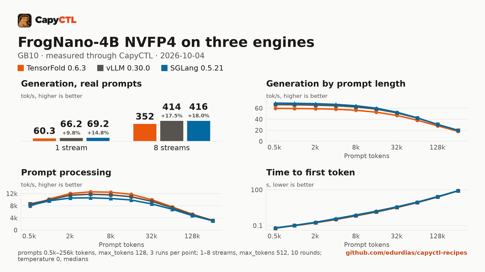

# TensorFold, vLLM and SGLang: FrogNano-4B-2609 NVFP4, one GB10

The same NVFP4 checkpoint, machine, prompts and request settings on three
engines, each running 8 requests at once, measured through CapyCTL with
capyctl-bench. The protocol is the one of the
[Qwen3.8-27B NVFP4 comparison](../qwen3.8-27b-nvfp4-three-engines-gb10/), with
these differences: a 4B model, no drafter, a bf16 KV cache on all three engines
and CapyCTL's default 50% managed memory limit.



The full report is [bench/report.html](bench/report.html): download it and open
it locally (GitHub shows the HTML source). [bench/summary.md](bench/summary.md)
has every table, [bench/data.csv](bench/data.csv) every point, and
[bench/results/](bench/results/) the capyctl-bench results files with every
request. There is no drafter, so the 0.5k and 1k context points are not
inflated by easy drafting and the summary image uses the full sweep.

## Setup

| | |
|---|---|
| Hardware | 1x NVIDIA GB10 (SM 12.1), unified memory (121.7 GiB), aarch64 |
| System | NVIDIA driver 580.173.02, CUDA 13.0 |
| CapyCTL | `main` at `9b90a56` (prints `capyctl 0.1.1`), release build, `capyctl start standalone` |
| TensorFold | 0.6.3, tag `v0.6.3`, commit `9356df5c424b0c36b7737e37873a6f968b08de79` (torch 2.13.0+cu130, triton 3.7.1) |
| vLLM | 0.30.0 (torch 2.13.0+cu130, triton 3.7.1, flashinfer-python 0.6.18.post1, transformers 5.18.0) |
| SGLang | 0.5.21 (torch 2.13.0 cu130, triton 3.7.1, flashinfer-python 0.6.18, sglang-kernel 0.4.7, transformers 5.12.1, torch-memory-saver 0.0.10) |
| Python | 3.12.14 in all three venvs |
| Model | [`capyctl/FrogNano-4B-2609-NVFP4`](https://huggingface.co/capyctl/FrogNano-4B-2609-NVFP4) at `8bfc6ae20df215dd3c85ebcf36605bc653e066fa`, converted from [`microsoft/FrogNano-4B-2609`](https://huggingface.co/microsoft/FrogNano-4B-2609) at `b90468c11a913c1916b4542b4b7a530ec42024a4` (see [Checkpoint](#checkpoint)) |
| Drafter | none |
| Benchmark | capyctl-bench 0.1.0 from this repository (`main` at `9c0cb49`) |
| Measured | 2026-10-04 |

The runs read a local copy of the checkpoint (`model.safetensors` sha256
`4e5fb2d82bd6b7c401216c43f07e08efd0db78ffb8f2c42fbc7f6f4cbc539ed4`) before the
Hugging Face repository was public; the deployment files here pin the published
revision, which holds the same `model.safetensors`.

CapyCTL ran standalone with its default managed limit of 50% (60.8 GiB):

```bash
capyctl start standalone --debug-engine-logs --listen 127.0.0.1:8443
```

Each engine was registered as its own profile:

```bash
capyctl engine add ~/tensorfold-0.6.3-venv --name tf063
capyctl engine add ~/vllm-0.30.0-venv --name vllm030
capyctl engine add ~/sglang-0.5.21-venv --name sglang0521
```

## Checkpoint

FrogNano-4B-2609 is a `qwen3_5` model (`Qwen3_5ForConditionalGeneration`, 32
layers: 24 Gated DeltaNet and 8 full attention, a vision tower and one MTP
layer), shipped in BF16 with a tied output layer. The NVFP4 checkpoint follows
the layout of
[`nvidia/Qwen3.8-27B-NVFP4`](https://huggingface.co/nvidia/Qwen3.8-27B-NVFP4):
ModelOpt `quant_method: modelopt`, `quant_algo: MIXED_PRECISION`, no KV cache
quantization. It is one `model.safetensors` of 4.8 GB.

| Layers | Format |
|---|---|
| 32 x `mlp.{gate,up,down}_proj` and `lm_head` | NVFP4 W4A4, group size 16, static input scales |
| 8 x `self_attn.{q,k,v,o}_proj`, 24 x `linear_attn.{in_proj_qkv,in_proj_z,out_proj}` | FP8 W8A8, per tensor |
| `embed_tokens`, `linear_attn.in_proj_a/b`, `conv1d`, `A_log`, `dt_bias`, norms, vision tower, MTP layer | BF16, bit-identical to the source |

How it was made, with [`convert/`](convert/):

- **ModelOpt 0.47.0** (`nvidia-modelopt==0.47.0`, transformers 5.14.1, torch
  2.13.0+cu130) and `examples/hf_ptq/hf_ptq.py` from the `0.47.0` tag of
  [NVIDIA/Model-Optimizer](https://github.com/NVIDIA/Model-Optimizer).
- **Recipe**: [`convert/qwen3_5-nvfp4_mlp-fp8_attn-kv_none.yaml`](convert/qwen3_5-nvfp4_mlp-fp8_attn-kv_none.yaml),
  ModelOpt's `huggingface/qwen3_5/ptq/w4a16_nvfp4-fp8_attn-kv_fp8_cast` with
  NVFP4 input quantizers added on the MLP and `lm_head` (W4A4) and the KV cache
  cast removed. Calibration algorithm `max`, 256 samples of up to 512 tokens,
  batch size 4.
- **Untied head**: TensorFold 0.6.3's NVFP4 loader needs a separate `lm_head`.
  [`convert/convert_qwen3_5_nvfp4.py`](convert/convert_qwen3_5_nvfp4.py) unties
  it after loading the BF16 model (`lm_head.weight` becomes a copy of
  `embed_tokens.weight`, `tie_word_embeddings: false`); the embedding stays BF16
  and the head is quantized to NVFP4.
- **Finish step** (same script): restores the source's tokenizer files and chat
  template, and writes `generation_config.json` with
  `eos_token_id: [248046, 248044]`, without which TensorFold does not stop at
  `<|im_end|>`.
- **Calibration set**: 256 conversations, rendered with FrogNano's chat
  template. 128 chat rows from
  [`HuggingFaceH4/ultrachat_200k`](https://huggingface.co/datasets/HuggingFaceH4/ultrachat_200k)
  (MIT, `test_sft` split) and 128 code rows from
  [`ise-uiuc/Magicoder-OSS-Instruct-75K`](https://huggingface.co/datasets/ise-uiuc/Magicoder-OSS-Instruct-75K)
  (MIT, problem as the user turn and solution as the assistant turn), taken at
  an even stride. The 1.1 MB JSONL is not in this repository;
  [`convert/make_calib.py`](convert/make_calib.py) rebuilds it from those two
  files (sha256 of the set used:
  `77b0bc52144ee04650a8fb8a81b1f97beb4c0854593245530b0ce1574fb98d8f`).

```bash
python convert/make_calib.py \
  --chat test_sft-00000-of-00001-f7dfac4afe5b93f4.parquet \
  --code data-oss_instruct-decontaminated.jsonl \
  --out calib-chat-code-256.jsonl

python convert/convert_qwen3_5_nvfp4.py \
  --source ~/models/FrogNano-4B-2609 \
  --out ~/models/FrogNano-4B-2609-NVFP4 \
  --hf-ptq-dir ~/Model-Optimizer-0.47.0/examples/hf_ptq \
  --calib calib-chat-code-256.jsonl --eos 248046 248044
```

The conversion ran on a 16 GB GPU in about 3 minutes; FP4 hardware is not
needed to calibrate.

## Deployments

- [deployment-tf.yaml](deployment-tf.yaml), [deployment-vllm.yaml](deployment-vllm.yaml)
  and [deployment-sglang.yaml](deployment-sglang.yaml), used for the
  concurrency runs: `context_length: 32768`.
- [deployment-ctx-tf.yaml](deployment-ctx-tf.yaml), [deployment-ctx-vllm.yaml](deployment-ctx-vllm.yaml)
  and [deployment-ctx-sglang.yaml](deployment-ctx-sglang.yaml), used for the
  context sweep: the same with `context_length: 262144`.

Only one deployment ran at a time.

| | TensorFold 0.6.3 | vLLM 0.30.0 | SGLang 0.5.21 |
|---|---|---|---|
| Running requests | `max_concurrent_requests: 8`, passed as `--parallel 8` | `max_concurrent_requests: 8` (`--max-num-seqs 8`) | `max_concurrent_requests: 8` (the engine logged `max_running_requests=8`) |
| Drafter | none: `--no-drafts` | none | none |
| KV cache dtype | `bf16` (TensorFold has no FP8 KV) | `bfloat16` | `bfloat16` |
| KV cache size | no fixed pool; grows within the declared budget | `memory.kv_cache: 16GiB` (471,099 tokens at 32k context, 516,991 at 262k) | `memory.kv_cache: 16GiB`, passed as `--max-total-tokens 524288` |
| Recurrent state | model native | model native (float32) | float32; CapyCTL sized 40 slots for 8 requests (1.97 GB) |
| Memory | declared 32 GiB `cold`, 30 GiB `ready`; launched with `TENSORFOLD_CUDA_MEMORY_LIMIT_GB=30` | `memory: {kv_cache: 16GiB}`; CapyCTL derives the request | `memory: {request: 31GiB, kv_cache: 16GiB}` |
| NVFP4 and FP8 kernels | its own FP4 x FP4 and FP8 x FP8 | `FlashInferCutlassNvFp4LinearKernel`, `FlashInferFP8ScaledMMLinearKernel` | `modelopt_mixed`, FlashInfer CUTLASS FP4 GEMM, fused SiLU+FP4 quant on |
| Residency | `restart_only` | CapyCTL default | CapyCTL default; CUDA graphs on (CapyCTL default) |
| Other | none | `language_model_only: true`, `timeouts.initialize: 900s` | `quantization: modelopt`, `timeouts.initialize: 900s` |

CapyCTL picked the `qwen3_coder` tool parser and the `qwen3` reasoning parser
for vLLM and SGLang. No idle timer was set (the standalone default), so nothing
parked during the runs.

## Method

- Every request went through the CapyCTL inference endpoint: OpenAI streaming
  chat completions, `temperature: 0`, no `extra_body`, thinking on (the chat
  template's default). Thinking and answer tokens are both counted.
- **Concurrency**: 1 to 8 streams, `max_tokens: 512`, the eight prompts of
  capyctl-bench's `prompts.json`. Each pass was a fresh warm start, with one
  warm-up round and 5 measured rounds per stream count. Two passes per engine,
  interleaved TensorFold, vLLM, SGLang, TensorFold, vLLM, SGLang; each engine's
  results file pools its two passes (10 measured rounds per point).
- **Context**: one stream, 0.5k to 256k prompt tokens, 3 runs per size,
  `max_tokens: 128`, one pass per engine, against the 262144-token deployments.
- Every cell is the median. Memory is system memory in use on the machine
  (`MemTotal - MemAvailable`, about 3.6 GiB with nothing running), sampled
  every 0.5 s, next to CapyCTL's own `startup.measured`.

The `run` commands for one engine:

```bash
python3 tools/capyctl-bench/capyctl_bench.py run \
  --api-key-file ~/.local/state/capyctl/identity/credentials \
  --model frog-vllm --label "vLLM 0.30.0" \
  --concurrency 1-8 --rounds 5 --concurrency-max-tokens 512 --record-chunks \
  --memory-cmd "awk '/^MemTotal:/ {t=\$2} /^MemAvailable:/ {a=\$2} END {print (t-a)/1048576}' /proc/meminfo" \
  --out conc-vllm-pass1.json

python3 tools/capyctl-bench/capyctl_bench.py run \
  --api-key-file ~/.local/state/capyctl/identity/credentials \
  --model frog-ctx-vllm --label "vLLM 0.30.0" --record-chunks \
  --context-sweep 0.5k,1k,2k,4k,8k,16k,32k,64k,128k,256k --runs 3 --max-tokens 128 \
  --memory-cmd "awk '/^MemTotal:/ {t=\$2} /^MemAvailable:/ {a=\$2} END {print (t-a)/1048576}' /proc/meminfo" \
  --out ctx-vllm.json
```

No request failed: 360 measured concurrency requests per engine, each
`finish_reason: length` at 512 tokens with usage, and 30 context requests per
engine, from 0.5k to 256k (258,174 prompt tokens), all answered. Per-pass
aggregates agree within 1% at every stream count on all three engines.

## Results

| | TensorFold 0.6.3 | vLLM 0.30.0 | SGLang 0.5.21 |
|---|---|---|---|
| Aggregate, 1 stream | 60.3 tok/s | 66.2 (+10%) | **69.2** (+15%) |
| Aggregate, 4 streams | 206.5 tok/s | 232.5 (+13%) | **237.2** (+15%) |
| Aggregate, 8 streams | 352.3 tok/s | 413.8 (+17%) | **415.9** (+18%) |
| Time to first token p50, 1 / 4 / 8 streams | **0.030 / 0.053** / 0.098 s | 0.042 / 0.077 / 0.096 s | 0.032 / 0.064 / **0.086** s |
| 2k: decode, time to first token | 59.0 tok/s, **0.17 s** | 65.5 tok/s, 0.18 s | **68.2 tok/s**, 0.19 s |
| 32k: decode, time to first token | 46.8 tok/s, **3.24 s** | 51.4 tok/s, 3.42 s | **52.6 tok/s**, 3.76 s |
| 128k: decode, time to first token | 28.1 tok/s, **24.7 s** | **30.7 tok/s**, 25.5 s | 30.6 tok/s, 27.1 s |
| 256k: decode, time to first token | 18.0 tok/s, **81.4 s** | **20.0 tok/s**, 82.6 s | 19.7 tok/s, 84.8 s |
| Prompt processing, 2k / 32k / 256k | **12,014 / 9,973 / 3,173 tok/s** | 11,460 / 9,451 / 3,126 | 10,524 / 8,594 / 3,047 |
| Peak memory, 8 streams (highest sample) | **10.1 GiB** | 30.8 GiB | 33.9 GiB |
| Peak memory, 128k / 256k (median of 3 runs) | **22.0** / 34.5 GiB | 30.4 / **30.6** GiB | 35.2 / 35.3 GiB |
| CapyCTL `startup.measured` | **8.9 GiB** | 27.2 GiB | 31.8 GiB |
| Ready, first start in a new state directory | 79.3 s | **57.5 s** | 109.8 s |
| Ready, warm (`start` after `stop`) | **5.2 s** | 28.8 to 29.3 s (55.6 s for the 262144-token deployment) | 68.6 to 69.7 s |

Bold marks the best value in each row. Percentages compare with TensorFold.
Startup times are single measurements per start.

## Where each engine leads

- **Decode: vLLM and SGLang.** 10% to 15% over TensorFold at one stream and
  about 18% at 8 streams (414 and 416 against 352 tok/s); the gap widens with
  streams, as TensorFold's per-stream rate falls from 60.5 to 44.4 tok/s and
  theirs from 67 to 69 down to 52. vLLM and SGLang are within 1% of each other
  from 2 streams up. On single-stream decode by context they lead by 9% to 16%
  at every length from 0.5k to 256k: SGLang from 0.5k to 64k, the two tie at
  128k, vLLM leads at 256k.
- **Prefill: TensorFold.** The fastest prompt processing from 1k to 256k
  (vLLM 2% to 7% slower, SGLang 4% to 17% slower), and so the lowest time to
  first token from 1k up; at 256k the three are within 4% (81 to 85 s). vLLM
  leads only at 0.5k.
- **Time to first token under load: TensorFold at 1 to 5 streams**
  (0.030 to 0.059 s p50), SGLang at 6 to 8 streams (0.076 to 0.086 s;
  TensorFold 0.084 to 0.098 s; vLLM 0.089 to 0.096 s). All three are under
  0.1 s p50 at 8 streams with these ~1k-token prompts.
- **Memory: TensorFold.** It grows with the load and context, under its 30 GiB
  cap: 10 GiB at 8 streams, 22 GiB at 128k, 34.5 GiB at 256k. vLLM and SGLang
  reserve up front: vLLM about 30.5 GiB at any load or context, SGLang about
  34 to 35 GiB (its 16 GiB KV pool plus 1.97 GB of float32 recurrent state).
- **Startup: TensorFold** is warm in 5 s, against 29 s for vLLM (56 s for the
  262144-token deployment) and 69 s for SGLang, CUDA graph capture included.
  On the first start in a new state directory vLLM was fastest (57 s).

All three served a 256k prompt.

## Outputs within each engine

Different kernels give different greedy outputs, so outputs are compared
within one engine only. TensorFold produced the same tokens for each prompt at
every stream count and round (8/8 prompts). vLLM's and SGLang's one-stream
replies matched between passes (8/8); their 8-stream replies varied (2 to 3
distinct texts per prompt over 4 samples).

## Quality spot check, NVFP4 against BF16

Run separately, before the benchmark, on an RTX 4090 Laptop GPU (SM 8.9, no
FP4 tensor cores, so both engines ran the NVFP4 layers as W4A16 and the
activation side of W4A4 was not exercised). NVFP4 on vLLM 0.30.0 and
TensorFold 0.6.3, each started directly; BF16 is `microsoft/FrogNano-4B-2609`
on vLLM 0.30.0 through CapyCTL, same prompts and settings. 80 prompts, greedy,
thinking off, `max_tokens: 1024`: 30 code (20 run against asserts in a
sandbox, 6 bug fixes, 4 "what does this print"), 30 tool calls (strict name
and argument match), 20 reasoning and math. Ten of them again with thinking on
and `max_tokens: 4096`.

| | NVFP4, vLLM | NVFP4, TensorFold | BF16, vLLM |
|---|---|---|---|
| Code (30) | 26 | 27 | 26 |
| Tool calls (30) | 29 | 29 | 28 |
| Reasoning (20) | 20 | 20 | 20 |
| **All, thinking off (80)** | **75** | **76** | **74** |
| Byte-identical to BF16 | 44 | 47 | |
| Same final answer as BF16 | 63 | 66 | |
| Thinking on (10) | 9 | 8 | 9 |
| Hit the 4096-token cap, thinking on | 0 | 2 | 0 |

- The differences from BF16 are one or two prompts, in both directions:
  noise at this size. Every tool call had valid JSON arguments; 29 of 30 calls
  were the same as BF16's.
- Greedy text diverges from BF16 early (median first difference at token 21
  to 23). The two NVFP4 engines agree with each other more than with BF16
  (56 of 80 byte-identical), so most of the drift comes from the weights.
- With thinking on, TensorFold NVFP4 looped until the cap on 2 of 10 prompts,
  and vLLM NVFP4 came within 127 tokens of it on one; BF16 did not. Set a
  `max_tokens` limit.

This is a spot check, not a benchmark suite or a perplexity measurement.

## Caveats

- **Same weights, same KV dtype.** All three engines read the same
  `model.safetensors` and ran native FP4 x FP4 on SM 12.1, each with its own
  kernels. All three ran a bf16 KV cache, since TensorFold has no FP8 KV; vLLM
  and SGLang each had a 16 GiB pool. The 27B comparison ran FP8 KV on vLLM and
  SGLang.
- **Default managed limit.** CapyCTL's default 50% (60.8 GiB) for all three;
  nothing needed more. The 27B comparison raised it to 80%.
- **Memory requests differ by design.** TensorFold declares its resources
  (32 GiB cold, 30 GiB Ready, capped at 30 GiB). CapyCTL derives vLLM's
  request. SGLang needs an explicit request that holds the weights, the KV
  pool, the float32 state for 8 requests and SGLang's 8 GiB margin: 31 GiB.
- **CapyCTL issues found in this run**, fixes pending in CapyCTL:
  - SGLang's refusal names too small a request. At 24 GiB CapyCTL refused and
    named 27.9 GB; at 26 GiB it refused again and named 30.0 GB. The named
    figure leaves out the 8 GiB margin; the real need is about 30.7 GiB. While
    refused, `capyctl start deployment --wait` stays queued instead of failing.
  - A `sha256:` value in `model.content_fingerprint` is compared with
    CapyCTL's digest of the whole checkpoint, not of one file, so a file's
    sha256 there makes the start fail with `checkpoint_mismatch`. The
    deployment files here leave `content_fingerprint` out.
- **Thinking on.** Every 512-token concurrency reply ended at the length
  limit, and most of each is reasoning.
- **vLLM's warm start depends on the context length**: 29 s for the
  32768-token deployment, 55.6 s for the 262144-token one.
- One machine, two passes for the concurrency runs and one pass for the
  context sweep. Temperature 0 throughout; sampled decoding was not compared.
