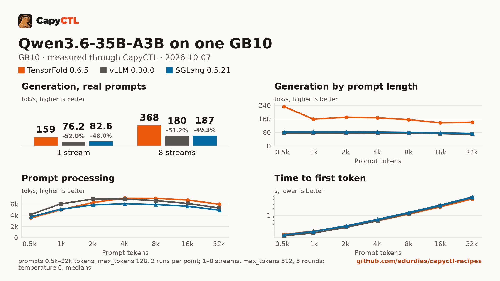

# TensorFold, vLLM and SGLang: Qwen3.6-35B-A3B sized for 32 GiB, one GB10

The three Qwen3.6-35B-A3B recipes sized for 32 GiB, each as its recipe ships
it, on the same machine, prompts and request settings, measured through
CapyCTL with capyctl-bench. No new runs were made for this page: it puts the
benchmarks of the three recipes side by side.

**The engines do not serve the same checkpoint.** TensorFold runs TensorFold's
own MLX 4-bit export with MTP drafts; vLLM and SGLang run NVIDIA's NVFP4
export without a drafter. TensorFold does not read the NVFP4 checkpoint. The
numbers compare the engines as each recipe serves the model, not three engines
on one checkpoint.

The full report is [bench/report.html](bench/report.html): download it and open
it locally (GitHub shows the HTML source). [bench/summary.md](bench/summary.md)
has every table, [bench/data.csv](bench/data.csv) every point, and
[bench/results/](bench/results/) the capyctl-bench results files with every
request, the same files as in each recipe's `bench/`.

## Setup

| | |
|---|---|
| Hardware | 1x NVIDIA GB10, unified memory, aarch64 |
| System | Ubuntu 24.04, NVIDIA driver 580.173.02, CUDA 13.0 |
| CapyCTL | `main` at `0c4ccb4` (prints `capyctl 0.1.2`), release build, `capyctl start standalone` with its default limits |
| TensorFold | 0.6.5 (torch 2.13.0+cu130) |
| vLLM | 0.30.0 (torch 2.13.0+cu130, FlashInfer 0.6.18.post1) |
| SGLang | 0.5.21 (torch 2.13.0, FlashInfer 0.6.18, sglang-kernel 0.4.7) |
| Model, TensorFold | [`TensorFold/Qwen3.6-35B-A3B-MLX-4bit-MTP`](https://huggingface.co/TensorFold/Qwen3.6-35B-A3B-MLX-4bit-MTP) at `f84b054c5677b6e59bdb969ae61915b0983d68bb`, MLX 4-bit (some layers 8-bit), 20.9 GB, MTP drafter in the checkpoint |
| Model, vLLM and SGLang | [`nvidia/Qwen3.6-35B-A3B-NVFP4`](https://huggingface.co/nvidia/Qwen3.6-35B-A3B-NVFP4) at `1355db6a052410cfd62085d94b58866fd0f2c3c5`, NVFP4 experts (weight-only) with FP8 linear-attention projections, 23.5 GB, no drafter |
| Benchmark | capyctl-bench 0.1.0 from this repository |
| Measured | 2026-10-07 |

## Deployments

[deployment-tf.yaml](deployment-tf.yaml), [deployment-vllm.yaml](deployment-vllm.yaml)
and [deployment-sglang.yaml](deployment-sglang.yaml) are the recipes' files,
unchanged:

- TensorFold: [tensorfold/qwen3.6-35b-a3b-mlx-4bit-32gib-gb10](../../tensorfold/qwen3.6-35b-a3b-mlx-4bit-32gib-gb10/)
- vLLM: [vllm/qwen3.6-35b-a3b-nvfp4-32gib-gb10](../../vllm/qwen3.6-35b-a3b-nvfp4-32gib-gb10/)
- SGLang: [sglang/qwen3.6-35b-a3b-nvfp4-32gib-gb10](../../sglang/qwen3.6-35b-a3b-nvfp4-32gib-gb10/)

Only one deployment ran at a time.

| | TensorFold 0.6.5 | vLLM 0.30.0 | SGLang 0.5.21 |
|---|---|---|---|
| Running requests | 8 (CapyCTL's default) | 4 (`max_concurrent_requests: 4`) | 4 (`max_concurrent_requests: 4`) |
| Drafter | MTP, in the checkpoint | none | none |
| KV cache | bf16, no fixed pool, within the 32 GiB cap | `fp8`, `memory.kv_cache: 2GiB` | `fp8_e4m3`, `memory.kv_cache: 1536MiB` (141,100 tokens allocated) |
| Memory | 32 GiB reserved in every phase but `parked`; CapyCTL caps TensorFold at it | derived by CapyCTL | derived by CapyCTL |
| Residency | `restart_only` (TensorFold cannot free memory while it runs) | `restart_only`: with CapyCTL's default deep parking, vLLM holds over 41 GiB once ready, more than 32 GiB | `restart_only` (SGLang 0.5.21 cannot reload modelopt weights on wake) |
| Context | 32,768 tokens | 32,768 tokens | 32,768 tokens |
| Other | | `language_model_only: true` | `--moe-runner-backend marlin`, CUDA graphs capped at 4 decode requests and 512 prefill tokens, vision tower loaded |

vLLM is restart-only here only because its deep-park footprint does not fit
32 GiB; the [vLLM recipe](../../vllm/qwen3.6-35b-a3b-nvfp4-32gib-gb10/#restart-instead-of-deep-parking)
measures both. SGLang and TensorFold run as in their recipes, which are
restart-only for their own reasons above.

## Method

- Every request went through the CapyCTL inference endpoint: OpenAI streaming
  chat completions, `temperature: 0`, thinking on (the model's default).
  Thinking and answer tokens are both counted.
- **Concurrency**: 1 to 8 streams, `max_tokens: 512`, the eight prompts of
  capyctl-bench's `prompts.json`, 5 rounds per stream count, one pass per
  engine.
- **Context**: one stream, 0.5k to 32k prompt tokens (the deployments'
  context), 3 runs per size, `max_tokens: 128`.
- Every cell is the median. Memory is system memory in use on the machine
  (`MemTotal - MemAvailable`; 4.3 GiB before TensorFold started, 3.6 GiB
  before vLLM and SGLang), sampled every 0.5 s.

## Results

| | TensorFold 0.6.5 | vLLM 0.30.0 | SGLang 0.5.21 |
|---|---|---|---|
| Decode per stream, 1 stream | **162 tok/s** | 77.1 (-52%) | 83.5 (-48%) |
| Decode per stream, 4 / 8 streams | **73.5 / 50.0 tok/s** | 45.5 / 45.4 | 47.0 / 47.2 |
| Aggregate, 1 stream | **159 tok/s** | 76.2 (-52%) | 82.6 (-48%) |
| Aggregate, 4 streams | **279 tok/s** | 180 (-35%) | 186 (-33%) |
| Aggregate, 8 streams | **368 tok/s** | 180 (-51%) | 187 (-49%) |
| Time to first token p50, 1 / 4 / 8 streams | **0.065** / 0.156 / **0.30** s | 0.069 / **0.145** / 5.80 s | 0.067 / 0.172 / 5.62 s |
| 2k: decode, time to first token | **170 tok/s**, 0.33 s | 77.0 tok/s, **0.29 s** | 83.2 tok/s, 0.34 s |
| 32k: decode, time to first token | **140 tok/s, 5.42 s** | 68.9 tok/s, 6.11 s | 73.9 tok/s, 6.59 s |
| Prompt processing, 2k / 32k | 6,292 / **5,963 tok/s** | **6,905** / 5,289 | 5,852 / 4,910 |
| Peak memory in use, 8 streams | **27.1 GiB** | 30.8 GiB | 35.3 GiB |
| Peak memory in use, 32k | **29.8 GiB** | 30.9 GiB | 35.3 GiB |
| Ready footprint (once ready, less memory in use before the start) | **21.4 to 23.8 GiB** | 26.4 to 27.2 GiB | 31.2 to 31.7 GiB |
| Loading peak (`MemAvailable` drop) | **21.5 GiB warm, 28.4 GiB cold** | 30.2 to 30.8 GiB | 34.6 to 34.8 GiB |
| Ready, cold / warm | 114 s / **7.7 s** | 176 s / 182 s | 127 s / 128 s |

Bold marks the best value in each row. Percentages compare with TensorFold.
Peak memory in use includes what was in use before the start; ready
footprint, loading peak and startup times are from each recipe's README.

## Where each engine leads

- **TensorFold 0.6.5**: about twice the one-stream decode of the other two
  (162 against 77 and 84 tok/s), helped by MTP drafts accepted at 61% to 62%;
  the highest aggregate at every stream count (368 tok/s at 8, against 180 and
  187); time to first token 0.30 s at 8 streams, where the other two queue;
  the fastest prefill from 4k up; the smallest ready footprint and a 7.7 s
  warm start.
- **vLLM 0.30.0**: the fastest prefill at 0.5k to 2k and the lowest time to
  first token at 0.5k to 2k and at 4 to 7 streams; memory flat at
  30.8 to 30.9 GiB through the whole benchmark.
- **SGLang 0.5.21**: 8% higher one-stream decode than vLLM on the same
  checkpoint and slightly higher aggregate at 4 and 8 streams; the most
  memory, fitting 32 GiB with 0.3 GiB to spare under load.

## Caveats

- **Different checkpoints.** TensorFold serves its MLX 4-bit export with MTP
  drafts, vLLM and SGLang NVIDIA's NVFP4 export without a drafter. Speeds
  compare engines as served; much of TensorFold's decode lead is the drafter,
  and the quantizations differ, so outputs and quality are not compared.
- **Different running requests.** TensorFold decodes up to 8 requests
  together; the vLLM and SGLang recipes run 4 to fit 32 GiB. From 5 streams
  the extra requests wait for a running one, which is why their aggregate
  drops at 5 and their time to first token reaches 5.6 to 5.8 s p50 and
  11 s p95 at 8 streams.
- **vLLM is restart-only** because deep parking does not fit 32 GiB; SGLang
  and TensorFold are restart-only as in their recipes.
- **Drafter acceptance on filler prompts.** The sweep's filler text is easy to
  draft at 0.5k: TensorFold decodes 233 tok/s there against 159 to 170 at 1k
  and 2k. The concurrency prompts are the one-stream figure to use. Only
  TensorFold reports acceptance in the stream.
- **KV cache dtype differs.** TensorFold ran bf16; vLLM `fp8` and SGLang
  `fp8_e4m3`.
- The three recipes were measured one after another on the same day (vLLM,
  TensorFold, then SGLang), one pass each, not interleaved. Thinking was on,
  so most of each 512-token reply is reasoning. Temperature 0 throughout.
