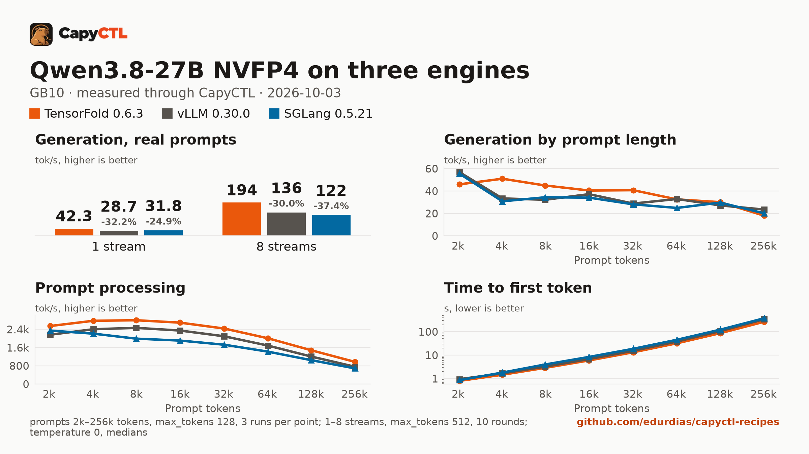

# TensorFold, vLLM and SGLang: Qwen3.8-27B NVFP4 with DFlash2 drafts, one GB10

The same checkpoint, drafter, machine, prompts and request settings on three
engines, each running 8 requests at once, measured through CapyCTL with
capyctl-bench. This is a rerun of a first comparison on the same machine; the
differences are listed under [What changed since the first run](#what-changed-since-the-first-run).



The full report is [bench/report.html](bench/report.html): download it and open
it locally (GitHub shows the HTML source). [bench/summary.md](bench/summary.md)
has every table, [bench/data.csv](bench/data.csv) every point, and
[bench/results/](bench/results/) the capyctl-bench results files with every
request. The summary image is built from [bench/results-summary/](bench/results-summary/),
the same files without the 0.5k and 1k context points (see [Caveats](#caveats)).

## Setup

| | |
|---|---|
| Hardware | 1x NVIDIA GB10, unified memory (121.7 GiB), aarch64 |
| System | NVIDIA driver 580.173.02, CUDA 13.0 |
| CapyCTL | `main` at `6a84457` (prints `capyctl 0.1.1`), release build, `capyctl start standalone` |
| TensorFold | 0.6.3, tag `v0.6.3`, commit `9356df5c424b0c36b7737e37873a6f968b08de79` |
| vLLM | 0.30.0 (torch 2.13.0+cu130, triton 3.7.1, flashinfer-python 0.6.18.post1, transformers 5.18.0) |
| SGLang | 0.5.21 (torch 2.13.0 cu130, triton 3.7.1, flashinfer-python 0.6.18, sglang-kernel 0.4.7, transformers 5.12.1, torch-memory-saver 0.0.10) |
| Python | 3.12.14 in all three venvs |
| Model | [`nvidia/Qwen3.8-27B-NVFP4`](https://huggingface.co/nvidia/Qwen3.8-27B-NVFP4) at `482ca0f3832238542f8f5295dde86b5f22711d80` |
| Drafter | [`z-lab/Qwen3.8-27B-DFlash2`](https://huggingface.co/z-lab/Qwen3.8-27B-DFlash2) at `50307d4c4cde6860d4eee73e2547cd786fe8e8a4` |
| Benchmark | capyctl-bench 0.1.0 from this repository |
| Measured | 2026-10-03 |

CapyCTL ran standalone with the managed memory limit raised from the default
50% to 80% (97.4 GiB) for all three engines:

```bash
capyctl start standalone --listen 127.0.0.1:8443 \
  --set host.resource_policy.memory.system.managed_limit=80%
```

Each engine was registered as its own profile:

```bash
capyctl engine add ~/tensorfold-0.6.3-venv --name tf063 \
  --approve-option=--drafter --approve-path /home/me/drafters
capyctl engine add ~/vllm-0.30.0-venv --name vllm030 \
  --approve-option=--speculative-config --approve-path /home/me/drafters
capyctl engine add ~/sglang-0.5.21-venv --name sglang0521 \
  --approve-option=--speculative-draft-model-path --approve-path /home/me/drafters
```

## Deployments

- [deployment-tf.yaml](deployment-tf.yaml), [deployment-vllm.yaml](deployment-vllm.yaml)
  and [deployment-sglang.yaml](deployment-sglang.yaml), used for the
  concurrency runs: `context_length: 32768`.
- [deployment-ctx-tf.yaml](deployment-ctx-tf.yaml), [deployment-ctx-vllm.yaml](deployment-ctx-vllm.yaml)
  and [deployment-ctx-sglang.yaml](deployment-ctx-sglang.yaml), used for the
  context sweep: the same with `context_length: 262144`.

Each starts from the engine's recipe in this repository and adds 8 running
requests. Only one deployment ran at a time.

| | TensorFold 0.6.3 | vLLM 0.30.0 | SGLang 0.5.21 |
|---|---|---|---|
| Running requests | `--parallel 8` (extra argument) | `max_concurrent_requests: 8` (`--max-num-seqs 8`) | `max_concurrent_requests: 8` (`--max-running-requests 8`; the engine logged `max_running_requests=8`) |
| Drafter | `--drafter`, TensorFold's draft tree | `--speculative-config`, `dflash`, 7 speculative tokens | `--speculative-algorithm DFLASH`, 8 draft tokens, drafter unquantized |
| KV cache dtype | `bf16` (TensorFold has no FP8 KV) | `fp8` | `fp8_e4m3` |
| KV cache size | no fixed pool; grows within the declared budget | `memory.kv_cache: 16GiB` | `memory.kv_cache: 16GiB`, passed as the KV pool (393,573 tokens) |
| Recurrent state | model native | model native (float32), sized by vLLM inside its request | model native float32; CapyCTL sized 40 state slots for 8 requests and 8 draft tokens |
| Memory | declared 84 GiB `cold`, 82 GiB `ready`; CapyCTL launches it with `TENSORFOLD_CUDA_MEMORY_LIMIT_GB=82` | `memory: {request: 48GiB, kv_cache: 16GiB}` | `memory: {request: 65GiB, kv_cache: 16GiB}` (at 48 GiB CapyCTL refused the start and named 64.2 GiB) |
| Residency | `restart_only` | CapyCTL default | CapyCTL default; CUDA graphs on (CapyCTL default) |
| Other | `--temperature 0` engine default | `language_model_only: true`, `timeouts.initialize: 900s` | `quantization: modelopt`, `timeouts.initialize: 900s` |

No idle timer was set (the standalone default), so nothing parked during the
runs.

## Method

- Every request went through the CapyCTL inference endpoint: OpenAI streaming
  chat completions, `temperature: 0`, no `extra_body`, thinking on (the model's
  default). Thinking and answer tokens are both counted.
- **Concurrency**: 1 to 8 streams, `max_tokens: 512`, the eight prompts of
  capyctl-bench's `prompts.json`. Each pass was a fresh warm start, with one
  warm-up round and 5 measured rounds per stream count. Two passes per engine,
  interleaved TensorFold, vLLM, SGLang, TensorFold, vLLM, SGLang; each engine's
  results file pools its two passes (10 measured rounds per point).
- **Context**: one stream, 0.5k to 256k prompt tokens, 3 runs per size,
  `max_tokens: 128`, one pass per engine, against the 262144-token deployments.
- Every cell is the median. Memory is system memory in use on the machine
  (`MemTotal - MemAvailable`, about 3.6 GiB with nothing running), sampled
  every 0.5 s, next to CapyCTL's own `startup.measured`.

The `run` commands for one engine:

```bash
python3 tools/capyctl-bench/capyctl_bench.py run \
  --api-key-file ~/.local/state/capyctl/identity/credentials \
  --model qwen38-vllm --label "vLLM 0.30.0" \
  --concurrency 1-8 --rounds 5 --concurrency-max-tokens 512 --record-chunks \
  --memory-cmd "awk '/^MemTotal:/ {t=\$2} /^MemAvailable:/ {a=\$2} END {print (t-a)/1048576}' /proc/meminfo" \
  --out conc-vllm-pass1.json

python3 tools/capyctl-bench/capyctl_bench.py run \
  --api-key-file ~/.local/state/capyctl/identity/credentials \
  --model qwen38-ctx-vllm --label "vLLM 0.30.0" --record-chunks \
  --context-sweep 0.5k,1k,2k,4k,8k,16k,32k,64k,128k,256k --runs 3 --max-tokens 128 \
  --memory-cmd "awk '/^MemTotal:/ {t=\$2} /^MemAvailable:/ {a=\$2} END {print (t-a)/1048576}' /proc/meminfo" \
  --out ctx-vllm.json
```

No request failed: 360 measured concurrency requests per engine, each
`finish_reason: length` at 512 tokens with usage, and 30 context requests per
engine, all answered. Per-pass aggregates agree within 2%, except vLLM at 2
streams (6%) and 5 streams (5%) and SGLang at 6 streams (3%).

## Results

| | TensorFold 0.6.3 | vLLM 0.30.0 | SGLang 0.5.21 |
|---|---|---|---|
| Aggregate, 1 stream | **42.3 tok/s** | 28.7 (-32%) | 31.8 (-25%) |
| Aggregate, 4 streams | **121.1 tok/s** | 87.9 (-27%) | 78.6 (-35%) |
| Aggregate, 8 streams | **194.3 tok/s** | 136.0 (-30%) | 121.6 (-37%) |
| Time to first token p50, 1 / 4 / 8 streams | **0.12** / 0.22 / 0.44 s | 0.24 / 0.46 / 0.63 s | 0.21 / 0.23 / **0.27** s |
| 2k: decode, time to first token | 46.0 tok/s, **0.80 s** | **56.9 tok/s**, 0.94 s | 55.6 tok/s, 0.86 s |
| 32k: decode, time to first token | **40.8 tok/s, 13.3 s** | 28.8 tok/s, 15.4 s | 28.1 tok/s, 18.7 s |
| 128k: decode, time to first token | **30.1 tok/s, 86.9 s** | 27.2 tok/s, 107 s | 29.7 tok/s, 123 s |
| 256k: decode, time to first token | 18.1 tok/s, **266 s** | **23.5 tok/s**, 341 s | 20.2 tok/s, 376 s |
| Prompt processing, 2k / 128k / 256k | **2,543 / 1,481 / 970 tok/s** | 2,163 / 1,205 / 757 | 2,343 / 1,046 / 686 |
| Peak memory, 8 streams (highest sample) | **29.5 GiB** | 50.8 GiB | 76.6 GiB |
| Peak memory, 128k / 256k (median of 3 runs) | 52.9 / 77.2 GiB | **50.7 / 50.8 GiB** | 73.6 / 73.6 GiB |
| Peak memory over the whole sweep (highest sample) | 85.3 GiB | **51.3 GiB** | 73.7 GiB |
| CapyCTL `startup.measured` | **30.9 GiB** | 50.2 GiB | 68.7 GiB |
| Ready, first start in a new state directory | 103.7 s | **63.2 s** | 270.2 s |
| Ready, warm (`start` after `stop`) | **14.5 to 15.5 s** | 66.5 to 71.0 s | 251.6 to 261.0 s |

Bold marks the best value in each row. Percentages compare with TensorFold.
Startup times are single measurements per start.

## Where each engine leads

- **TensorFold 0.6.3**: aggregate throughput at every stream count, 1.3x to
  1.7x over the other two from 1 to 8 streams; prompt processing and time to
  first token at every context length; single-stream decode on the
  concurrency prompts (+47% over vLLM, +33% over SGLang) and on the sweep from
  4k to 128k (64k is a tie with vLLM); time to first token at 1 to 4 and 7
  streams; the smallest footprint up to 64k; a 15 s warm start.
- **vLLM 0.30.0**: single-stream decode at 2k (+24% over TensorFold) and 256k
  (+30%); a flat memory footprint of about 51 GiB at any load and context,
  while TensorFold grows to 85.3 GiB at 256k; the fastest first start in a new
  state directory (63 s). From 2 streams up it has higher aggregate throughput
  than SGLang.
- **SGLang 0.5.21**: the lowest time to first token under load, 0.24, 0.25 and
  0.27 s p50 at 5, 6 and 8 streams (TensorFold 0.34, 0.40 and 0.44 s; vLLM
  0.55 to 0.63 s) and the lowest p95 from 3 to 7 streams; single-stream decode
  at 2k (+21% over TensorFold) and 256k (+12%); higher aggregate than vLLM at
  one stream. It holds the most memory (72 to 77 GiB: its 16 GiB KV pool plus
  16 GiB of float32 recurrent state for 8 requests and 8 draft tokens) and
  starts slowest (about 4.3 minutes warm, of which about 100 s is CUDA graph
  capture).

## Caveats

- **KV cache dtype differs.** TensorFold has no FP8 KV cache and ran bf16
  (twice the bytes per token); vLLM ran `fp8` and SGLang `fp8_e4m3`, both with
  16 GiB. TensorFold has no fixed KV pool and allocates within its declared
  budget.
- **The managed limit was raised** from CapyCTL's default 50% to 80% for every
  engine. SGLang needs it: with float32 state, 8 running requests and a 16 GiB
  KV cache, its 65 GiB request does not fit under the default limit.
- **Memory requests differ**: vLLM 48 GiB, SGLang 65 GiB, TensorFold a declared
  84 GiB cold and 82 GiB Ready so a 256k prompt fits under its cap. TensorFold
  used 29.5 GiB at 8 streams and up to 85.3 GiB of machine memory (81.7 GiB
  above idle) in the sweep.
- **vLLM's KV token count depends on the context length.** With the same
  16 GiB, vLLM reported 124,935 tokens in the 32768-context deployment and
  322,687 in the 262144-context one. The concurrency prompts are about 1k
  tokens each, so 8 of them fit either way.
- **Drafter acceptance on filler prompts.** The sweep's filler text is easy to
  draft at short lengths: TensorFold decodes 135 tok/s at 0.5k and 1k against
  46 at 2k. That is the prompt, not the engine, so the summary image starts at
  2k and its headline bars use the 1- and 8-stream runs on the real prompt set;
  the full report keeps every point. Single-stream decode on filler moves with
  acceptance at every length, so compare the curves, not one point. Only
  TensorFold reports acceptance in the stream (21% to 26%).
- **The first start used warm kernel caches.** The kernel caches from the
  first run were on disk, so "first start in a new state directory" built no
  kernels. In the first run, building them took 729 s on vLLM and 565 s on
  SGLang.
- **Outputs are compared within one engine only.** Different kernels give
  different greedy outputs. TensorFold produced the same tokens for each prompt
  at every stream count and round. vLLM's one-stream replies matched between
  passes (8/8 prompts); its 8-stream replies differed. SGLang's one-stream
  replies matched between passes for 5/8 prompts.
- **vLLM dips at 5 streams.** Its aggregate at 5 streams (80.9 tok/s) is below
  4 streams (87.9) in both passes. SGLang is flat from 4 to 5 (78.6, 80.5);
  TensorFold is not affected.
- Single runs vary: one SGLang 128k run decoded at 21.1 tok/s against 29.7 for
  the other two, and one TensorFold 256k run at 20.1 against 18.1 and 17.1.
  Medians are reported.
- One machine, two passes for the concurrency runs and one pass for the
  context sweep. Thinking was on, so most of each 512-token reply is reasoning.
  Temperature 0 throughout; sampled decoding was not compared.

## What changed since the first run

The first run used CapyCTL `main` at `53a63e5` with the default 50% managed
limit. Since then CapyCTL passes SGLang's `memory.kv_cache` as its KV pool and
sizes its recurrent state for the requested running requests
([capyctl#45](https://github.com/edurdias/capyctl/pull/45)), so SGLang runs 8
requests and holds a 256k prompt; it relays SGLang's rejection of a prompt
longer than its KV pool instead of cutting the stream
([capyctl#43](https://github.com/edurdias/capyctl/pull/43)); and the
standalone memory limit is settable, with TensorFold capped by its declaration
([capyctl#46](https://github.com/edurdias/capyctl/pull/46)).

| | First run | This run |
|---|---|---|
| Managed limit | 50% (60.8 GiB) | 80% (97.4 GiB), the same for all three |
| SGLang running requests | 2 (capped by its state pool) | 8 |
| SGLang memory | request 48 GiB, `kv_cache: 16GiB` as a lower bound | request 65 GiB, `kv_cache: 16GiB` as the KV pool, 40 float32 state slots |
| SGLang CUDA graphs | off | on (CapyCTL default) |
| SGLang, 8 streams: aggregate, time to first token p50 | 48.4 tok/s, 30.9 s | 121.6 tok/s, 0.27 s |
| SGLang, 256k prompt | failed (prompt longer than its KV pool) | 20.2 tok/s, time to first token 376 s |
| SGLang, memory at 8 streams and warm start | 49.2 GiB, 155 to 174 s | 76.6 GiB, 252 to 261 s |
| TensorFold memory | 60 GiB cold, 58 GiB Ready, no cap (reached 77.9 GiB) | 84 GiB cold, 82 GiB Ready, capped at 82 GiB |
| vLLM memory | request 48 GiB, KV cache derived (16 GiB) | request 48 GiB, `kv_cache: 16GiB` stated |
| Order | SGLang after TensorFold and vLLM | interleaved per pass |

TensorFold and vLLM are within 4% of the first run at every headline point:
194.3 against 195.5 and 136.0 against 132.6 tok/s at 8 streams, 18.1 against
18.8 and 23.5 against 23.5 tok/s at 256k.
