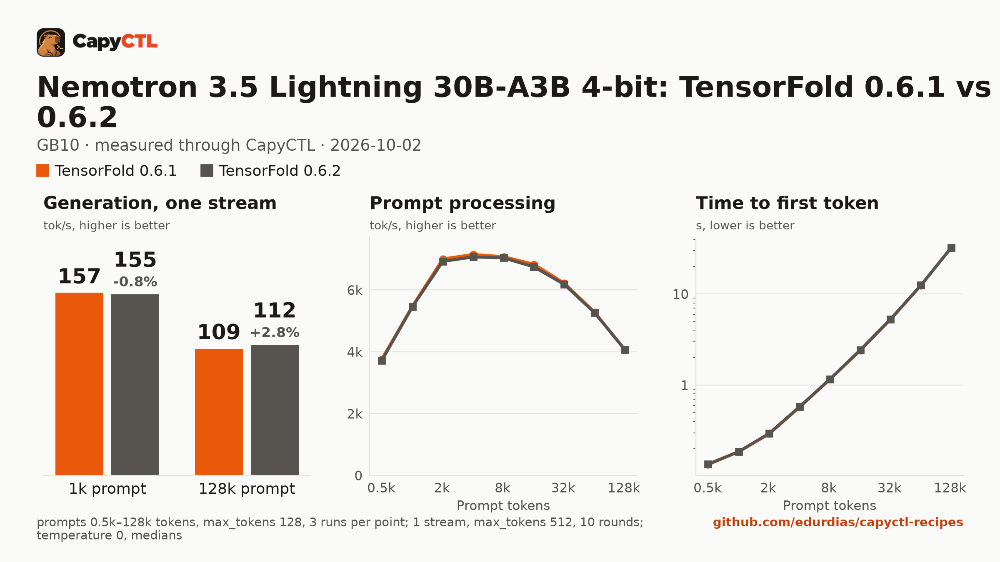

# TensorFold 0.6.1 vs 0.6.2: Nemotron 3.5 Lightning 30B-A3B 4-bit, one GB10

The same model, machine and deployment settings on two TensorFold releases,
measured through CapyCTL. The only difference between the two deployments is
the engine profile.



The full report is [bench/report.html](bench/report.html): download it and open
it locally (GitHub shows the HTML source). [bench/summary.md](bench/summary.md)
has every table, [bench/data.csv](bench/data.csv) every point, and
[bench/results/](bench/results/) the results files with every request.

## Verdict

0.6.2 is the same as 0.6.1 for this model:

- Greedy outputs are identical: the same `token_sha` for every request in both
  versions (all 27 context-sweep runs, and every prompt of the one-stream runs).
  MTP acceptance is identical too.
- Speed is within about 1%. 0.6.2 is 0.7% slower in one-stream decode, and
  prefill is 0.3% to 1.2% slower below 128k (equal at 128k). Both are
  consistent across passes and too small to notice in use.
- Startup and memory are the same: cold start 84 s vs 85 s, warm start 8.2 s,
  startup peak 26.8 vs 27.4 GiB.

## Setup

| | |
|---|---|
| Hardware | 1x NVIDIA GB10, 121.7 GiB unified memory, aarch64 |
| System | NVIDIA driver 580.173.02, CUDA 13.0 toolkit (V13.0.88) in `/usr/local/cuda`, kernel 6.17.0-1031-nvidia |
| CapyCTL | `main` at `91bfca9` (prints `capyctl 0.1.1`), release build, `capyctl start standalone` |
| TensorFold 0.6.1 | tag `v0.6.1`, commit `17c73e189f5e6a5304cda7ea37f086f9c49b4788` |
| TensorFold 0.6.2 | tag `v0.6.2`, commit `56e2e3ec55bc0ae1d7d5158c4fa2c79a3567ab21` |
| Venvs | Python 3.12.14, torch 2.13.0+cu130, triton 3.7.1, ninja 1.13.2, the same recipe for both tags |
| Model | [`Vontra/NVIDIA-Nemotron-3.5-Lightning-30B-A3B-MLX-4bit`](https://huggingface.co/Vontra/NVIDIA-Nemotron-3.5-Lightning-30B-A3B-MLX-4bit) at `d9d758fb83953437f7263256b0d96157e2a348b8` |
| Drafter | none; the model's built-in MTP heads, with TensorFold's defaults (up to 3 drafts a round) |
| Measured | 2026-10-02 |

Each venv was built the same way, with the tag changed:

```bash
uv venv -p 3.12 ~/tensorfold-0.6.1-venv
uv pip install -p ~/tensorfold-0.6.1-venv/bin/python "torch==2.13.0" triton \
    --index-url https://download.pytorch.org/whl/cu130
uv pip install -p ~/tensorfold-0.6.1-venv/bin/python \
    "tensorfold @ git+https://github.com/ashhart/TensorFold.git@v0.6.1" ninja
```

and registered as its own profile:

```bash
capyctl engine add ~/tensorfold-0.6.1-venv --name tf061
capyctl engine add ~/tensorfold-0.6.2-venv --name tf062
```

## Deployments

- [deployment-tf061.yaml](deployment-tf061.yaml) and
  [deployment-tf062.yaml](deployment-tf062.yaml), used for the one-stream runs
  and startup: `context_length: 32768`, `kv_cache_dtype: bf16`,
  `tensorfold.thinking: true`, 40 GiB `cold` and 38 GiB `ready` reservations,
  and `extra_args: [--parallel, "8", --temperature, "0"]`.
- [deployment-ctx-tf061.yaml](deployment-ctx-tf061.yaml) and
  [deployment-ctx-tf062.yaml](deployment-ctx-tf062.yaml), used for the context
  sweep: the same with `context_length: 262144` (the model's maximum) and 56 GiB
  `cold` and 54 GiB `ready`.

The two files of each pair differ only in `name` and `engine`. Only one
deployment ran at a time. CapyCTL started the engine as:

```text
tensorfold serve <model> --backend cuda --snapshot-dir none --context 32768 --kv-dtype bf16 --thinking --drafter none --parallel 8 --temperature 0
```

## Method

- Every request went through the CapyCTL inference endpoint: OpenAI streaming
  chat completions with `stream_options.include_usage`, `temperature: 0`,
  thinking on.
- **One stream**: the eight prompts of [bench/prompts.json](bench/prompts.json),
  `max_tokens: 512`, one warm-up round and 5 measured rounds per pass. Two
  passes per version, interleaved 0.6.1, 0.6.2, 0.6.1, 0.6.2, each a fresh warm
  start; the results pool both (10 rounds). Every reply ran to 512 tokens.
- **Context sweep**: one stream, 512 to 131,072 prompt tokens, 3 runs per size,
  `max_tokens: 128`. Every prompt starts with a run tag, so no prefix cache is
  reused (`cached_tokens` was 0 in every run); run *k* of a size is the same
  prompt in both versions. 0.6.1 ran first, then 0.6.2.
- Every cell is the median. Memory is system memory in use on the machine
  (`MemTotal - MemAvailable`, which includes about 4 GiB of idle system use).
- These runs used a standard-library client that sends the same requests and
  takes the same timings as capyctl-bench (time to first token is the first
  content or reasoning chunk; decode is `(tokens - 1) / (last - first)`). Its
  records were converted to the capyctl-bench results format, and
  `capyctl_bench.py report` rendered `bench/` from them; the results files name
  the converter in `tool`.

## Results

### One stream

| | 0.6.1 | 0.6.2 | Change |
|---|---|---|---|
| Aggregate, tokens/s | 143.4 | 142.2 | -0.8% |
| Decode per stream, tokens/s | 144.7 | 143.7 | -0.7% |
| Time to first token, p50 | 0.025 s | 0.031 s | +6 ms |
| MTP acceptance | 57.6% | 57.6% | same |

Both passes of 0.6.2 were below both passes of 0.6.1 in decode, by less than
1%. The 6 ms time to first token difference also held in both passes.

**Only one stream is reported.** TensorFold's CUDA engine for Nemotron serves
one request at a time in both versions: it accepts `--parallel 8` and does not
use it. With 2 to 8 concurrent streams the requests queue, aggregate
throughput stays flat at about 141 to 156 tokens/s, and time to first token
grows by one reply time per place in the queue. That measures a queue, not
batching, so 2 to 8 streams are not reported here.

### Context sweep, one stream

| Prompt tokens | Decode 0.6.1 | Decode 0.6.2 | Change | Prefill 0.6.1 | Prefill 0.6.2 | Change | TTFT 0.6.1 | TTFT 0.6.2 |
|---|---|---|---|---|---|---|---|---|
| 505 | 158.4 | 157.1 | -0.8% | 3,756 | 3,715 | -1.1% | 0.13 s | 0.14 s |
| 1,017 | 156.7 | 155.4 | -0.8% | 5,471 | 5,449 | -0.4% | 0.19 s | 0.19 s |
| 2,040 | 161.5 | 160.0 | -0.9% | 6,998 | 6,919 | -1.1% | 0.29 s | 0.29 s |
| 4,089 | 164.5 | 164.1 | -0.3% | 7,141 | 7,063 | -1.1% | 0.57 s | 0.58 s |
| 8,185 | 153.8 | 152.9 | -0.6% | 7,070 | 7,033 | -0.5% | 1.16 s | 1.16 s |
| 16,377 | 138.0 | 141.4 | +2.4% | 6,825 | 6,742 | -1.2% | 2.40 s | 2.43 s |
| 32,761 | 178.2 | 179.0 | +0.5% | 6,214 | 6,176 | -0.6% | 5.27 s | 5.30 s |
| 65,529 | 139.8 | 139.5 | -0.2% | 5,277 | 5,259 | -0.3% | 12.42 s | 12.46 s |
| 131,065 | 108.8 | 111.8 | +2.8% | 4,063 | 4,062 | -0.0% | 32.26 s | 32.26 s |

Decode and prefill in tokens/s, medians of 3 runs. Decode varies between the
3 runs of one size (for example 135 to 174 tokens/s at 16k) because the prompts
differ and so does MTP acceptance; compared run by run, 0.6.2's decode change
has a median of -0.55% and its prefill change a median of -0.8%. Peak memory is
28.7 to 28.9 GiB at every size in both versions: TensorFold allocates its
window up front.

### Startup and memory

| | 0.6.1 | 0.6.2 |
|---|---|---|
| Ready, cold (empty kernel cache) | 83.9 s | 85.0 s |
| Ready, warm (`start` after `stop`) | 8.15 to 8.16 s | 8.16 to 8.17 s |
| Startup peak measured by CapyCTL, 32k deployment | 26.76 GiB | 27.36 GiB |
| Startup peak measured by CapyCTL, 262144-token deployment | 22.50 GiB | 22.89 GiB |

## Limits

- One machine; two passes per version for the one-stream runs, one for the
  context sweep. Differences under about 1% are at the edge of what these runs
  can resolve.
- Concurrent serving could not be compared: neither version batches this model
  on CUDA.
- Startup times and peaks are single measurements.
- Thinking was on, so most of each 512-token reply is reasoning.
- Temperature 0 throughout; sampled decoding was not compared.
