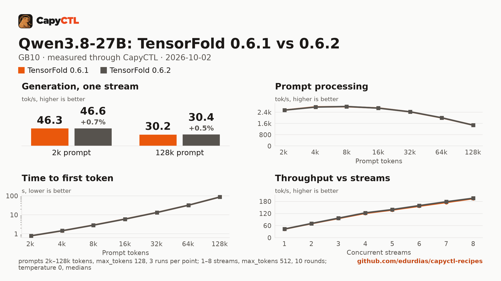

# TensorFold 0.6.1 vs 0.6.2: Qwen3.8-27B NVFP4 with DFlash2 drafts, one GB10

The same model, drafter, machine and deployment settings on two TensorFold
releases, measured through CapyCTL with capyctl-bench. The only difference
between the two deployments is the engine profile.



The full report is [bench/report.html](bench/report.html): download it and open
it locally (GitHub shows the HTML source). [bench/summary.md](bench/summary.md)
has every table, [bench/data.csv](bench/data.csv) every point, and
[bench/results/](bench/results/) the capyctl-bench results files with every
request.

## Verdict

0.6.2 is the same as 0.6.1 for this model, slightly faster:

- Greedy outputs are identical: the same `token_sha` for all 61 (streams,
  prompt) pairs of the concurrency sweep and all 27 context-sweep runs.
- Aggregate throughput is 0.5% to 2.0% higher at 1 to 8 streams.
- Decode in the context sweep is 0.3% to 1.1% higher; prompt processing and
  time to first token are within 0.4% from 2k up (within 1% at 0.5k and 1k).
- Memory is the same.

Nothing in these numbers is a reason to stay on 0.6.1 or a large reason to
move; the outputs do not change.

## Setup

| | |
|---|---|
| Hardware | 1x NVIDIA GB10, unified memory, aarch64 |
| System | NVIDIA driver 580.173.02, CUDA 13.0 toolkit (V13.0.88) in `/usr/local/cuda`, kernel 6.17.0-1031-nvidia |
| CapyCTL | `main` at `91bfca9` (prints `capyctl 0.1.1`), release build, `capyctl start standalone` |
| TensorFold 0.6.1 | tag `v0.6.1`, commit `17c73e189f5e6a5304cda7ea37f086f9c49b4788` |
| TensorFold 0.6.2 | tag `v0.6.2`, commit `56e2e3ec55bc0ae1d7d5158c4fa2c79a3567ab21` |
| Venvs | Python 3.12.14, torch 2.13.0+cu130, triton 3.7.1, the same recipe for both tags |
| Model | [`nvidia/Qwen3.8-27B-NVFP4`](https://huggingface.co/nvidia/Qwen3.8-27B-NVFP4) at `482ca0f3832238542f8f5295dde86b5f22711d80` |
| Drafter | [`z-lab/Qwen3.8-27B-DFlash2`](https://huggingface.co/z-lab/Qwen3.8-27B-DFlash2) at `50307d4c4cde6860d4eee73e2547cd786fe8e8a4` |
| Benchmark | capyctl-bench 0.1.0 from this repository |
| Measured | 2026-10-02 |

Each venv was built the same way, with the tag changed:

```bash
uv venv -p 3.12 ~/tensorfold-0.6.1-venv
uv pip install -p ~/tensorfold-0.6.1-venv/bin/python "torch==2.13.0" triton \
    --index-url https://download.pytorch.org/whl/cu130
uv pip install -p ~/tensorfold-0.6.1-venv/bin/python \
    "tensorfold @ git+https://github.com/ashhart/TensorFold.git@v0.6.1" ninja
```

and registered as its own profile:

```bash
capyctl engine add ~/tensorfold-0.6.1-venv --name tf061 \
  --approve-option=--drafter --approve-path /home/me/drafters
capyctl engine add ~/tensorfold-0.6.2-venv --name tf062 \
  --approve-option=--drafter --approve-path /home/me/drafters
```

## Deployments

- [deployment-tf061.yaml](deployment-tf061.yaml) and
  [deployment-tf062.yaml](deployment-tf062.yaml), used for the concurrency
  sweep: `context_length: 32768`, `kv_cache_dtype: bf16`, 60 GiB `cold` and
  58 GiB `ready` reservations, and
  `extra_args: [--drafter, /home/me/drafters/Qwen3.8-27B-DFlash2, --parallel, "8", --temperature, "0"]`.
- [deployment-ctx-tf061.yaml](deployment-ctx-tf061.yaml) and
  [deployment-ctx-tf062.yaml](deployment-ctx-tf062.yaml), used for the context
  sweep: the same with `context_length: 262144`, since a 32k window cannot hold
  the 64k and 128k prompts.

The two files of each pair differ only in `name` and `engine`. Only one
deployment ran at a time.

At both tags the Qwen3.8 dense CUDA engine serves concurrent requests when
`--parallel` is above 1; the engine log says `up to 8 streams`, and the engine
reported 8 requests running during the 8-stream rounds.

## Method

- Every request went through the CapyCTL inference endpoint: OpenAI streaming
  chat completions, `temperature: 0`, thinking on (the model's default).
- **Concurrency sweep**: 1 to 8 streams, `max_tokens: 512`, the eight prompts of
  capyctl-bench's `prompts.json`. Each pass was a fresh warm start, with one
  warm-up round and 5 measured rounds per stream count. The passes were
  interleaved 0.6.1, 0.6.2, 0.6.1, 0.6.2, and each version's results file pools
  its two passes (10 measured rounds per point). All 720 measured requests ran
  to 512 tokens (`finish_reason: length`).
- **Context sweep**: one stream, 0.5k to 128k prompt tokens, 3 runs per size
  after one warm-up, `max_tokens: 128`. 0.6.2 ran first, then 0.6.1.
- Every cell is the median. Memory is system memory in use on the machine
  (`MemTotal - MemAvailable`, which includes the idle system), sampled every
  0.5 s.
- The concurrency passes ran with capyctl-bench as of #2; the context sweeps and
  the report with the fixes of #3. The request path and metrics are the same in
  both; #3 adds the check that a stream ended with `[DONE]`.

The `run` command for one version's concurrency pass:

```bash
python3 tools/capyctl-bench/capyctl_bench.py run \
  --api-key-file ~/.local/state/capyctl/identity/credentials \
  --model qwen38-tf061 --label "TensorFold 0.6.1" \
  --concurrency 1-8 --rounds 5 --concurrency-max-tokens 512 --record-chunks \
  --memory-cmd "awk '/^MemTotal:/ {t=\$2} /^MemAvailable:/ {a=\$2} END {print (t-a)/1048576}' /proc/meminfo" \
  --meta gpu=GB10 --meta engine=tensorfold --meta engine_version=0.6.1 --meta capyctl=91bfca9 \
  --out conc-061-pass1.json
```

and for the context sweep, against the 262144-token deployment:

```bash
python3 tools/capyctl-bench/capyctl_bench.py run \
  --api-key-file ~/.local/state/capyctl/identity/credentials \
  --model qwen38-ctx-tf061 --label "TensorFold 0.6.1" --record-chunks \
  --context-sweep 0.5k,1k,2k,4k,8k,16k,32k,64k,128k --runs 3 --max-tokens 128 \
  --memory-cmd "awk '/^MemTotal:/ {t=\$2} /^MemAvailable:/ {a=\$2} END {print (t-a)/1048576}' /proc/meminfo" \
  --out ctx-061.json
```

## Results

### Concurrency, aggregate and per stream

| Streams | Aggregate 0.6.1 | Aggregate 0.6.2 | Change | Per stream 0.6.1 | Per stream 0.6.2 |
|---|---|---|---|---|---|
| 1 | 42.8 | 43.0 | +0.5% | 43.1 | 43.4 |
| 2 | 69.8 | 70.5 | +1.0% | 39.5 | 39.9 |
| 3 | 95.5 | 96.8 | +1.3% | 36.3 | 36.9 |
| 4 | 121.0 | 123.3 | +1.9% | 35.1 | 35.5 |
| 5 | 137.5 | 139.5 | +1.5% | 31.8 | 32.3 |
| 6 | 156.4 | 159.2 | +1.8% | 30.5 | 30.9 |
| 7 | 174.7 | 178.2 | +2.0% | 29.2 | 29.7 |
| 8 | 193.8 | 195.7 | +1.0% | 28.1 | 28.6 |

Tokens/s, medians of 10 rounds. Draft acceptance is 20% to 27% in both
versions (0.6.2 slightly lower at most stream counts). Time to first token is
0.11 s at one stream and 0.13 s to 0.43 s at 2 to 8 streams; between the
versions it moves both ways (for example -21% at 7 streams, +61% at 8), with
no consistent direction. Peak memory is 28.3 GiB at one stream and 30.6 GiB at
8 in both.

One stream here is 43.1 and 43.4 tokens/s, below the 48.2 tokens/s of the
[TensorFold recipe](../../tensorfold/qwen3.8-27b-nvfp4-gb10/). That recipe runs
a single-stream server; with `--parallel 8`, TensorFold uses narrower draft
trees (12 rows rather than 16 to 128) on one GB10, the same in both versions.
The recipe also uses its own three prompts at `temperature: 0.6`.

### Context sweep, one stream

| Prompt | Decode 0.6.1 | Decode 0.6.2 | Change | Prefill 0.6.1 | Prefill 0.6.2 | TTFT 0.6.1 | TTFT 0.6.2 | Peak memory |
|---|---|---|---|---|---|---|---|---|
| 0.5k | 136.5 | 137.9 | +1.1% | 1,815 | 1,816 | 0.28 s | 0.27 s | 28.1 / 28.2 GiB |
| 1k | 136.7 | 138.0 | +0.9% | 2,311 | 2,318 | 0.43 s | 0.43 s | 28.1 / 28.2 GiB |
| 2k | 46.3 | 46.6 | +0.7% | 2,543 | 2,543 | 0.79 s | 0.79 s | 28.3 / 28.4 GiB |
| 4k | 51.5 | 51.8 | +0.6% | 2,772 | 2,760 | 1.46 s | 1.46 s | 29.3 / 29.4 GiB |
| 8k | 45.4 | 45.7 | +0.5% | 2,790 | 2,800 | 2.88 s | 2.86 s | 30.5 / 30.5 GiB |
| 16k | 40.9 | 41.0 | +0.3% | 2,692 | 2,686 | 5.99 s | 5.97 s | 31.5 / 31.5 GiB |
| 32k | 41.1 | 41.2 | +0.4% | 2,422 | 2,425 | 13.3 s | 13.3 s | 34.5 / 34.5 GiB |
| 64k | 32.8 | 33.0 | +0.3% | 1,996 | 2,001 | 32.3 s | 32.3 s | 40.6 / 40.6 GiB |
| 128k | 30.2 | 30.4 | +0.5% | 1,479 | 1,477 | 87.1 s | 87.2 s | 52.8 / 52.8 GiB |

Decode and prefill in tokens/s, medians of 3 runs.

**Why 0.5k and 1k decode at about 137 tokens/s.** The sweep's prompts are
numbered filler sections with a question at the end. At 0.5k and 1k, DFlash2
predicts the reply well: 117 of 150 drafted tokens accepted over 10 rounds for
a 128-token reply. From 2k up the same reply takes 21 to 33 rounds, with 94 to
106 accepted of 315 to 495 drafted (one 4k run: 115 of 180). This comes from
the prompt content, not from the engine version: both versions drafted and
accepted exactly the same counts on every run. The summary image starts its
bars and lines at 2k for that reason; the full report and the tables keep
every point.

### Startup

| | 0.6.1 | 0.6.2 |
|---|---|---|
| Ready, cold (fresh state directory, kernels built) | 107.2 s | 101.9 s |
| Ready, warm (`start` after `stop`), two passes | 14.3 s, 13.8 s | 13.9 s, 13.9 s |

Single measurements.

## Limits

- One machine, two passes per version for the concurrency sweep and one pass
  for the context sweep. Differences under about 1% are at the edge of what
  these runs can resolve.
- **256k was not measured.** A 256k prompt prefills for more than 120 s without
  a stream event, and CapyCTL standalone's stream idle bound (120 s, not
  settable in standalone) closes the stream first. All three 256k requests of a
  first attempt ended at 120.5 s with no token. This is a known CapyCTL
  limitation; a fix is planned. 128k, which prefills in 87 s, is the largest
  size reported.
- Thinking was on, so most of each 512-token reply is reasoning.
- Temperature 0 throughout; sampled decoding was not compared.
