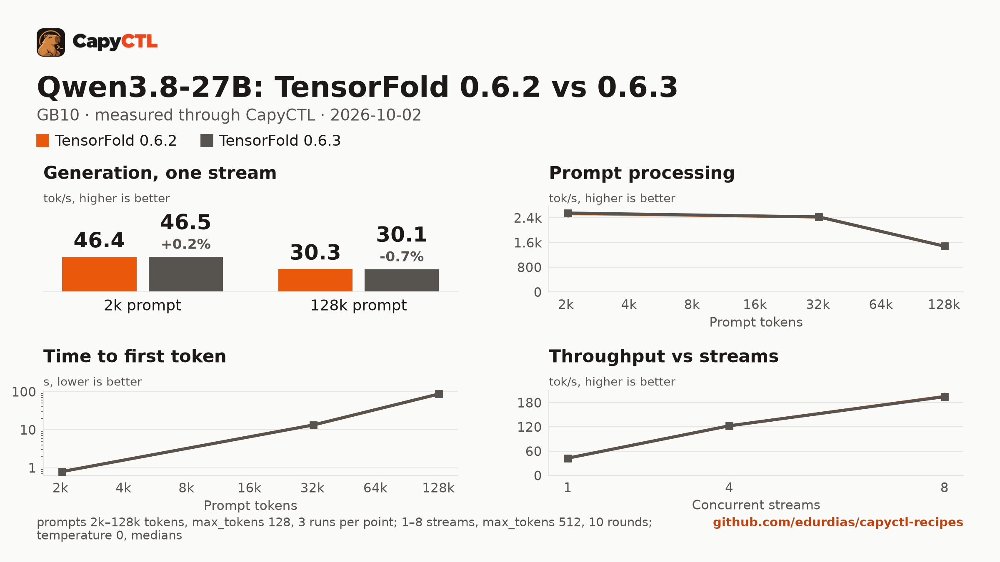

# TensorFold 0.6.2 vs 0.6.3: Qwen3.8-27B NVFP4 with DFlash2 drafts, one GB10

The same model, drafter, machine and deployment settings on two TensorFold
releases, measured through CapyCTL with capyctl-bench. The only difference
between the two deployments is the engine profile.

This is a quick check, not a full sweep: 1, 4 and 8 streams, and 2k, 32k and
128k prompts. The full sweep of the previous release is in
[tensorfold-0.6.1-vs-0.6.2-qwen3.8-27b-nvfp4-gb10](../tensorfold-0.6.1-vs-0.6.2-qwen3.8-27b-nvfp4-gb10/).



The full report is [bench/report.html](bench/report.html): download it and open
it locally (GitHub shows the HTML source). [bench/summary.md](bench/summary.md)
has every table, [bench/data.csv](bench/data.csv) every point, and
[bench/results/](bench/results/) the capyctl-bench results files with every
request.

## Verdict

0.6.3 is a drop-in replacement for 0.6.2 for this model:

- Greedy outputs are identical: the same `token_sha` for all 21 (streams,
  prompt) pairs of the concurrency runs and all 9 context runs.
- Aggregate throughput is within 0.4% at 1, 4 and 8 streams.
- Decode, prompt processing and time to first token are within 1% at 2k, 32k
  and 128k.
- Memory is the same.

One change is visible to clients: with `stream_options.include_usage`, 0.6.3
sends usage as its own final chunk with `choices: []`, then `[DONE]`. 0.6.2
put usage on the finish chunk. capyctl-bench reads both; every measured
request had its token counts (130 of 130 concurrency requests per version at
512 tokens, every context request at 128).

## Setup

| | |
|---|---|
| Hardware | 1x NVIDIA GB10, unified memory, aarch64 |
| System | NVIDIA driver 580.173.02, CUDA 13.0 toolkit (V13.0.88) in `/usr/local/cuda`, kernel 6.17.0-1031-nvidia |
| CapyCTL | `main` at `74a9b9b` (prints `capyctl 0.1.1`), release build, `capyctl start standalone` |
| TensorFold 0.6.2 | tag `v0.6.2`, commit `56e2e3ec55bc0ae1d7d5158c4fa2c79a3567ab21` |
| TensorFold 0.6.3 | tag `v0.6.3`, commit `9356df5c424b0c36b7737e37873a6f968b08de79` |
| Venvs | Python 3.12.14, torch 2.13.0+cu130, triton 3.7.1, the same recipe for both tags; `uv pip freeze` differs only in the `tensorfold` line |
| Model | [`nvidia/Qwen3.8-27B-NVFP4`](https://huggingface.co/nvidia/Qwen3.8-27B-NVFP4) at `482ca0f3832238542f8f5295dde86b5f22711d80` |
| Drafter | [`z-lab/Qwen3.8-27B-DFlash2`](https://huggingface.co/z-lab/Qwen3.8-27B-DFlash2) at `50307d4c4cde6860d4eee73e2547cd786fe8e8a4` |
| Benchmark | capyctl-bench 0.1.0 from this repository |
| Measured | 2026-10-02 |

Each venv was built the same way, with the tag changed:

```bash
uv venv -p 3.12 ~/tensorfold-0.6.3-venv
uv pip install -p ~/tensorfold-0.6.3-venv/bin/python "torch==2.13.0" triton \
    --index-url https://download.pytorch.org/whl/cu130
uv pip install -p ~/tensorfold-0.6.3-venv/bin/python \
    "tensorfold @ git+https://github.com/ashhart/TensorFold.git@v0.6.3" ninja
```

and registered as its own profile:

```bash
capyctl engine add ~/tensorfold-0.6.2-venv --name tf062 \
  --approve-option=--drafter --approve-path /home/me/drafters
capyctl engine add ~/tensorfold-0.6.3-venv --name tf063 \
  --approve-option=--drafter --approve-path /home/me/drafters
```

## Deployments

- [deployment-tf062.yaml](deployment-tf062.yaml) and
  [deployment-tf063.yaml](deployment-tf063.yaml), used for the concurrency
  runs: `context_length: 32768`, `kv_cache_dtype: bf16`, 60 GiB `cold` and
  58 GiB `ready` reservations, and
  `extra_args: [--drafter, /home/me/drafters/Qwen3.8-27B-DFlash2, --parallel, "8", --temperature, "0"]`.
- [deployment-ctx-tf062.yaml](deployment-ctx-tf062.yaml) and
  [deployment-ctx-tf063.yaml](deployment-ctx-tf063.yaml), used for the context
  runs: the same with `context_length: 262144`, since a 32k window cannot hold
  the 128k prompt.

The two files of each pair differ only in `name` and `engine`. Only one
deployment ran at a time.

## Method

- Every request went through the CapyCTL inference endpoint: OpenAI streaming
  chat completions, `temperature: 0`, thinking on (the model's default).
- **Concurrency**: 1, 4 and 8 streams, `max_tokens: 512`, the eight prompts of
  capyctl-bench's `prompts.json`. Each pass was a fresh warm start, with one
  warm-up round and 5 measured rounds per stream count. The passes were
  interleaved 0.6.2, 0.6.3, 0.6.2, 0.6.3, and each version's results file pools
  its two passes (10 measured rounds per point). All measured requests ran to
  512 tokens (`finish_reason: length`).
- **Context**: one stream, 2k, 32k and 128k prompt tokens, 3 runs per size
  after one warm-up, `max_tokens: 128`, one pass per version.
- Every cell is the median. Memory is system memory in use on the machine
  (`MemTotal - MemAvailable`, which includes the idle system), sampled every
  0.5 s.

The `run` command for one version's concurrency pass:

```bash
python3 tools/capyctl-bench/capyctl_bench.py run \
  --api-key-file ~/.local/state/capyctl/identity/credentials \
  --model qwen38-tf063 --label "TensorFold 0.6.3" \
  --concurrency 1,4,8 --rounds 5 --concurrency-max-tokens 512 --record-chunks \
  --memory-cmd "awk '/^MemTotal:/ {t=\$2} /^MemAvailable:/ {a=\$2} END {print (t-a)/1048576}' /proc/meminfo" \
  --meta gpu=GB10 --meta engine=tensorfold --meta engine_version=0.6.3 --meta capyctl=74a9b9b \
  --out conc-063-pass1.json
```

and for the context runs, against the 262144-token deployment:

```bash
python3 tools/capyctl-bench/capyctl_bench.py run \
  --api-key-file ~/.local/state/capyctl/identity/credentials \
  --model qwen38-ctx-tf063 --label "TensorFold 0.6.3" --record-chunks \
  --context-sweep 2k,32k,128k --runs 3 --max-tokens 128 \
  --memory-cmd "awk '/^MemTotal:/ {t=\$2} /^MemAvailable:/ {a=\$2} END {print (t-a)/1048576}' /proc/meminfo" \
  --out ctx-063.json
```

## Results

### Concurrency, aggregate and per stream

| Streams | Aggregate 0.6.2 | Aggregate 0.6.3 | Change | Per stream 0.6.2 | Per stream 0.6.3 |
|---|---|---|---|---|---|
| 1 | 42.7 | 42.7 | -0.1% | 43.1 | 43.0 |
| 4 | 122.6 | 122.7 | +0.1% | 34.9 | 35.3 |
| 8 | 195.3 | 194.6 | -0.4% | 28.4 | 28.3 |

Tokens/s, medians of 10 rounds. Per pass (pass 1 / pass 2), 0.6.2 ran
42.7 / 42.7, 122.5 / 122.7 and 195.1 / 195.5; 0.6.3 ran 42.6 / 42.8,
122.6 / 122.9 and 194.8 / 193.9. The 8-stream gap is smaller than the spread
between 0.6.3's own two passes. Draft acceptance is 20.6% to 26.3% in both.
Time to first token (median) is 0.11 s at one stream, 0.16 s to 0.17 s at 4
and 0.43 s to 0.44 s at 8. Peak memory is 27.1 GiB at one stream and 29.6 GiB
at 8 in both.

### Context, one stream

| Prompt | Decode 0.6.2 | Decode 0.6.3 | Change | Prefill 0.6.2 | Prefill 0.6.3 | TTFT 0.6.2 | TTFT 0.6.3 | Peak memory |
|---|---|---|---|---|---|---|---|---|
| 2k | 46.4 | 46.5 | +0.2% | 2,534 | 2,550 | 0.80 s | 0.80 s | 28.9 / 28.9 GiB |
| 32k | 41.2 | 41.3 | +0.0% | 2,422 | 2,425 | 13.3 s | 13.3 s | 33.3 / 33.3 GiB |
| 128k | 30.3 | 30.1 | -0.7% | 1,479 | 1,478 | 87.1 s | 87.0 s | 49.1 / 49.1 GiB |

Decode and prefill in tokens/s, medians of 3 runs.

### Startup

| | 0.6.2 | 0.6.3 |
|---|---|---|
| Ready, cold (fresh state directory, kernels built) | 115.1 s | 103.4 s |
| Ready, warm (`start` after `stop`), two passes | 13.8 s, 14.4 s | 13.9 s, 13.9 s |

Single measurements.

## Limits

- A quick check: three stream counts and three prompt sizes. The points in
  between were not measured on 0.6.3.
- One machine, two passes per version for the concurrency runs and one pass
  for the context runs. Differences under about 1% are at the edge of what
  these runs can resolve.
- Thinking was on, so most of each 512-token reply is reasoning.
- Temperature 0 throughout; sampled decoding was not compared.
