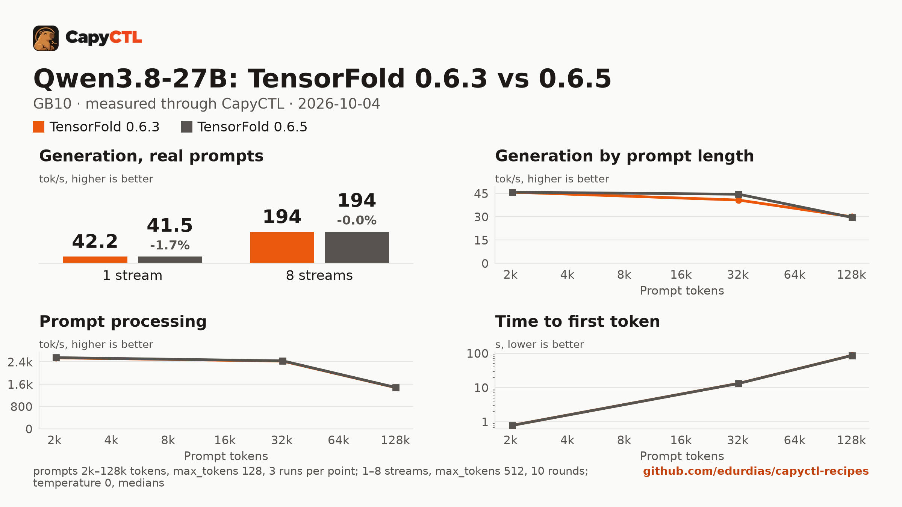

# TensorFold 0.6.3 vs 0.6.5: Qwen3.8-27B NVFP4 with DFlash2 drafts, one GB10

The same model, drafter, machine and deployment settings on two TensorFold
releases, measured through CapyCTL with capyctl-bench. The only difference
between the two deployments is the engine profile. A short one-stream run of
Nemotron 3.5 Lightning, whose MTP drafting changed in 0.6.5, is included.

This is a quick check, not a full sweep: 1, 4 and 8 streams, and 2k, 32k and
128k prompts. The previous quick check is
[tensorfold-0.6.2-vs-0.6.3-qwen3.8-27b-nvfp4-gb10](../tensorfold-0.6.2-vs-0.6.3-qwen3.8-27b-nvfp4-gb10/).



The full report is [bench/report.html](bench/report.html): download it and open
it locally (GitHub shows the HTML source). [bench/summary.md](bench/summary.md)
has every table, [bench/data.csv](bench/data.csv) every point, and
[bench/results/](bench/results/) the capyctl-bench results files with every
request. The Nemotron runs are in [bench/nemotron/](bench/nemotron/).

## Verdict

0.6.5 is a drop-in replacement for 0.6.3 for this model:

- Aggregate throughput is within 0.1% at 4 and 8 streams. At one stream the
  pooled median is 1.7% lower because of a single slower round; the other 9
  rounds match 0.6.3 to 0.1 tokens/s.
- Prompt processing and time to first token are within 0.4% at 2k, 32k and
  128k.
- Greedy outputs are identical for all 21 (streams, prompt) pairs of the
  concurrency runs and the three 2k runs. The 32k and 128k replies differ.
  TensorFold 0.6.4 changed how tree attention on CUDA adds up its partial sums
  (fp32 groups), and its release notes say long replies can differ from 0.6.3
  in the last bits. The prompts were the same, and each version gave the same
  reply on every repeat.
- Because those long-context replies differ, so does the share of drafts the
  drafter gets accepted, and decode speed at 32k and 128k follows the reply,
  not the engine (see Context below).

Nemotron 3.5 Lightning at one stream is 3.4% faster at the median (147.5
against 152.5 tokens/s), between 1.8% and 9.2% depending on the prompt, with
identical outputs.

## Setup

| | |
|---|---|
| Hardware | 1x NVIDIA GB10, unified memory, aarch64 |
| System | NVIDIA driver 580.173.02, CUDA 13.0 toolkit (V13.0.88) in `/usr/local/cuda`, kernel 6.17.0-1031-nvidia |
| CapyCTL | `main` at `9b90a56` (prints `capyctl 0.1.1`), release build, `capyctl start standalone` |
| TensorFold 0.6.3 | tag `v0.6.3`, commit `9356df5c424b0c36b7737e37873a6f968b08de79` |
| TensorFold 0.6.5 | tag `v0.6.5`, commit `609ca419abecebdc5a059498a613680bd3aa847f` |
| Venvs | Python 3.12.14, torch 2.13.0+cu130, triton 3.7.1, the same recipe for both tags; `uv pip freeze` differs only in the `tensorfold` line (and `pip`, which `--seed` adds) |
| Model | [`nvidia/Qwen3.8-27B-NVFP4`](https://huggingface.co/nvidia/Qwen3.8-27B-NVFP4) at `482ca0f3832238542f8f5295dde86b5f22711d80` |
| Drafter | [`z-lab/Qwen3.8-27B-DFlash2`](https://huggingface.co/z-lab/Qwen3.8-27B-DFlash2) at `50307d4c4cde6860d4eee73e2547cd786fe8e8a4` |
| Second model | [`Vontra/NVIDIA-Nemotron-3.5-Lightning-30B-A3B-MLX-4bit`](https://huggingface.co/Vontra/NVIDIA-Nemotron-3.5-Lightning-30B-A3B-MLX-4bit) at `d9d758fb83953437f7263256b0d96157e2a348b8`, its own MTP head, no drafter |
| Benchmark | capyctl-bench 0.1.0 from this repository |
| Measured | 2026-10-04 |

Each venv was built the same way, with the tag changed:

```bash
uv venv --python 3.12 --seed --managed-python ~/tensorfold-0.6.5-venv
uv pip install --python ~/tensorfold-0.6.5-venv/bin/python "torch==2.13.0" triton \
    --index-url https://download.pytorch.org/whl/cu130
uv pip install --python ~/tensorfold-0.6.5-venv/bin/python \
    "tensorfold @ git+https://github.com/ashhart/TensorFold.git@v0.6.5" ninja
```

and registered as its own profile:

```bash
capyctl engine add ~/tensorfold-0.6.3-venv --name tf063 \
  --approve-option=--drafter --approve-path /home/me/drafters
capyctl engine add ~/tensorfold-0.6.5-venv --name tf065 \
  --approve-option=--drafter --approve-path /home/me/drafters
```

## Deployments

- [deployment-tf063.yaml](deployment-tf063.yaml) and
  [deployment-tf065.yaml](deployment-tf065.yaml), used for the concurrency
  runs: `context_length: 32768`, `kv_cache_dtype: bf16`, 60 GiB `cold` and
  58 GiB `ready` reservations, and
  `extra_args: [--drafter, /home/me/drafters/Qwen3.8-27B-DFlash2, --parallel, "8", --temperature, "0"]`.
- [deployment-ctx-tf063.yaml](deployment-ctx-tf063.yaml) and
  [deployment-ctx-tf065.yaml](deployment-ctx-tf065.yaml), used for the context
  runs: the same with `context_length: 262144`, since a 32k window cannot hold
  the 128k prompt.
- [deployment-nemotron-tf063.yaml](deployment-nemotron-tf063.yaml) and
  [deployment-nemotron-tf065.yaml](deployment-nemotron-tf065.yaml):
  `context_length: 32768`, thinking on, 40 GiB `cold` and 38 GiB `ready`,
  `extra_args: [--parallel, "8", --temperature, "0"]`.

The two files of each pair differ only in `name` and `engine`. Only one
deployment ran at a time.

## Method

- Every request went through the CapyCTL inference endpoint: OpenAI streaming
  chat completions, `temperature: 0`, thinking on (the model's default).
- **Concurrency**: 1, 4 and 8 streams, `max_tokens: 512`, the eight prompts of
  capyctl-bench's `prompts.json`. Each pass was a fresh warm start, with one
  warm-up round and 5 measured rounds per stream count. The passes were
  interleaved 0.6.3, 0.6.5, 0.6.3, 0.6.5, and each version's results file pools
  its two passes (10 measured rounds per point). All measured requests ran to
  512 tokens (`finish_reason: length`).
- **Context**: one stream, 2k, 32k and 128k prompt tokens, 3 runs per size
  after one warm-up, `max_tokens: 128`, one pass per version.
- **Nemotron**: one stream, `max_tokens: 512`, one warm-up and 5 measured
  rounds per pass, two interleaved passes per version.
- Every cell is the median. Memory is system memory in use on the machine
  (`MemTotal - MemAvailable`, which includes the idle system), sampled every
  0.5 s.

The `run` command for one version's concurrency pass:

```bash
python3 tools/capyctl-bench/capyctl_bench.py run \
  --api-key-file ~/.local/state/capyctl/identity/credentials \
  --model qwen38-tf065 --label "TensorFold 0.6.5" \
  --concurrency 1,4,8 --rounds 5 --concurrency-max-tokens 512 --record-chunks \
  --memory-cmd "awk '/^MemTotal:/ {t=\$2} /^MemAvailable:/ {a=\$2} END {print (t-a)/1048576}' /proc/meminfo" \
  --meta gpu=GB10 --meta engine=tensorfold --meta engine_version=0.6.5 --meta capyctl=9b90a56 \
  --out conc-065-pass1.json
```

and for the context runs, against the 262144-token deployment:

```bash
python3 tools/capyctl-bench/capyctl_bench.py run \
  --api-key-file ~/.local/state/capyctl/identity/credentials \
  --model qwen38-ctx-tf065 --label "TensorFold 0.6.5" --record-chunks \
  --context-sweep 2k,32k,128k --runs 3 --max-tokens 128 \
  --memory-cmd "awk '/^MemTotal:/ {t=\$2} /^MemAvailable:/ {a=\$2} END {print (t-a)/1048576}' /proc/meminfo" \
  --out ctx-065.json
```

## Results

### Concurrency, aggregate and per stream

| Streams | Aggregate 0.6.3 | Aggregate 0.6.5 | Change | Per stream 0.6.3 | Per stream 0.6.5 |
|---|---|---|---|---|---|
| 1 | 42.2 | 41.5 | -1.7% | 42.6 | 41.8 |
| 4 | 121.3 | 121.4 | +0.1% | 34.7 | 34.9 |
| 8 | 193.9 | 193.8 | -0.0% | 28.3 | 28.3 |

Tokens/s, medians of 10 rounds. Per pass (pass 1 / pass 2), 0.6.3 ran
42.2 / 42.2, 121.5 / 121.1 and 194.2 / 193.6; 0.6.5 ran 40.7 / 42.2,
121.3 / 121.5 and 193.5 / 194.2. At one stream every round matches 0.6.3 to
0.1 tokens/s except one 0.6.5 pass-1 round on the same prompt with the same
tokens (40.7 against 42.2). Draft acceptance is 20.6% to 26.5% in both.

Time to first token at one and four streams is the same (0.12 s and 0.21 s).
At eight streams it is bimodal in both versions: a request starts in the first
prompt wave (about 0.26 s) or the second (about 0.45 s). 0.6.3 split 40/40 and
0.6.5 30/50 over 80 requests, so the median moves from 0.35 s to 0.45 s while
the mean moves from 0.342 s to 0.358 s and the 95th percentile (0.46 s) is the
same. Peak memory is 27.0 / 27.2 GiB at one stream and 29.5 GiB at 8 in both.

### Context, one stream

| Prompt | Decode 0.6.3 | Decode 0.6.5 | Prefill 0.6.3 | Prefill 0.6.5 | TTFT 0.6.3 | TTFT 0.6.5 | Peak memory |
|---|---|---|---|---|---|---|---|
| 2k | 45.8 | 45.9 | 2,544 | 2,550 | 0.79 s | 0.79 s | 28.4 / 29.4 GiB |
| 32k | 40.8 | 44.5 | 2,427 | 2,436 | 13.3 s | 13.3 s | 32.8 / 33.9 GiB |
| 128k | 30.0 | 29.6 | 1,476 | 1,481 | 87.2 s | 86.9 s | 48.6 / 49.7 GiB |

Decode and prefill in tokens/s, medians of 3 runs. At 2k the replies are the
same and decode matches. At 32k and 128k the replies differ (see the Verdict),
and decode follows how many drafts each reply gets accepted: 0.6.3's own three
32k runs ranged from 38.7 to 54.1 tokens/s, and 0.6.5's from 41.3 to 50.6.
Peak memory is about 1 GiB higher with 0.6.5 at every prompt size, the same
offset at 2k as at 128k.

### Nemotron 3.5 Lightning, one stream

| | 0.6.3 | 0.6.5 | Change |
|---|---|---|---|
| Aggregate tokens/s, median of 10 rounds | 147.5 | 152.5 | +3.4% |
| Per prompt, mean of 2 passes | 132.8 to 152.6 | 139.8 to 162.3 | +1.8% to +9.2% |
| Time to first token | 0.072 s | 0.074 s | |
| Outputs | | | identical on all 5 prompts |

In 0.6.5, Nemotron on CUDA sets each round's draft depth from costs it
measures at startup. TensorFold reports about 6% on one DGX Spark against
0.6.4; against 0.6.3 here, the gain depends on the prompt.

### Startup

| | 0.6.3 | 0.6.5 |
|---|---|---|
| Ready, cold (fresh state directory, kernels built) | 123.0 s | 104.8 s |
| Ready, warm (`start` after `stop`), two passes | 14.5 s, 14.5 s | 14.4 s, 14.5 s |

Single measurements.

## Limits

- A quick check: three stream counts and three prompt sizes. The points in
  between were not measured on 0.6.5.
- One machine, two passes per version for the concurrency runs and one pass
  for the context runs. Differences under about 1% are at the edge of what
  these runs can resolve.
- Thinking was on, so most of each 512-token reply is reasoning. 0.6.5 logs a
  warning for each reply that hits `max_tokens` while still thinking; the
  responses themselves are unchanged.
- Temperature 0 throughout; sampled decoding was not compared.
- 0.6.4 was not measured.
