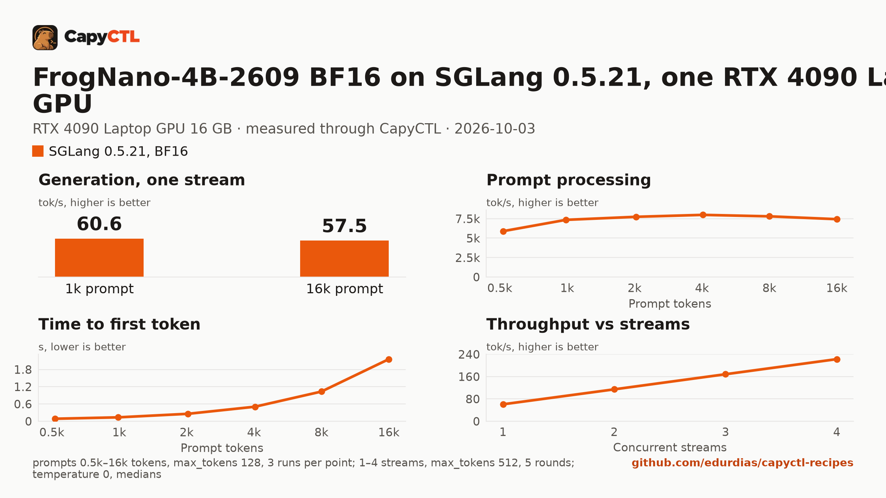

# FrogNano-4B-2609 on SGLang 0.5.21, one RTX 4090 Laptop GPU

| | |
|---|---|
| Hardware | 1x NVIDIA GeForce RTX 4090 Laptop GPU, 16 GB (16376 MiB), compute capability 8.9; Intel Core i9-14900HX, 64 GB RAM, x86_64 |
| System | Ubuntu 26.04, NVIDIA driver 615.71.09, CUDA 13.4 toolkit in `/usr/local/cuda` |
| Engine | SGLang 0.5.21 in a venv |
| Model | [`microsoft/FrogNano-4B-2609`](https://huggingface.co/microsoft/FrogNano-4B-2609) at `b90468c11a913c1916b4542b4b7a530ec42024a4`, BF16, 9.3 GB |
| Drafter | none |
| CapyCTL | `main` at `c5ebc1a` (prints `capyctl 0.1.1`); `capyctl start standalone` |
| Measured | 2026-10-03 |

This recipe needs CapyCTL newer than the 0.1.1 release: `main` at `c5ebc1a`
or later, until the next release. CapyCTL picks the tool-call and reasoning
parsers from the model family (`qwen3_coder` and `qwen3` for `qwen3_5`) and
sizes SGLang to fit a 16 GB card. The deployment file itself validates with
the 0.1.1 release, which is what this repository's check runs.

The file sets one thing, `cuda_graphs: true`. CapyCTL turns SGLang's CUDA
graphs off while a model can park; with them on, this model decodes at about
61 tokens/s here, and CapyCTL's guide measured 35 without them on the same
card. Parked, the model then keeps about 0.6 GiB more of the card.

The same checkpoint on vLLM: [vllm/frognano-4b-rtx4090](../../vllm/frognano-4b-rtx4090/).
In 4-bit on TensorFold: [tensorfold/frognano-4b-mlx-4bit-rtx4090](../../tensorfold/frognano-4b-mlx-4bit-rtx4090/).

## Run it

The API key comes from the credentials file the start banner names:

```bash
KEY=$(sed -n 's/^api_key: //p' ~/.local/state/capyctl/identity/credentials)
```

```bash
capyctl engine add ~/sglang-0.5.21-venv
```

```text
Registered sglang (sglang 0.5.21)

  Executable     /home/me/sglang-0.5.21-venv/bin/python3
  Deep park      enabled
  CUDA           /usr/local/cuda
  Engines file   /home/me/.config/capyctl/engines.yaml (revision 3)
  Published      yes
```

```bash
capyctl deploy model --file deployment.yaml
```

```text
Request identity: 01M412JY6HQPRKBVVKJE6ZG61K (reuse --request-id 01M412JY6HQPRKBVVKJE6ZG61K to recover this command)
Deployment frognano-4b-sglang created (revision 1)

  Deployment ID       01M412JY6TKDN0DBQPD0HGZ1DQ
  Operation           01M412JY6T9JTS0ZP28EFD73AW
  Checkpoint digest   being measured
the checkpoint digest of frognano-4b-sglang is being measured; `capyctl start deployment frognano-4b-sglang --wait` waits for it and starts the deployment
```

The weights were already in the model store from the vLLM recipe, so this
start only measured the checkpoint digest; on a fresh machine it downloads the
9.3 GB checkpoint first.

```bash
capyctl start deployment frognano-4b-sglang --wait
```

```text
Request identity: 01M412JY88G0Z8V2TB5EGBZ4DC (reuse --request-id 01M412JY88G0Z8V2TB5EGBZ4DC to recover this command)
Waiting for the checkpoint digest of frognano-4b-sglang to be measured (at most 900s)
Started frognano-4b-sglang: ready

  Ready       1/1
  Hosts       host-a
  Operation   initialize succeeded
```

FrogNano thinks before it answers; SGLang returns the thinking in
`reasoning_content`:

```bash
curl -s http://127.0.0.1:8443/v1/chat/completions \
  -H "Authorization: Bearer $KEY" -H 'Content-Type: application/json' \
  -d '{"model": "frognano-4b-sglang", "messages": [{"role": "user", "content": "Name the largest planet in one sentence."}]}' \
  | jq -r '.choices[0].message.content'
```

```text


Jupiter is the largest planet in our solar system.
```

Tool calls come back structured, with `finish_reason: tool_calls`:

```bash
curl -s http://127.0.0.1:8443/v1/chat/completions \
  -H "Authorization: Bearer $KEY" -H 'Content-Type: application/json' \
  -d '{"model": "frognano-4b-sglang", "messages": [{"role": "user", "content": "What is the weather in Lisbon, in celsius?"}],
       "tools": [{"type": "function", "function": {"name": "get_weather", "description": "Get the current weather for a city.",
         "parameters": {"type": "object", "properties": {"city": {"type": "string"}, "unit": {"type": "string", "enum": ["celsius", "fahrenheit"]}}, "required": ["city"]}}}]}' \
  | jq -c '.choices[0] | {finish_reason, tool_calls: .message.tool_calls}'
```

```json
{"finish_reason":"tool_calls","tool_calls":[{"function":{"arguments":"{\"city\": \"Lisbon\", \"unit\": \"celsius\"}","name":"get_weather"},"id":"call_18d17c2b3f064780840021e7","type":"function"}]}
```

## Measured through CapyCTL

| | |
|---|---|
| Ready, cold | 56 s (`start` after `deploy model`, weights already in the model store; includes measuring the checkpoint digest) |
| Ready, warm | 56 s (`start` after `stop` finished) |
| Time to first token | 0.049 s median (0.046 to 0.052) |
| Decode, one stream | 61.2 tokens/s median (61.1 to 61.3) |
| Peak memory | 13.5 GiB of GPU memory, whole-card `nvidia-smi`, against the 14.5 GiB GPU and 4 GiB RAM reservation CapyCTL sized for the card (its default startup size) |
| Context | 30,128 tokens, fitted by CapyCTL (it counts every layer of this hybrid model as full attention) |

Three streaming chat completions through the CapyCTL endpoint, one at a time,
`max_tokens: 512`, `temperature: 0`, thinking on (the model's default; the
first token counted is the first `reasoning_content` token). Two requests
generated all 512 tokens; the third finished on its own at 359.

## Benchmark

[`bench/`](bench/) has the capyctl-bench results and report
([`report.html`](bench/report.html), [`summary.md`](bench/summary.md),
[`data.csv`](bench/data.csv)). Context sweep 0.5k to 16k tokens (the fitted
context is 30,128, below the 32k point), three runs per point,
`max_tokens: 128`; concurrency 1 to 4 streams, five rounds each,
`max_tokens: 512`; `temperature: 0`, thinking on; GPU memory sampled with
`nvidia-smi`.

| Context | Time to first token | Decode, one stream |
|---|---|---|
| 0.5k | 0.09 s | 61.0 tokens/s |
| 2k | 0.26 s | 59.9 tokens/s |
| 8k | 1.03 s | 59.0 tokens/s |
| 16k | 2.16 s | 57.5 tokens/s |

| Streams | Aggregate | Per stream | Time to first token, median |
|---|---|---|---|
| 1 | 60.8 tokens/s | 61.1 tokens/s | 0.04 s |
| 2 | 114.4 tokens/s | 57.6 tokens/s | 0.08 s |
| 4 | 222.6 tokens/s | 56.1 tokens/s | 0.08 s |


