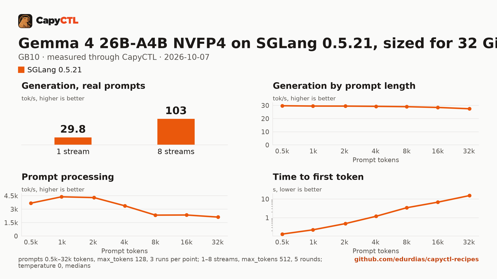

# Gemma 4 26B-A4B NVFP4 on SGLang 0.5.21, sized for 32 GiB, one GB10

| | |
|---|---|
| Hardware | 1x NVIDIA GB10 (DGX Spark class), compute capability 12.1, 128 GB unified memory, aarch64 |
| System | Ubuntu 24.04, NVIDIA driver 580.173.02, CUDA 13.0 toolkit in `/usr/local/cuda` |
| Engine | SGLang 0.5.21 in a venv (torch 2.13.0, FlashInfer 0.6.18, sglang-kernel 0.4.7) |
| Model | [`nvidia/Gemma-4-26B-A4B-NVFP4`](https://huggingface.co/nvidia/Gemma-4-26B-A4B-NVFP4) at `a19cfe00be84568a6867111c9a68c9c44fdcffe6`, NVFP4 W4A4 (ModelOpt), 18.8 GB |
| Drafter | none |
| CapyCTL | `main` at `7e50aa9` (prints `capyctl 0.1.2`), release build; `capyctl start standalone` with its default limits |
| Measured | 2026-10-07 |

Gemma 4 26B-A4B for a GPU with 32 GB: the deployment is sized so the model,
once ready, fits in 32 GiB, with up to 4 requests together. It was validated
on a GB10, not on a 32 GB card. The
[vLLM](../../vllm/gemma-4-26b-a4b-nvfp4-32gib-gb10/) recipe sized for the
same 32 GiB serves the same weights in less memory. TensorFold 0.6.5: not
supported on GB10; Gemma 4 has only an MLX engine (no CUDA engine). Needs new
model support in TensorFold.

### What the file sets, and why

- `quantization: modelopt_fp4`: with it SGLang serves the NVFP4 experts with
  FlashInfer's CUTLASS MoE kernels. With `quantization: modelopt` the start
  failed (`AttributeError: 'FusedMoE' object has no attribute
  'g1_scale_c'`); with `--moe-runner-backend marlin` it failed too, because
  the Marlin MoE kernels take only gated SiLU experts and Gemma's use GELU
  (`Only gated SiLU/SiTU is supported, got gelu`); and
  `--moe-runner-backend flashinfer_cutlass` with `quantization: modelopt` was
  refused (`FlashInfer Cutlass MOE supports only: 'modelopt_fp4', ...`).
- `memory.request: 32GiB`: SGLang loads 19.1 GB of weights. CapyCTL derives
  SGLang's static pool (`--mem-fraction-static`) from the request and keeps
  an 8 GiB margin on unified memory, so 32 GiB gives SGLang a 24 GiB pool
  (fraction 0.2042); the part the weights leave over holds an FP8 KV cache of
  42,353 full-attention and 33,882 sliding-window tokens (3.6 GB). Sized from
  `memory.kv_cache: 3GiB` instead, the pool came out at fraction 0.1744 and
  left a KV cache of 2,720 tokens.
- The vision tower loads too; text requests do not use it.

### Memory

Up to 4 requests run together (`max_concurrent_requests: 4`).

| | |
|---|---|
| Ready footprint | 28.2 to 29.0 GiB after a cold start, 28.1 to 28.2 GiB after a warm one, 30.6 GiB after the benchmark: machine memory in use once ready, less what was in use before the start. SGLang's own GPU allocations are 23.0 to 23.2 GiB at rest and peaked at 25.5 GiB during the benchmark |
| Loading peak | 33.5 GiB during the cold start, 33.6 GiB during a warm one (`MemAvailable` drop); CapyCTL measured 33.5 GiB both times |
| Fits | 32 GiB: yes, with 1.4 GiB to spare after the benchmark. 24 GiB: no |

On the GB10's unified memory the loading peak and the engine's CPU-side
memory come out of the same pool as the GPU's. On a discrete card most of
that lands in system RAM, so the ready footprint is the number to compare
with a card's VRAM.

SGLang 0.5.21 cannot reload ModelOpt NVFP4 weights from disk, which a deep
park's wake does, so the file sets `residency: restart_only`: CapyCTL stops
the model and starts it again when it needs the memory, and `capyctl park`
answers `error [unsupported]: unsupported_capability`.

## Run it

The API key comes from the credentials file the start banner names:

```bash
KEY=$(sed -n 's/^api_key: //p' ~/.local/state/capyctl/identity/credentials)
```

```bash
capyctl engine add ~/sglang-0.5.21-venv
```

```text
Registered sglang (sglang 0.5.21)

  Executable     /home/me/sglang-0.5.21-venv/bin/python3
  Deep park      enabled
  CUDA           /usr/local/cuda
  Engines file   /home/me/.config/capyctl/engines.yaml (revision 1)
  Published      yes
```

```bash
capyctl deploy model --file deployment.yaml
```

```text
Request identity: 01M4BP8MMMSN7XW35VW4YAN6BA (reuse --request-id 01M4BP8MMMSN7XW35VW4YAN6BA to recover this command)
Deployment gemma4-26b-a4b-sglang created (revision 1)

  Deployment ID       01M4BP8MN912V91VSQCW4XVZ5Z
  Operation           01M4BP8MN9VN64QPCDV1N3XBMR
  Checkpoint digest   being measured
the checkpoint digest of gemma4-26b-a4b-sglang is being measured; `capyctl start deployment gemma4-26b-a4b-sglang --wait` waits for it and starts the deployment
```

```bash
capyctl start deployment gemma4-26b-a4b-sglang --wait
```

```text
Request identity: 01M4BNWG8WHHNNM39Q1X48TMRN (reuse --request-id 01M4BNWG8WHHNNM39Q1X48TMRN to recover this command)
Waiting for the checkpoint digest of gemma4-26b-a4b-sglang to be measured (at most 900s)
Started gemma4-26b-a4b-sglang: ready

  Ready       1/1
  Hosts       host-a
  Operation   initialize succeeded
```

`capyctl status deployment gemma4-26b-a4b-sglang`:

```text
NAME                    STATE   READY   REVISION   STARTUP    INITIALIZE   LAST OPERATION
gemma4-26b-a4b-sglang   ready   1/1     1          48.6 GiB   790s         initialize succeeded

INSTANCE   HOST     STATE   LIFECYCLE   DEVICES   LAST ERROR
0          host-a   ready   active      gpu0      -

Engine  sglang 0.5.21 (/home/me/sglang-0.5.21-venv/bin/python3)
Parsers tool calls: gemma4, reasoning: gemma4
note: deployment gemma4-26b-a4b-sglang serves /metrics without authentication on its loopback listener (read_only; a known and accepted limitation)
```

Gemma 4 answers without thinking unless a request turns it on, so the answer
is all in `content`:

```bash
curl -s http://127.0.0.1:8443/v1/chat/completions \
  -H "Authorization: Bearer $KEY" -H 'Content-Type: application/json' \
  -d '{"model": "gemma4-26b-a4b-sglang", "messages": [{"role": "user", "content": "Name the largest planet in one sentence."}]}' \
  | jq -r '.choices[0].message.content'
```

```text
Jupiter is the largest planet in our solar system.
```

## Measured through CapyCTL

| | |
|---|---|
| Ready, cold | 124 s (the first start of the deployment; weights already on disk, page cache dropped; includes measuring the checkpoint digest, SGLang's weight loading and CUDA graph capture) |
| Ready, warm | 134 s (`start` after `stop` finished, page cache dropped again; SGLang repeats its startup) |
| Time to first token | 0.085 s median (0.082 to 0.089) |
| Decode, one stream | 30.0 tokens/s median (30.0 to 30.1) |
| Peak memory | 33.5 GiB measured by CapyCTL on the cold and the warm start; ready footprint in [Memory](#memory) |
| Park | refused (`restart_only`) |
| Concurrency | up to 4 requests together (`max_concurrent_requests: 4`) |
| Context | 32,768 tokens, declared |

Three streaming chat completions through the CapyCTL endpoint, one at a time,
`max_tokens: 512`, `temperature: 0.6`, thinking off (the model's default).
The three prompts are the first three of capyctl-bench's prompt set
(`explain-tcp`, `python-lru`, `history-printing`); every request generated
all 512 tokens. The same three requests after the warm start gave 0.083 s and
30.0 tokens/s.

## Benchmark

[`bench/`](bench/) has the capyctl-bench results and report
([`report.html`](bench/report.html), [`summary.md`](bench/summary.md),
[`data.csv`](bench/data.csv)). Context sweep 0.5k to 32k tokens, three runs per
point, `max_tokens: 128`; concurrency 1 to 8 streams, five rounds each,
`max_tokens: 512`; `temperature: 0`, thinking off; machine memory in use
(`MemTotal - MemAvailable`, 3.6 GiB before the model started) sampled every
0.5 s.

| Context | Time to first token | Decode, one stream | Memory in use, peak |
|---|---|---|---|
| 0.5k | 0.13 s | 29.7 tokens/s | 32.0 GiB |
| 1k | 0.23 s | 29.5 tokens/s | 32.0 GiB |
| 2k | 0.49 s | 29.5 tokens/s | 32.0 GiB |
| 4k | 1.20 s | 29.3 tokens/s | 32.7 GiB |
| 8k | 3.43 s | 29.0 tokens/s | 33.5 GiB |
| 16k | 6.83 s | 28.4 tokens/s | 34.2 GiB |
| 32k | 15.3 s | 27.5 tokens/s | 34.2 GiB |

| Streams | Together | Each | Time to first token |
|---|---|---|---|
| 1 | 29.8 tokens/s | 29.9 tokens/s | 0.08 s |
| 2 | 62.0 tokens/s | 31.2 tokens/s | 0.10 s |
| 3 | 76.8 tokens/s | 25.7 tokens/s | 0.09 s |
| 4 | 103 tokens/s | 25.7 tokens/s | 0.09 s |
| 5 | 68.9 tokens/s | 26.1 tokens/s | 0.09 s |
| 6 | 84.1 tokens/s | 25.7 tokens/s | 0.10 s |
| 7 | 90.0 tokens/s | 25.8 tokens/s | 0.10 s |
| 8 | 103 tokens/s | 25.8 tokens/s | 10.0 s |

Four streams decode 3.4 times as many tokens as one. Past four, the extra
requests wait for a running one to finish: at 5 to 8 streams the total falls
back to 69 to 103 tokens/s, and at 8 the median time to first token is
10.0 s. Machine memory in use rose from 31.7 to 34.3 GiB during the context
sweep (SGLang's GPU allocations grew from 23.0 to 25.5 GiB) and stayed there,
30.7 GiB above what was in use before the start.



The model needs about 18.8 GB in the model store; with the download, the first
start takes as long as the download plus the time above.
