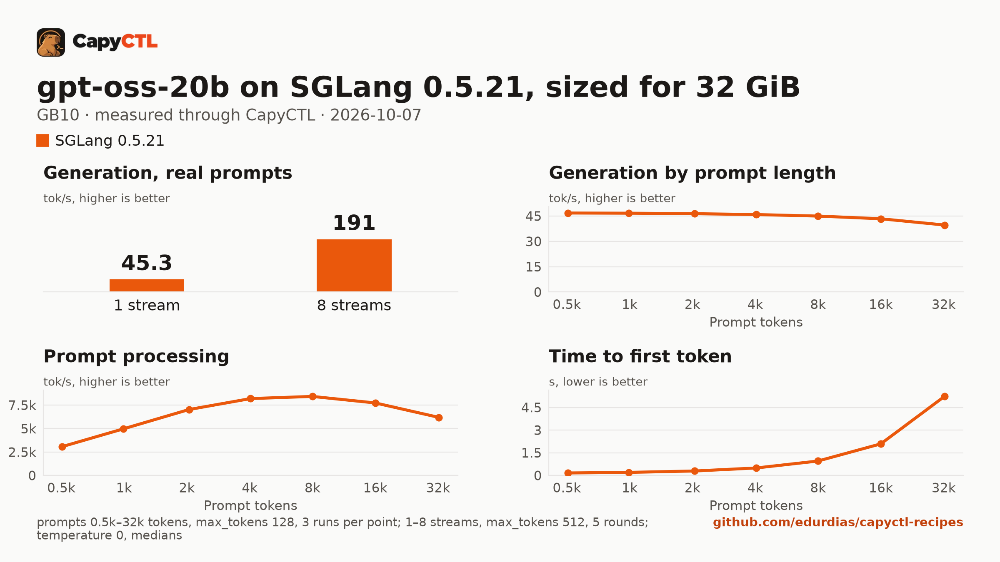

# gpt-oss-20b on SGLang 0.5.21, sized for 32 GiB, one GB10

| | |
|---|---|
| Hardware | 1x NVIDIA GB10 (DGX Spark class), compute capability 12.1, 128 GB unified memory, aarch64 |
| System | Ubuntu 24.04, NVIDIA driver 580.173.02, CUDA 13.0 toolkit in `/usr/local/cuda` |
| Engine | SGLang 0.5.21 in a venv (torch 2.13.0, FlashInfer 0.6.18, sglang-kernel 0.4.7) |
| Model | [`openai/gpt-oss-20b`](https://huggingface.co/openai/gpt-oss-20b) at `6cee5e81ee83917806bbde320786a8fb61efebee`, MXFP4 experts with the rest in BF16, 13.8 GB |
| Drafter | none |
| CapyCTL | `main` at `7e50aa9` (prints `capyctl 0.1.2`), release build; `capyctl start standalone` with its default limits |
| Measured | 2026-10-07 |

gpt-oss-20b for a GPU with 32 GB: the deployment is sized so the model, once
ready, fits in 32 GiB, with up to 8 requests together. It was validated on a
GB10, not on a 32 GB card. The
[vLLM](../../vllm/gpt-oss-20b-32gib-gb10/) recipe sized for the same 32 GiB
serves the same weights in less memory. TensorFold 0.6.5: not supported on
GB10; gpt-oss is not a TensorFold model family. Needs new model support in
TensorFold.

### What the file sets, and why

- `memory.request: 32GiB`: SGLang loads this checkpoint as 17.1 GB of
  weights, more than the 13.8 GB on disk. CapyCTL derives SGLang's static
  pool (`--mem-fraction-static`) from the request and keeps an 8 GiB margin
  on unified memory, so 32 GiB gives SGLang a 24 GiB pool (fraction 0.2043);
  the part the weights and CUDA graphs leave over holds the KV cache, 140,310
  full-attention and 112,248 sliding-window tokens in BF16 (5.8 GB). With
  `memory.request: 24GiB` SGLang refused to start (`Loaded weights leave no
  GPU memory for the KV cache`).
- The tokenizer vocabulary: unlike vLLM, SGLang serves chat completions for
  gpt-oss without the `o200k_base` file. Without it SGLang only disables its
  Responses API (`/v1/responses disabled ... HarmonyError`), which CapyCTL's
  endpoint does not use, so this recipe needs no engine environment.

### Memory

Up to 8 requests run together (`max_concurrent_requests: 8`).

| | |
|---|---|
| Ready footprint | 27.5 GiB after a cold start, after a warm one and after the benchmark: machine memory in use once ready, less what was in use before the start. SGLang's own GPU allocations are 22.4 GiB at rest and peaked at 22.5 GiB during the benchmark |
| Loading peak | 30.9 GiB during the cold start, 31.0 GiB during a warm one (`MemAvailable` drop); CapyCTL measured 30.9 GiB both times |
| Fits | 32 GiB: yes, with 4.5 GiB to spare. 24 GiB: no |

On the GB10's unified memory the loading peak and the engine's CPU-side
memory come out of the same pool as the GPU's. On a discrete card most of
that lands in system RAM, so the ready footprint is the number to compare
with a card's VRAM.

### The first start on a machine

The first time SGLang 0.5.21 serves gpt-oss on a machine, FlashInfer tunes
its MXFP4 MoE kernels and caches the result under
`~/.cache/sglang/flashinfer/autotune`. On the GB10 that first start took
533 s, and machine memory in use rose 93 GiB above what was in use before it
while the tuning ran. Every later start reads the cache: the starts measured
below took 139 s and 149 s. A card with less memory than that has to tune
within what it has; this was not measured.

### Restart instead of deep parking

CapyCTL parks SGLang deep by default: SGLang releases its memory and reloads
the weights from disk on wake. SGLang 0.5.21 does not reload gpt-oss that
way. The same file without `residency: restart_only`, measured on the same
machine:

- With deep parking on, SGLang loaded the weights as 20.8 GB, so the same
  24 GiB pool left a KV cache of only 49,330 full-attention tokens; ready
  footprint 30.0 GiB, 45.6 tokens/s for one stream.
- Park works: SGLang held 4.3 GiB of GPU memory parked, machine memory in use
  fell from 33.6 to 12.7 GiB, and CapyCTL measured a 7.9 GiB parked charge.
- The wake fails: SGLang's weight reload
  (`update_weights_from_disk`) stops with
  `TypeError: default_weight_loader() got an unexpected keyword argument 'weight_name'`.
  The request sent to the parked model was answered after 6 s with
  `{"code":"activation_uncertain", ...}`, and CapyCTL kept the deployment
  out of service.

So this file sets `residency: restart_only`: CapyCTL stops the model and
starts it again when it needs the memory, and `capyctl park` answers
`error [unsupported]: unsupported_capability`.

## Run it

The API key comes from the credentials file the start banner names:

```bash
KEY=$(sed -n 's/^api_key: //p' ~/.local/state/capyctl/identity/credentials)
```

```bash
capyctl engine add ~/sglang-0.5.21-venv
```

```text
Registered sglang (sglang 0.5.21)

  Executable     /home/me/sglang-0.5.21-venv/bin/python3
  Deep park      enabled
  CUDA           /usr/local/cuda
  Engines file   /home/me/.config/capyctl/engines.yaml (revision 1)
  Published      yes
```

```bash
capyctl deploy model --file deployment.yaml
```

```text
Request identity: 01M4BGCK733H2PDTKAAWQGEPSE (reuse --request-id 01M4BGCK733H2PDTKAAWQGEPSE to recover this command)
Deployment gpt-oss-20b-sglang created (revision 1)

  Deployment ID       01M4BGCK7Y87W67GW89WPPCDEJ
  Operation           01M4BGCK7YDN4AD37BWEZ2CSS3
  Checkpoint digest   being measured
the checkpoint digest of gpt-oss-20b-sglang is being measured; `capyctl start deployment gpt-oss-20b-sglang --wait` waits for it and starts the deployment
```

```bash
capyctl start deployment gpt-oss-20b-sglang --wait
```

```text
Request identity: 01M4BGCKBYWGB7YSSNFRR5BQCZ (reuse --request-id 01M4BGCKBYWGB7YSSNFRR5BQCZ to recover this command)
Waiting for the checkpoint digest of gpt-oss-20b-sglang to be measured (at most 900s)
Started gpt-oss-20b-sglang: ready

  Ready       1/1
  Hosts       host-a
  Operation   initialize succeeded
```

`capyctl status deployment gpt-oss-20b-sglang`:

```text
NAME                 STATE   READY   REVISION   STARTUP    INITIALIZE   LAST OPERATION
gpt-oss-20b-sglang   ready   1/1     1          38.1 GiB   740s         initialize succeeded

INSTANCE   HOST     STATE   LIFECYCLE   DEVICES   LAST ERROR
0          host-a   ready   active      gpu0      -

Engine  sglang 0.5.21 (/home/me/sglang-0.5.21-venv/bin/python3)
Parsers tool calls: gpt-oss, reasoning: gpt-oss
note: deployment gpt-oss-20b-sglang serves /metrics without authentication on its loopback listener (read_only; a known and accepted limitation)
```

gpt-oss reasons before it answers; with the `gpt-oss` reasoning parser SGLang
returns the reasoning in `reasoning_content` and the answer in `content`:

```bash
curl -s http://127.0.0.1:8443/v1/chat/completions \
  -H "Authorization: Bearer $KEY" -H 'Content-Type: application/json' \
  -d '{"model": "gpt-oss-20b-sglang", "messages": [{"role": "user", "content": "Name the largest planet in one sentence."}]}' \
  | jq -r '.choices[0].message.content'
```

```text
Jupiter is the largest planet in our Solar System.
```

## Measured through CapyCTL

| | |
|---|---|
| Ready, cold | 139 s (the first start of the deployment, FlashInfer's tuning already cached; weights already on disk, page cache dropped; includes measuring the checkpoint digest, SGLang's weight loading and CUDA graph capture) |
| Ready, warm | 149 s (`start` after `stop` finished, page cache dropped again; SGLang repeats its startup) |
| Time to first token | 0.137 s median (0.136 to 0.147) |
| Decode, one stream | 45.8 tokens/s median (45.8 to 45.9) |
| Peak memory | 30.9 GiB measured by CapyCTL on the cold and the warm start; ready footprint in [Memory](#memory) |
| Park | refused (`restart_only`); see [Restart instead of deep parking](#restart-instead-of-deep-parking) |
| Concurrency | up to 8 requests together (`max_concurrent_requests: 8`) |
| Context | 32,768 tokens, declared |

Three streaming chat completions through the CapyCTL endpoint, one at a time,
`max_tokens: 512`, `temperature: 0.6`, reasoning on (the model's default
effort; the first token counted is the first `reasoning_content` token). The
three prompts are the first three of capyctl-bench's prompt set
(`explain-tcp`, `python-lru`, `history-printing`); every request generated all
512 tokens. The same three requests after the warm start gave 0.141 s and
45.8 tokens/s.

## Benchmark

[`bench/`](bench/) has the capyctl-bench results and report
([`report.html`](bench/report.html), [`summary.md`](bench/summary.md),
[`data.csv`](bench/data.csv)). Context sweep 0.5k to 32k tokens, three runs per
point, `max_tokens: 128`; concurrency 1 to 8 streams, five rounds each,
`max_tokens: 512`; `temperature: 0`, reasoning on; machine memory in use
(`MemTotal - MemAvailable`, 3.5 GiB before the model started) sampled every
0.5 s.

| Context | Time to first token | Decode, one stream | Memory in use, peak |
|---|---|---|---|
| 0.5k | 0.16 s | 46.8 tokens/s | 31.0 GiB |
| 1k | 0.20 s | 46.6 tokens/s | 31.0 GiB |
| 2k | 0.29 s | 46.4 tokens/s | 31.0 GiB |
| 4k | 0.49 s | 45.8 tokens/s | 31.0 GiB |
| 8k | 0.95 s | 45.0 tokens/s | 31.0 GiB |
| 16k | 2.09 s | 43.4 tokens/s | 31.0 GiB |
| 32k | 5.23 s | 39.7 tokens/s | 31.2 GiB |

| Streams | Together | Each | Time to first token |
|---|---|---|---|
| 1 | 45.3 tokens/s | 45.8 tokens/s | 0.14 s |
| 2 | 83.2 tokens/s | 42.0 tokens/s | 0.12 s |
| 3 | 91.0 tokens/s | 30.5 tokens/s | 0.14 s |
| 4 | 125 tokens/s | 31.6 tokens/s | 0.13 s |
| 5 | 126 tokens/s | 25.5 tokens/s | 0.14 s |
| 6 | 146 tokens/s | 24.4 tokens/s | 0.15 s |
| 7 | 161 tokens/s | 23.1 tokens/s | 0.16 s |
| 8 | 191 tokens/s | 24.0 tokens/s | 0.16 s |

Eight streams decode 4.2 times as many tokens as one. Machine memory in use
stayed between 31.0 and 31.2 GiB through the whole benchmark, 27.6 GiB above
what was in use before the start.



The model needs about 13.8 GB in the model store; with the download, the first
start takes as long as the download plus the time above.
