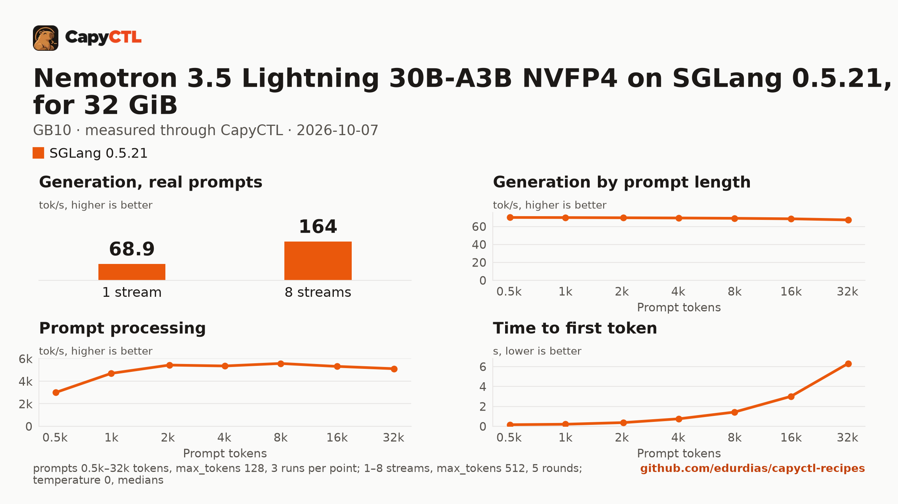

# Nemotron 3.5 Lightning 30B-A3B NVFP4 on SGLang 0.5.21, sized for 32 GiB, one GB10

| | |
|---|---|
| Hardware | 1x NVIDIA GB10 (DGX Spark class), compute capability 12.1, 128 GB unified memory, aarch64 |
| System | Ubuntu 24.04, NVIDIA driver 580.173.02, CUDA 13.0 toolkit in `/usr/local/cuda` |
| Engine | SGLang 0.5.21 in a venv (torch 2.13.0, FlashInfer 0.6.18, sglang-kernel 0.4.7) |
| Model | [`nvidia/NVIDIA-Nemotron-3.5-Lightning-30B-A3B-NVFP4`](https://huggingface.co/nvidia/NVIDIA-Nemotron-3.5-Lightning-30B-A3B-NVFP4) at `bee7596271d1495f6992ae224aefde4410e816b8`, ModelOpt mixed precision (NVFP4 weight-only experts, FP8 mixer projections), 21.6 GB |
| Drafter | none |
| CapyCTL | `main` at `7e50aa9` (prints `capyctl 0.1.2`), release build; `capyctl start standalone` with its default limits |
| Measured | 2026-10-07 |

Nemotron 3.5 Lightning for a GPU with 32 GB: the deployment is sized so the
model, once ready, fits in 32 GiB, with up to 4 requests together. It was
validated on a GB10, not on a 32 GB card. The
[vLLM](../../vllm/nemotron-3.5-lightning-30b-a3b-nvfp4-32gib-gb10/) recipe
sized for the same 32 GiB serves the same weights and parks deep; the
[TensorFold](../../tensorfold/nemotron-3.5-lightning-30b-a3b-mlx-4bit-32gib-gb10/)
one serves TensorFold's MLX 4-bit export.

### What the file sets, and why

- `--max-mamba-cache-size 20`: SGLang keeps 5 Mamba state slots per running
  request, so 4 requests need 20. Without the flag SGLang sized the state
  pool from what was left on each start: 20 slots on one start, 16 on the
  next two, and then `max_running_requests is capped to 3 by the mamba state
  cache (max_mamba_cache_size=16, 5 state slots per request)`; with 4 streams
  the benchmark got 111 tokens/s together instead of 163.
- `--mamba-ssm-dtype float16`: the Mamba state in FP16, as NVIDIA's model card
  and SGLang's cookbook set it for this model.
- `--moe-runner-backend marlin`: the experts are weight-only NVFP4, the same
  path on which SGLang's default MoE kernels failed for the
  [Qwen3.6-35B-A3B NVFP4 recipe](../qwen3.6-35b-a3b-nvfp4-32gib-gb10/)
  (`'FusedMoE' object has no attribute 'g1_scale_c'`). The default path was
  not tried again for this model.
- `--cuda-graph-max-bs-decode 4`: decode graphs up to the 4 requests.
- `memory.kv_cache: 3GiB`: CapyCTL sizes SGLang's static pool from it
  (fraction 0.1966). SGLang allocated an FP8 KV cache of 125,013 to 150,763
  tokens for the attention layers (it varied from start to start) and 20
  Mamba state slots (0.5 GB).

### Memory

Up to 4 requests run together (`max_concurrent_requests: 4`).

| | |
|---|---|
| Ready footprint | 26.7 to 26.9 GiB after each start, 29.4 GiB after the benchmark: machine memory in use once ready, less what was in use before the start. SGLang's own GPU allocations are 22.1 to 22.2 GiB at rest and peaked at 24.6 GiB during the benchmark |
| Loading peak | 38.5 GiB during the cold start, 35.6 to 37.9 GiB during later starts (`MemAvailable` drop); CapyCTL measured 37.2 GiB |
| Fits | 32 GiB: yes, with 2.6 GiB to spare after the benchmark. 24 GiB: no |

On the GB10's unified memory the loading peak and the engine's CPU-side
memory come out of the same pool as the GPU's. On a discrete card most of
that lands in system RAM, so the ready footprint is the number to compare
with a card's VRAM. During one start SGLang's own GPU allocations peaked at
31.7 GiB.

SGLang 0.5.21 cannot reload modelopt weights from disk, which a deep park's
wake does, so CapyCTL refuses deep parking for this checkpoint and the file
sets `residency: restart_only`: CapyCTL stops the model and starts it again
when it needs the memory, and `capyctl park` answers
`error [unsupported]: unsupported_capability`.

## Run it

The API key comes from the credentials file the start banner names:

```bash
KEY=$(sed -n 's/^api_key: //p' ~/.local/state/capyctl/identity/credentials)
```

```bash
capyctl engine add ~/sglang-0.5.21-venv
```

```text
Registered sglang (sglang 0.5.21)

  Executable     /home/me/sglang-0.5.21-venv/bin/python3
  Deep park      enabled
  CUDA           /usr/local/cuda
  Engines file   /home/me/.config/capyctl/engines.yaml (revision 1)
  Published      yes
```

```bash
capyctl deploy model --file deployment.yaml
```

```text
Request identity: 01M4BYMDRZEBSPHWEGGGRQ10T4 (reuse --request-id 01M4BYMDRZEBSPHWEGGGRQ10T4 to recover this command)
Deployment nemotron35-30b-sglang created (revision 1)

  Deployment ID       01M4BYMDSZFWEXMZYKFS5JX9HF
  Operation           01M4BYMDSZWYV5HJ8GEV1VV693
  Checkpoint digest   being measured
the checkpoint digest of nemotron35-30b-sglang is being measured; `capyctl start deployment nemotron35-30b-sglang --wait` waits for it and starts the deployment
```

```bash
capyctl start deployment nemotron35-30b-sglang --wait
```

```text
Request identity: 01M4BYMDWYRE0PX8AK58F50JSN (reuse --request-id 01M4BYMDWYRE0PX8AK58F50JSN to recover this command)
Waiting for the checkpoint digest of nemotron35-30b-sglang to be measured (at most 900s)
Started nemotron35-30b-sglang: ready

  Ready       1/1
  Hosts       host-a
  Operation   initialize succeeded
```

`capyctl status deployment nemotron35-30b-sglang`:

```text
NAME                    STATE   READY   REVISION   STARTUP    INITIALIZE   LAST OPERATION
nemotron35-30b-sglang   ready   1/1     1          54.4 GiB   820s         initialize succeeded

INSTANCE   HOST     STATE   LIFECYCLE   DEVICES   LAST ERROR
0          host-a   ready   active      gpu0      -

Engine  sglang 0.5.21 (/home/me/sglang-0.5.21-venv/bin/python3)
Parsers tool calls: qwen3_coder, reasoning: nemotron_3
note: deployment nemotron35-30b-sglang serves /metrics without authentication on its loopback listener (read_only; a known and accepted limitation)
```

Nemotron reasons before it answers; with the `nemotron_3` reasoning parser
SGLang returns the reasoning in `reasoning_content` and the answer in
`content`:

```bash
curl -s http://127.0.0.1:8443/v1/chat/completions \
  -H "Authorization: Bearer $KEY" -H 'Content-Type: application/json' \
  -d '{"model": "nemotron35-30b-sglang", "messages": [{"role": "user", "content": "Name the largest planet in one sentence."}]}' \
  | jq -r '.choices[0].message.content'
```

```text
Jupiter is the largest planet in the solar system.
```

## Measured through CapyCTL

| | |
|---|---|
| Ready, cold | 140 s (the first start of the deployment; weights already on disk, page cache dropped; includes measuring the checkpoint digest, SGLang's weight loading and CUDA graph capture) |
| Ready, warm | 141 s (`start` after `stop` finished, page cache dropped again; SGLang repeats its startup) |
| Time to first token | 0.088 s median (0.088 to 0.096) |
| Decode, one stream | 69.9 tokens/s median (69.9 to 70.1) |
| Peak memory | 37.2 GiB measured by CapyCTL; ready footprint in [Memory](#memory) |
| Park | refused (`restart_only`) |
| Concurrency | up to 4 requests together (`max_concurrent_requests: 4`) |
| Context | 32,768 tokens, declared |

Three streaming chat completions through the CapyCTL endpoint, one at a time,
`max_tokens: 512`, `temperature: 0.6`, reasoning on (the model's default; the
first token counted is the first `reasoning_content` token). The three prompts
are the first three of capyctl-bench's prompt set (`explain-tcp`,
`python-lru`, `history-printing`); every request generated all 512 tokens. The
same three requests after the warm start gave 0.090 s and 69.8 tokens/s.

## Benchmark

[`bench/`](bench/) has the capyctl-bench results and report
([`report.html`](bench/report.html), [`summary.md`](bench/summary.md),
[`data.csv`](bench/data.csv)). Context sweep 0.5k to 32k tokens, three runs per
point, `max_tokens: 128`; concurrency 1 to 8 streams, five rounds each,
`max_tokens: 512`; `temperature: 0`, reasoning on; machine memory in use
(`MemTotal - MemAvailable`, 3.6 GiB before the model started) sampled every
0.5 s.

| Context | Time to first token | Decode, one stream | Memory in use, peak |
|---|---|---|---|
| 0.5k | 0.17 s | 70.1 tokens/s | 31.0 GiB |
| 1k | 0.21 s | 69.9 tokens/s | 31.0 GiB |
| 2k | 0.38 s | 69.7 tokens/s | 31.0 GiB |
| 4k | 0.76 s | 69.5 tokens/s | 31.6 GiB |
| 8k | 1.43 s | 69.1 tokens/s | 32.8 GiB |
| 16k | 3.01 s | 68.6 tokens/s | 33.0 GiB |
| 32k | 6.32 s | 67.3 tokens/s | 33.0 GiB |

| Streams | Together | Each | Time to first token |
|---|---|---|---|
| 1 | 68.9 tokens/s | 69.7 tokens/s | 0.09 s |
| 2 | 109 tokens/s | 55.3 tokens/s | 0.14 s |
| 3 | 123 tokens/s | 41.6 tokens/s | 0.18 s |
| 4 | 163 tokens/s | 41.3 tokens/s | 0.19 s |
| 5 | 128 tokens/s | 41.5 tokens/s | 0.19 s |
| 6 | 140 tokens/s | 41.4 tokens/s | 0.20 s |
| 7 | 144 tokens/s | 41.5 tokens/s | 0.21 s |
| 8 | 164 tokens/s | 41.4 tokens/s | 6.41 s |

Four streams decode 2.4 times as many tokens as one. Past four, the extra
requests wait for a running one to finish: at 5 to 8 streams the total stays
between 128 and 164 tokens/s. Machine memory in use rose from 30.5 to
33.0 GiB during the context sweep (SGLang's GPU allocations grew from 22.2 to
24.6 GiB) and stayed there, 29.4 GiB above what was in use before the start.



The model needs about 21.6 GB in the model store; with the download, the first
start takes as long as the download plus the time above.
