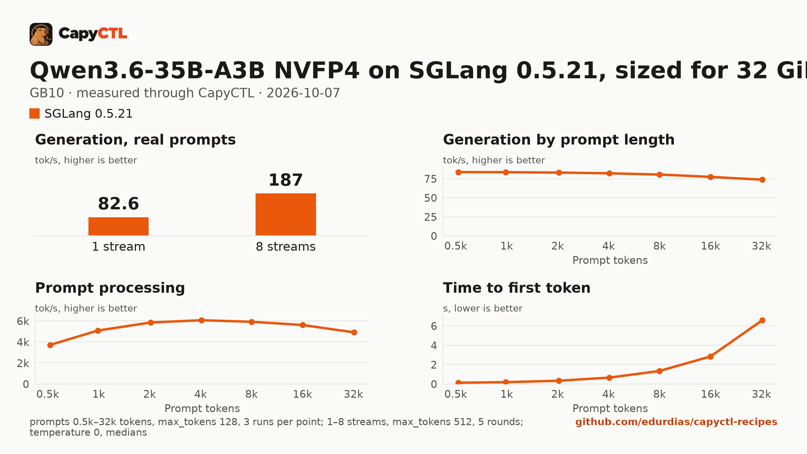

# Qwen3.6-35B-A3B NVFP4 on SGLang 0.5.21, sized for 32 GiB, one GB10

| | |
|---|---|
| Hardware | 1x NVIDIA GB10 (DGX Spark class), compute capability 12.1, 128 GB unified memory, aarch64 |
| System | Ubuntu 24.04, NVIDIA driver 580.173.02, CUDA 13.0 toolkit in `/usr/local/cuda` |
| Engine | SGLang 0.5.21 in a venv (torch 2.13.0, FlashInfer 0.6.18, sglang-kernel 0.4.7) |
| Model | [`nvidia/Qwen3.6-35B-A3B-NVFP4`](https://huggingface.co/nvidia/Qwen3.6-35B-A3B-NVFP4) at `1355db6a052410cfd62085d94b58866fd0f2c3c5`, NVFP4 experts (weight-only) with FP8 linear-attention projections, 23.5 GB |
| Drafter | none |
| CapyCTL | `main` at `0c4ccb4` (prints `capyctl 0.1.2`), release build; `capyctl start standalone` with its default limits |
| Measured | 2026-10-07 |

Qwen3.6-35B-A3B for a GPU with 32 GB: the deployment is sized so the model,
once ready, fits in 32 GiB, with up to 4 requests together. It was validated
on a GB10, not on a 32 GB card. The
[vLLM](../../vllm/qwen3.6-35b-a3b-nvfp4-32gib-gb10/) recipe sized for the same
32 GiB serves the same weights; the
[TensorFold](../../tensorfold/qwen3.6-35b-a3b-mlx-4bit-32gib-gb10/) one serves
TensorFold's MLX 4-bit export with its MTP drafter.

### What the file sets, and why

- `--moe-runner-backend marlin`: the experts are weight-only NVFP4 (W4A16).
  On SGLang's default MoE path for this checkpoint the start failed with
  `AttributeError: 'FusedMoE' object has no attribute 'g1_scale_c'`; the
  Marlin kernels serve them.
- `memory.kv_cache: 1536MiB`: a 157,286-token FP8 KV pool (SGLang allocated
  141,100), enough for 4 requests of 32,768 tokens. Qwen3.6 mixes linear
  attention with full attention, and CapyCTL sizes SGLang's linear-attention
  state for the 4 requests (`--max-mamba-cache-size 20`, 1.3 GB) beside the KV
  pool. Do not pass your own `--max-mamba-cache-size`: SGLang keeps 5 state
  slots per running request, and with 8 slots it capped the running requests
  at 1 (`max_running_requests is capped to 1 by the mamba state cache`), so
  2 to 8 streams were served one at a time at 82.7 tokens/s together.
- CUDA graphs on (CapyCTL's default for SGLang), capped: decode graphs up to
  the 4 requests (`--cuda-graph-max-bs-decode 4`), prefill graphs up to 512
  tokens (`--cuda-graph-max-bs-prefill 512`; longer prefills run without a
  graph). In an earlier run on another GB10, the model without graphs
  (`cuda_graphs: false`) needed 0.9 GiB less and decoded 48.2 tokens/s
  instead of 84.3.
- `language_model_only` is not set: SGLang 0.5.21 refuses it for this model
  (`--language-model-only does not support ['Qwen3_5MoeForConditionalGeneration']`),
  so the vision tower loads too.

### Memory

Up to 4 requests run together (`max_concurrent_requests: 4`).

| | |
|---|---|
| Ready footprint | 31.2 GiB after a cold start, 31.3 GiB after a warm one, 31.7 GiB after the benchmark: machine memory in use once ready, less what was in use before the start. SGLang's own GPU allocations are 26.4 GiB at rest and peaked at 26.7 GiB during the benchmark |
| Loading peak | 34.6 GiB during the cold start, 34.8 GiB during a warm one (`MemAvailable` drop); CapyCTL measured 34.6 GiB, then 34.7 GiB |
| Fits | 32 GiB: yes, with 0.3 GiB to spare under load. 24 GiB: no |

On the GB10's unified memory the loading peak and the engine's CPU-side
memory come out of the same pool as the GPU's. On a discrete card most of
that lands in system RAM, so the ready footprint is the number to compare
with a card's VRAM.

SGLang 0.5.21 cannot reload modelopt weights from disk, which a deep park's
wake does, so CapyCTL refuses deep parking for this checkpoint and the file
sets `residency: restart_only`: CapyCTL stops the model and starts it again
when it needs the memory.

## Run it

The API key comes from the credentials file the start banner names:

```bash
KEY=$(sed -n 's/^api_key: //p' ~/.local/state/capyctl/identity/credentials)
```

```bash
capyctl engine add ~/sglang-0.5.21-venv
```

```text
Registered sglang (sglang 0.5.21)

  Executable     /home/me/sglang-0.5.21-venv/bin/python3
  Deep park      enabled
  CUDA           /usr/local/cuda
  Engines file   /home/me/.config/capyctl/engines.yaml (revision 1)
  Published      yes
```

```bash
capyctl deploy model --file deployment.yaml
```

```text
Request identity: 01M4BBC5PSES27FNERZSB6CRV8 (reuse --request-id 01M4BBC5PSES27FNERZSB6CRV8 to recover this command)
Deployment qwen36-35b-sglang created (revision 1)

  Deployment ID       01M4BBC5QERERD59VS4A5SRHDG
  Operation           01M4BBC5QEK8S7RGJKRR1G00JT
  Checkpoint digest   being measured
the checkpoint digest of qwen36-35b-sglang is being measured; `capyctl start deployment qwen36-35b-sglang --wait` waits for it and starts the deployment
```

```bash
capyctl start deployment qwen36-35b-sglang --wait
```

```text
Request identity: 01M4BBC5XY0R5T64VKK5XH63JF (reuse --request-id 01M4BBC5XY0R5T64VKK5XH63JF to recover this command)
Waiting for the checkpoint digest of qwen36-35b-sglang to be measured (at most 900s)
Started qwen36-35b-sglang: ready

  Ready       1/1
  Hosts       host-a
  Operation   initialize succeeded
```

`capyctl status deployment qwen36-35b-sglang`:

```text
NAME                STATE   READY   REVISION   STARTUP    INITIALIZE   LAST OPERATION
qwen36-35b-sglang   ready   1/1     1          58.3 GiB   840s         initialize succeeded

INSTANCE   HOST     STATE   LIFECYCLE   DEVICES   LAST ERROR
0          host-a   ready   active      gpu0      -

Engine  sglang 0.5.21 (/home/me/sglang-0.5.21-venv/bin/python3)
Parsers tool calls: qwen3_coder, reasoning: qwen3 (model family qwen3_5)
note: deployment qwen36-35b-sglang serves /metrics without authentication on its loopback listener (read_only; a known and accepted limitation)
```

Qwen3.6 thinks before it answers. CapyCTL picks the `qwen3` reasoning parser
for this model family (and `qwen3_coder` for tool calls), so SGLang returns
the thinking in `reasoning_content` and the answer in `content`:

```bash
curl -s http://127.0.0.1:8443/v1/chat/completions \
  -H "Authorization: Bearer $KEY" -H 'Content-Type: application/json' \
  -d '{"model": "qwen36-35b-sglang", "messages": [{"role": "user", "content": "Name the largest planet in one sentence."}]}' \
  | jq -r '.choices[0].message.content'
```

```text


Jupiter is the largest planet in our solar system.
```

## Measured through CapyCTL

| | |
|---|---|
| Ready, cold | 127 s (the first start of the deployment; weights already on disk, page cache dropped; includes measuring the checkpoint digest, SGLang's weight loading and CUDA graph capture) |
| Ready, warm | 128 s (`start` after `stop` finished, page cache dropped again; SGLang repeats its startup) |
| Time to first token | 0.068 s median (0.066 to 0.069) |
| Decode, one stream | 83.5 tokens/s median (83.4 to 83.6) |
| Peak memory | 34.6 GiB measured by CapyCTL on the cold start, 34.7 GiB on the warm one; ready footprint in [Memory](#memory) |
| Park | not supported for this checkpoint; the model restarts instead |
| Concurrency | up to 4 requests together (`max_concurrent_requests: 4`) |
| Context | 32,768 tokens, declared |

Three streaming chat completions through the CapyCTL endpoint, one at a time,
`max_tokens: 512`, `temperature: 0.6`, thinking on (the model's default; the
first token counted is the first `reasoning_content` token). The three prompts
are the first three of capyctl-bench's prompt set (`explain-tcp`,
`python-lru`, `history-printing`); every request generated all 512 tokens. The
same three requests after the warm start gave 0.068 s and 83.3 tokens/s.

## Benchmark

[`bench/`](bench/) has the capyctl-bench results and report
([`report.html`](bench/report.html), [`summary.md`](bench/summary.md),
[`data.csv`](bench/data.csv)). Context sweep 0.5k to 32k tokens, three runs per
point, `max_tokens: 128`; concurrency 1 to 8 streams, five rounds each,
`max_tokens: 512`; `temperature: 0`, thinking on; machine memory in use
(`MemTotal - MemAvailable`, 3.6 GiB before the model started) sampled every
0.5 s.

| Context | Time to first token | Decode, one stream | Memory in use, peak |
|---|---|---|---|
| 0.5k | 0.14 s | 83.9 tokens/s | 35.3 GiB |
| 1k | 0.19 s | 83.7 tokens/s | 35.3 GiB |
| 2k | 0.34 s | 83.2 tokens/s | 35.3 GiB |
| 4k | 0.67 s | 82.3 tokens/s | 35.3 GiB |
| 8k | 1.35 s | 80.7 tokens/s | 35.3 GiB |
| 16k | 2.85 s | 77.6 tokens/s | 35.3 GiB |
| 32k | 6.59 s | 73.9 tokens/s | 35.3 GiB |

| Streams | Together | Each | Time to first token |
|---|---|---|---|
| 1 | 82.6 tokens/s | 83.5 tokens/s | 0.07 s |
| 2 | 124 tokens/s | 63.1 tokens/s | 0.10 s |
| 3 | 142 tokens/s | 47.9 tokens/s | 0.15 s |
| 4 | 186 tokens/s | 47.0 tokens/s | 0.17 s |
| 5 | 149 tokens/s | 47.2 tokens/s | 0.17 s |
| 6 | 160 tokens/s | 47.3 tokens/s | 0.17 s |
| 7 | 164 tokens/s | 47.5 tokens/s | 0.20 s |
| 8 | 187 tokens/s | 47.2 tokens/s | 5.62 s |

Four streams decode 2.2 times as many tokens as one. Past four, the extra
requests wait for a running one to finish: at 5 to 8 streams the total falls
back to 149 to 187 tokens/s. Machine memory in use stayed at 35.3 GiB through
the whole benchmark, 31.7 GiB above what was in use before the start.



The model needs about 23.5 GB in the model store; with the download, the first
start takes as long as the download plus the time above.
