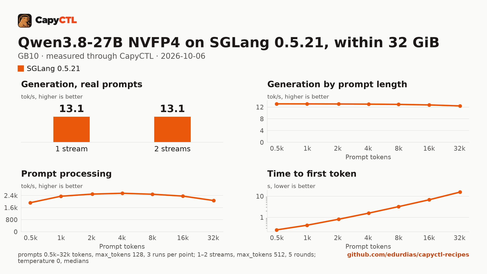

# Qwen3.8-27B NVFP4 on SGLang 0.5.21 within 32 GiB, one GB10

| | |
|---|---|
| Hardware | 1x NVIDIA GB10 (DGX Spark class), compute capability 12.1, 128 GB unified memory, aarch64, held to 32 GiB (below) |
| System | Ubuntu 24.04, NVIDIA driver 580.173.02, CUDA 13.0 toolkit in `/usr/local/cuda` |
| Engine | SGLang 0.5.21 in a venv (torch 2.13.0, FlashInfer 0.6.18, sglang-kernel 0.4.7) |
| Model | [`capyctl/Qwen3.8-27B-NVFP4-2GiB-shards`](https://huggingface.co/capyctl/Qwen3.8-27B-NVFP4-2GiB-shards) at `3619d612d4ba53292c8c0bfb6be6a15f7deca8bc`: [`nvidia/Qwen3.8-27B-NVFP4`](https://huggingface.co/nvidia/Qwen3.8-27B-NVFP4) at `482ca0f3832238542f8f5295dde86b5f22711d80` in 2 GiB files, tensors unchanged; NVFP4 with FP8 layers, 21.9 GB |
| Drafter | none |
| CapyCTL | `main` at `a6b2560` (prints `capyctl 0.1.2`), release build; `capyctl start standalone --set host.resource_policy.memory.system.managed_limit=32GiB` |
| Measured | 2026-10-06 |

Qwen3.8-27B for a machine with 32 GiB for the model, such as a 32 GB GPU: this
recipe holds CapyCTL to 32 GiB of the GB10's memory and runs the model inside
it, one request at a time, as the SGLang cookbook's RTX 5090 (32 GB) cell does.
The [128 GB recipe](../qwen3.8-27b-nvfp4-gb10/) uses the whole machine and a
drafter. The [TensorFold](../../tensorfold/qwen3.8-27b-nvfp4-32gib-gb10/) and
[vLLM](../../vllm/qwen3.8-27b-nvfp4-32gib-gb10/) recipes for the same 32 GiB
are next to this one.

### The checkpoint

The deployment downloads
[`capyctl/Qwen3.8-27B-NVFP4-2GiB-shards`](https://huggingface.co/capyctl/Qwen3.8-27B-NVFP4-2GiB-shards) at
`3619d612d4ba53292c8c0bfb6be6a15f7deca8bc`: NVIDIA's
[`nvidia/Qwen3.8-27B-NVFP4`](https://huggingface.co/nvidia/Qwen3.8-27B-NVFP4)
at `482ca0f3832238542f8f5295dde86b5f22711d80` with every tensor byte-identical,
rewritten from three files of up to 10 GB into eleven of at most 2 GiB (the
embedding table, 2.5 GB, has a file of its own). Its model card lists each
file's sha256. [`convert/reshard.py`](convert/reshard.py) rebuilds it from the
upstream revision:

```bash
hf download nvidia/Qwen3.8-27B-NVFP4 \
  --revision 482ca0f3832238542f8f5295dde86b5f22711d80 --local-dir qwen3.8-27b-nvfp4
python3 convert/reshard.py qwen3.8-27b-nvfp4 qwen3.8-27b-nvfp4-2gib 2
```

The served model is the same; what changes is the load. On the GB10,
SGLang loading the upstream 10 GB files peaked at 34.3 GiB
(measured by CapyCTL), above the 32 GiB limit, so CapyCTL, which reserves a
model's measured peak for its next start, refused the next start (`needs 34.3 GiB of unified memory, 32.0 GiB free of its 32.0 GiB limit`); with the
2 GiB files the peak is 29.7 GiB. To use the upstream revision instead,
set `model: {hf: nvidia/Qwen3.8-27B-NVFP4@482ca0f3832238542f8f5295dde86b5f22711d80}`
and allow more than 32 GiB.

The live runs used a local copy byte-identical to the pinned revision (the
output of `convert/reshard.py`, deployed by its directory name in the model
store); an `hf:` fetch check follows when the repository is public.

Of the two NVFP4 exports the SGLang cookbook lists, this uses NVIDIA's, which
packs the `lm_head` to NVFP4 too: its weights are 21.9 GB against 23.8 GB for
`RadixArk/Qwen3.8-27B-NVFP4-BF16-LMHead`, and the cookbook puts the BF16 head
at about 3.2 GB more at runtime, room that 32 GiB does not have.

### Memory

The standalone's managed limit is 32 GiB:

```bash
capyctl start standalone --set host.resource_policy.memory.system.managed_limit=32GiB
```

The deployment runs one request at a time (`max_concurrent_requests: 1`) with
a 1 GiB FP8 KV pool (`memory.kv_cache: 1GiB`), 2048-token prefill chunks, one
CUDA graph (`--cuda-graph-max-bs-decode 1`) and SGLang loading the weights one
file at a time (`--model-loader-extra-config '{"enable_multithread_load": false}'`).
CapyCTL measured a 29.7 GiB peak.

`capyctl status` shows a 55.2 GiB startup figure: the estimate CapyCTL makes
for a model it has not measured. That is above the 32 GiB limit, so the first
start runs alone on the machine (nothing else may hold memory) and is
measured; later starts reserve the measured peak, and the warm start below was
admitted under the 32 GiB limit.

### No parking

SGLang 0.5.21 cannot reload modelopt (NVFP4) weights from disk, and a deep
park's wake does that, so the file sets `residency: restart_only`: CapyCTL
stops the model and starts it again when it needs the memory, and
`capyctl park deployment` is refused. Deep park is unavailable for SGLang
modelopt checkpoints on CapyCTL up to `a6b2560`: without `restart_only`, that
build parked the model and the wake failed (`AttributeError: 'Parameter'
object has no attribute 'weight_loader'` in SGLang, and the request was
answered `activation_uncertain`). CapyCTL 0.1.3 and later refuse deep park for
SGLang modelopt; use `restart_only`.

## Run it

The API key comes from the credentials file the start banner names:

```bash
KEY=$(sed -n 's/^api_key: //p' ~/.local/state/capyctl/identity/credentials)
```

Register the engine and allow the loader option:

```bash
capyctl engine add ~/sglang-0.5.21-venv --approve-option=--model-loader-extra-config
```

```text
Registered sglang (sglang 0.5.21)

  Executable     /home/me/sglang-0.5.21-venv/bin/python3
  Deep park      enabled
  CUDA           /usr/local/cuda
  Engines file   /home/me/.config/capyctl/engines.yaml (revision 2)
  Published      yes
```

The revision is 2 because the TensorFold profile was added before it.

```bash
capyctl deploy model --file deployment.yaml
```

```text
Request identity: 01M49GP1JJKQ2522JCFSQEF5JP (reuse --request-id 01M49GP1JJKQ2522JCFSQEF5JP to recover this command)
Deployment qwen38-27b-sglang created (revision 1)

  Deployment ID       01M49GP1KJ0101WEGXGR4YB9WG
  Operation           01M49GP1KJYNWRR93R11CAW211
  Checkpoint digest   being measured
the checkpoint digest of qwen38-27b-sglang is being measured; `capyctl start deployment qwen38-27b-sglang --wait` waits for it and starts the deployment
```

```bash
capyctl start deployment qwen38-27b-sglang --wait
```

```text
Request identity: 01M49GP1MTQ5256951HQN8FS3S (reuse --request-id 01M49GP1MTQ5256951HQN8FS3S to recover this command)
Waiting for the checkpoint digest of qwen38-27b-sglang to be measured (at most 900s)
Started qwen38-27b-sglang: ready

  Ready       1/1
  Hosts       host-a
  Operation   initialize succeeded
```

```bash
capyctl status deployment qwen38-27b-sglang
```

```text
NAME                STATE   READY   REVISION   STARTUP    INITIALIZE   LAST OPERATION
qwen38-27b-sglang   ready   1/1     1          55.2 GiB   820s         initialize succeeded

INSTANCE   HOST         STATE   LIFECYCLE   DEVICES   LAST ERROR
0          host-a   ready   active      gpu0      -

Engine  sglang 0.5.21 (/home/me/sglang-0.5.21-venv/bin/python3)
Parsers tool calls: qwen3_coder, reasoning: qwen3 (model family qwen3_5)
note: deployment qwen38-27b-sglang serves /metrics without authentication on its loopback listener (read_only; a known and accepted limitation)
```

Qwen3.8 thinks before it answers. CapyCTL picks the `qwen3` reasoning parser
for this model family (and `qwen3_coder` for tool calls), so SGLang returns
the thinking in `reasoning_content` and the answer in `content`:

```bash
curl -s http://127.0.0.1:8443/v1/chat/completions \
  -H "Authorization: Bearer $KEY" -H 'Content-Type: application/json' \
  -d '{"model": "qwen38-27b-sglang", "messages": [{"role": "user", "content": "Name the largest planet in one sentence."}]}' \
  | jq -r '.choices[0].message.content'
```

```text


Jupiter is the largest planet in our solar system.
```

```bash
capyctl park deployment qwen38-27b-sglang
```

```text
Request identity: 01M49JDTDQ5XBHA8KFWMR9C4H8 (reuse --request-id 01M49JDTDQ5XBHA8KFWMR9C4H8 to recover this command)
error [unsupported]: unsupported_capability: Requested capability is unavailable
```

## Measured through CapyCTL

| | |
|---|---|
| Ready, cold | 191 s (the first start of the deployment; weights already in the model store; includes measuring the checkpoint digest) |
| Ready, warm | 189 s (`start` after `stop` finished; SGLang repeats its full startup, CUDA graph capture included) |
| Time to first token | 0.172 s median (0.132 to 0.182) |
| Decode, one stream | 13.1 tokens/s median (13.1 to 13.1) |
| Peak memory | 29.7 GiB measured by CapyCTL, under the 32 GiB limit; `MemAvailable` fell by 29.6 GiB at most |
| Park | refused (`residency: restart_only`, above) |
| Concurrency | one request at a time (`max_concurrent_requests: 1`); others wait in SGLang's queue |
| Context | 32,768 tokens, declared |

Three streaming chat completions through the CapyCTL endpoint, one at a time,
`max_tokens: 512`, `temperature: 0.6`, thinking on (the model's default; the
first token counted is the first `reasoning_content` token). The three prompts
are the first three of capyctl-bench's prompt set (`explain-tcp`,
`python-lru`, `history-printing`); every request generated all 512 tokens. The
same three requests after the warm start gave 0.172 s and 13.1 tokens/s.

## Benchmark

[`bench/`](bench/) has the capyctl-bench results and report
([`report.html`](bench/report.html), [`summary.md`](bench/summary.md),
[`data.csv`](bench/data.csv)). Context sweep 0.5k to 32k tokens, three runs per
point, `max_tokens: 128`; concurrency 1 and 2 streams (the deployment runs one
request at a time, so more streams only queue), five rounds each,
`max_tokens: 512`; `temperature: 0`, thinking on; machine memory in use
(`MemTotal - MemAvailable`, about 3.5 GiB before the model starts) sampled
every 0.5 s.

| Context | Time to first token | Decode, one stream | Memory in use, peak |
|---|---|---|---|
| 0.5k | 0.26 s | 13.1 tokens/s | 33.0 GiB |
| 1k | 0.43 s | 13.1 tokens/s | 33.0 GiB |
| 2k | 0.82 s | 13.1 tokens/s | 33.0 GiB |
| 4k | 1.59 s | 13.0 tokens/s | 33.0 GiB |
| 8k | 3.21 s | 12.9 tokens/s | 33.0 GiB |
| 16k | 6.79 s | 12.7 tokens/s | 33.0 GiB |
| 32k | 15.67 s | 12.4 tokens/s | 33.0 GiB |

| Streams | Together | Each | Time to first token |
|---|---|---|---|
| 1 | 13.1 tokens/s | 13.1 tokens/s | 0.17 s |
| 2 | 13.1 tokens/s | 13.1 tokens/s | 19.76 s |

With two streams the second request waits for the first: the total stays at
13.1 tokens/s and the time to first token is the wait.



The model needs about 21.9 GB in the model store; with the download, the first
start takes as long as the download plus the time above.
