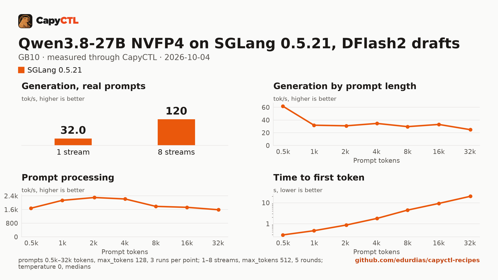

# Qwen3.8-27B NVFP4 on SGLang 0.5.21 with DFlash2 drafts, one GB10

| | |
|---|---|
| Hardware | 1x NVIDIA GB10 (DGX Spark class), compute capability 12.1, 128 GB unified memory, aarch64 |
| System | Ubuntu 24.04, NVIDIA driver 580.173.02, CUDA 13.0 toolkit in `/usr/local/cuda` |
| Engine | SGLang 0.5.21 in a venv (torch 2.13.0+cu130, FlashInfer 0.6.18, sglang-kernel 0.4.7) |
| Model | [`nvidia/Qwen3.8-27B-NVFP4`](https://huggingface.co/nvidia/Qwen3.8-27B-NVFP4) at `482ca0f3832238542f8f5295dde86b5f22711d80`, NVFP4 with FP8 layers, 21.9 GB |
| Drafter | [`z-lab/Qwen3.8-27B-DFlash2`](https://huggingface.co/z-lab/Qwen3.8-27B-DFlash2) at `50307d4c4cde6860d4eee73e2547cd786fe8e8a4`, 3.8 GB |
| CapyCTL | `main` at `1f2cfc7` (prints `capyctl 0.1.1`), release build; `capyctl start standalone --set host.resource_policy.memory.system.managed_limit=80%` |
| Measured | 2026-10-04 |

This recipe needs CapyCTL newer than the 0.1.1 release (`main` at `1f2cfc7`
or later, until the next release). It uses changes made after 0.1.1:
`capyctl engine add --approve-option/--approve-path`; `memory.kv_cache` as
SGLang's real KV pool, with CapyCTL sizing SGLang's recurrent state for the
running requests of this hybrid model; a settable standalone memory limit;
SGLang's CUDA graphs on by default; and speculative SGLang deployments
restarting instead of parking. The deployment file itself validates with
0.1.1, which is what this repository's check runs.

The checkpoint, the drafter and the measuring method are the same as in the
[TensorFold recipe](../../tensorfold/qwen3.8-27b-nvfp4-gb10/) and the
[vLLM recipe](../../vllm/qwen3.8-27b-nvfp4-gb10/) for this model. The
deployment names SGLang's `modelopt` quantization and an FP8 KV cache; the
drafter runs unquantized (`--speculative-draft-model-quantization unquant`).

### Memory

The deployment runs up to 8 requests together (`max_concurrent_requests: 8`)
with a 16 GiB FP8 KV pool (`memory.kv_cache: 16GiB`, which CapyCTL passes as
SGLang's `--max-total-tokens`). Beside the weights, the drafter and the KV
pool, SGLang keeps recurrent state (float32, the model's own) for every
running request of this hybrid model. With an explicit `memory.request`,
CapyCTL refuses a request that cannot hold that state before anything starts,
and names the request it needs; 48 GiB is not enough for 8 requests, so the
file asks for 65 GiB.

CapyCTL charges the start 68.8 GiB, more than a standalone's default managed
limit (50 % of memory, 60.8 GiB on a GB10). With the default, the start is
refused:

```text
error [insufficient_resources]: capacity_blocked: Capacity is unavailable: host host-a needs 68.8 GiB of unified memory, 60.8 GiB free of its 60.8 GiB limit; wait, stop another deployment, or start with --evict
```

Raise the limit when you start CapyCTL, with the flag:

```bash
capyctl start standalone --set host.resource_policy.memory.system.managed_limit=80%
```

or the same setting as `CAPYCTL_SET__HOST__RESOURCE_POLICY__MEMORY__SYSTEM__MANAGED_LIMIT=80%`,
or in the standalone document:

```yaml
host:
  resource_policy:
    memory:
      system:
        managed_limit: 80%
```

80 % is 97.4 GiB on a GB10. Fewer running requests need less memory.

A deployment with a drafter restarts instead of parking: CapyCTL resolves it
`restart_only`, its default for SGLang speculative decoding.

## Run it

CapyCTL does not download drafters. Download it into a directory of drafters:

```bash
hf download z-lab/Qwen3.8-27B-DFlash2 \
  --revision 50307d4c4cde6860d4eee73e2547cd786fe8e8a4 \
  --local-dir ~/drafters/Qwen3.8-27B-DFlash2
```

The API key comes from the credentials file the start banner names:

```bash
KEY=$(sed -n 's/^api_key: //p' ~/.local/state/capyctl/identity/credentials)
```

Register the engine and allow `--speculative-draft-model-path` for drafters
inside that directory:

```bash
capyctl engine add ~/sglang-0.5.21-venv \
  --approve-option=--speculative-draft-model-path --approve-path /home/me/drafters
```

```text
Registered sglang (sglang 0.5.21)

  Executable     /home/me/sglang-0.5.21-venv/bin/python3
  Deep park      enabled
  CUDA           /usr/local/cuda
  Engines file   /home/me/.config/capyctl/engines.yaml (revision 9)
  Published      yes
```

The revision is 9 because this ran after the vLLM and TensorFold recipes'
profiles were added and removed.

```bash
capyctl deploy model --file deployment.yaml
```

```text
Request identity: 01M4429EV05624SCY504YDQ2ZX (reuse --request-id 01M4429EV05624SCY504YDQ2ZX to recover this command)
Deployment qwen38-27b-sglang created (revision 1)

  Deployment ID       01M4429EVM7E6H2C7PG5WE42VX
  Operation           01M4429EVM26B69YDR46MZ7306
  Checkpoint digest   being measured
the checkpoint digest of qwen38-27b-sglang is being measured; `capyctl start deployment qwen38-27b-sglang --wait` waits for it and starts the deployment
```

The first start, under the default limit, was refused as shown above. After
CapyCTL was restarted with the 80 % limit:

```bash
capyctl start deployment qwen38-27b-sglang --wait
```

```text
Request identity: 01M4429XQ3S489YNBZ6G53AW23 (reuse --request-id 01M4429XQ3S489YNBZ6G53AW23 to recover this command)
Started qwen38-27b-sglang: ready

  Ready       1/1
  Hosts       host-a
  Operation   initialize succeeded
```

Qwen3.8 thinks before it answers. CapyCTL picks the `qwen3` reasoning parser
for this model family (and `qwen3_coder` for tool calls), so SGLang returns
the thinking in `reasoning_content` and the answer in `content`:

```bash
curl -s http://127.0.0.1:8443/v1/chat/completions \
  -H "Authorization: Bearer $KEY" -H 'Content-Type: application/json' \
  -d '{"model": "qwen38-27b-sglang", "messages": [{"role": "user", "content": "Name the largest planet in one sentence."}]}' \
  | jq -r '.choices[0].message.content'
```

```text


Jupiter is the largest planet in our solar system.
```

## Measured through CapyCTL

| | |
|---|---|
| Ready, cold | 252 s (the first start that ran; weights already in the model store and the checkpoint digest measured by the refused start) |
| Ready, warm | 253 s (`start` after `stop` finished; SGLang repeats its full startup, CUDA graph capture included) |
| Time to first token | 0.210 s median (0.134 to 0.231) |
| Decode, one stream | 28.2 tokens/s median (25.2 to 44.4), DFlash2 drafts on |
| Peak memory | 68.9 GiB measured by CapyCTL, against a 68.8 GiB startup reservation (CapyCTL's default for the 65 GiB request); `MemAvailable` fell by 68.9 GiB at most |
| Concurrency | up to 8 requests decoded together (`max_concurrent_requests: 8`) |
| Context | 32,768 tokens, declared |

Three streaming chat completions through the CapyCTL endpoint, one at a time,
`max_tokens: 512`, `temperature: 0.6`, thinking on (the model's default; the
first token counted is the first `reasoning_content` token). The three prompts
are the first three of capyctl-bench's prompt set (`explain-tcp`,
`python-lru`, `history-printing`); every request generated all 512 tokens. The
same three requests after the warm start gave 0.211 s and 27.2 tokens/s (24.1
to 40.0): with sampling on, the outputs differ from run to run, and so does
how many drafted tokens are accepted. The 2026-10-02 measurement on SGLang
0.5.20 (33.1 tokens/s) used other prompts, a 48 GiB request and CUDA graphs
off, and is not comparable.

### What the drafter does

The same deployment without `extra_args` (and so without the drafter), on the
same machine, the same three requests:

| | DFlash2 drafts | No drafts |
|---|---|---|
| Decode, one stream | 28.2 tokens/s (25.2 to 44.4) | 12.3 tokens/s (12.3 to 12.3) |
| Time to first token | 0.210 s | 0.177 s |
| Ready, first start of the deployment | 252 s | 242 s |
| Peak memory (CapyCTL) | 68.9 GiB | 54.1 GiB |

## Benchmark

[`bench/`](bench/) has the capyctl-bench results and report
([`report.html`](bench/report.html), [`summary.md`](bench/summary.md),
[`data.csv`](bench/data.csv)). Context sweep 0.5k to 32k tokens, three runs per
point, `max_tokens: 128`; concurrency 1 to 8 streams, five rounds each,
`max_tokens: 512`; `temperature: 0`, thinking on; machine memory in use
(`MemTotal - MemAvailable`) sampled every 0.5 s.

| Context | Time to first token | Decode, one stream | Memory in use, peak |
|---|---|---|---|
| 0.5k | 0.29 s | 61.9 tokens/s | 71.8 GiB |
| 1k | 0.47 s | 31.9 tokens/s | 71.8 GiB |
| 2k | 0.87 s | 30.9 tokens/s | 71.8 GiB |
| 4k | 1.80 s | 34.7 tokens/s | 72.2 GiB |
| 8k | 4.48 s | 29.6 tokens/s | 73.5 GiB |
| 16k | 9.31 s | 33.1 tokens/s | 73.5 GiB |
| 32k | 20.39 s | 24.9 tokens/s | 73.4 GiB |

| Streams | Together | Each | Time to first token |
|---|---|---|---|
| 1 | 32.0 tokens/s | 32.4 tokens/s | 0.21 s |
| 2 | 47.4 tokens/s | 26.3 tokens/s | 0.21 s |
| 3 | 65.5 tokens/s | 23.4 tokens/s | 0.22 s |
| 4 | 81.6 tokens/s | 22.5 tokens/s | 0.23 s |
| 5 | 80.7 tokens/s | 17.1 tokens/s | 0.24 s |
| 6 | 91.8 tokens/s | 16.2 tokens/s | 0.25 s |
| 7 | 109.4 tokens/s | 17.4 tokens/s | 0.27 s |
| 8 | 120.1 tokens/s | 17.2 tokens/s | 0.27 s |

Eight streams decode 3.8 times as many tokens as one.



A downloaded copy needs about 21.9 GB in the model store and 3.8 GB for the
drafter; with the download, the first start takes as long as the download plus
the time above.
