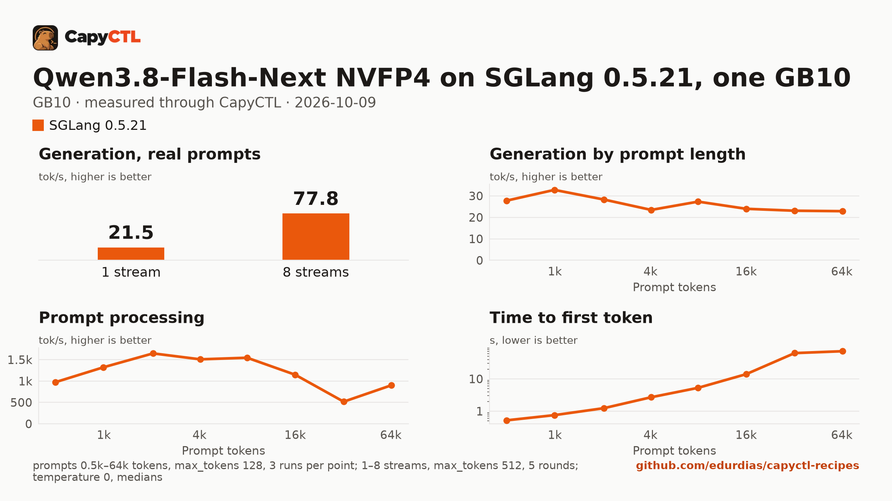

# Qwen3.8-Flash-Next NVFP4 on SGLang 0.5.21 with MTP drafts, n-gram table on disk, one GB10

| | |
|---|---|
| Hardware | 1x NVIDIA GB10 (DGX Spark class), compute capability 12.1, 128 GB unified memory, aarch64, local NVMe |
| System | Ubuntu 24.04, NVIDIA driver 580.173.02, CUDA 13.0 toolkit in `/usr/local/cuda` |
| Engine | SGLang 0.5.21 in a venv (torch 2.13.0, FlashInfer 0.6.18, sglang-kernel 0.4.7, transformers 5.12.1) |
| Model | [`RadixArk/Qwen3.8-Flash-Next-NVFP4`](https://huggingface.co/RadixArk/Qwen3.8-Flash-Next-NVFP4) at `7b719225242aacd3dbd3f9407468c2ee9a9d2594`, NVFP4 W4A4 routed experts (ModelOpt), BF16 rest, FP8 n-gram table, 135.3 GB |
| Drafter | MTP (`NEXTN`), in the checkpoint |
| CapyCTL | `main` at `eb214aa` (prints `capyctl 0.1.2`), release build; `capyctl start standalone` with the managed limit raised to 110 GiB and the free reserve lowered to 8 GiB. Earlier CapyCTL releases, 0.1.2 included, charge the n-gram table as memory and cannot start this model on one GB10 |
| Measured | 2026-10-09 |

Qwen3.8-Flash-Next on one GB10, with the full 262,144-token context, MTP drafts
and up to 8 requests together: the SGLang cookbook's one-machine settings. The
checkpoint holds 125.9 GiB of weights, more than the machine's 121.7 GiB, and
47.7 GiB of them are the model's n-gram (per-layer embedding) table. With
`--ple-offload-backend file` SGLang keeps that table in a file on disk and at
most 8 GiB of it in memory, and the model needs about 98 GiB once ready.

The [TensorFold recipe](../../tensorfold/qwen3.8-flash-next-mlx-4bit-gb10/)
serves TensorFold's MLX 4-bit export with the table read from disk; it is a
different quantization, so the two are not a one-to-one engine comparison.

### vLLM 0.30.0 cannot serve it on one GB10

vLLM 0.30.0 has no option to keep the table out of memory, so all 125.9 GiB of
weights would have to be resident. CapyCTL charges them and refuses the start
before any launch (the same model, context and 8 requests on vLLM):

```text
error [insufficient_resources]: capacity_blocked: Capacity is unavailable: host host-a needs 292.5 GiB of unified memory, 110.0 GiB free of its 110.0 GiB limit; wait, stop another deployment, or start with --evict
```

### The n-gram table on disk

At start SGLang writes the table into a file under `--ple-offload-dir`, maps
it, and trims what it keeps in memory:

```text
PLE table: file-backed mmap <redacted>.bin (47.7 GiB, torch.float8_e4m3fn)
PLE table: WILLNEED prefetch on for gathers of >= 2048 rows (row = 160 B)
PLE table: resident set capped at 8.0 GiB, checked every 30 s
```

The file is 51,200,245,760 bytes and was fully written (not sparse) on every
start, in about 80 s after the main weights loaded: keep about 48 GiB free on
the disk that holds the directory, beside the 135.3 GB in the model store.
CapyCTL does not count this file against the models disk. Every measured
start began without the file: it was deleted before each start, as the SGLang
cookbook advises (it reports that rewriting an existing file takes about 55
minutes). A start over an existing file was not measured. CapyCTL restarts a
`restart_only` model on its own when it needs the memory, and it does not
delete the file.

`--ple-offload-dir` names a path, so CapyCTL lets a deployment pass it only
when the engine profile approves the option and the directory:

```text
error [invalid_config]: invalid_config: Invalid deployment configuration: unsupported combination at `engine_config.extra_args`: option `--ple-offload-dir` is security-sensitive; it needs the host installation to list it in security.approved_options
```

### How CapyCTL sizes it

With `--ple-offload-backend file` in the arguments, CapyCTL reads the table
from the checkpoint's headers and charges memory for the rest of the weights
plus SGLang's 8 GiB of the table. Its effective configuration records:

| | Without the file backend | With it (this file) |
|---|---|---|
| Weights charged | 125.9 GiB (the whole checkpoint) | 86.2 GiB: 125.9 less the 47.7 GiB table, plus 8 GiB |
| Steady request | 152.8 GiB | 107.2 GiB (plus a 16.9 GiB margin and the 4 GiB KV cache) |
| Ready reservation | 154.0 GiB | 108.4 GiB |
| Startup estimate | 292.5 GiB | 203.3 GiB; 109.2 GiB with `memory.startup: 108GiB` |
| Start | refused, `capacity_blocked` (needs 292.5 GiB) | ready |

Without `memory.startup` the derived startup estimate (202.0 GiB plus the
engine's CUDA context) is more than the machine has, and the start gives up
with `gave up: resource or evidence check failed: insufficient resources`.
CapyCTL needs the declared startup to be at least the steady request
(107.2 GiB), so the file declares 108 GiB. CapyCTL measured a loading peak of
98.9 GiB.

### The managed limit and the free reserve

The 109.2 GiB startup reservation is above the standalone's default managed
limit (half the memory, 60.8 GiB), so the limit has to be raised to 110 GiB.
The standalone accepts a limit and free reserve that together fit in the
machine's 121.7 GiB, and it accepted 110 GiB with an 11 GiB reserve. With
that pair the start still gave up, without figures:

```text
error [operation_failed]: Operation 01M4G4X3AAWB1AJCHXH1GRKCHC failed: gave up: resource or evidence check failed: insufficient resources
```

When CapyCTL starts a model it also checks the memory available at that
moment (118.2 GiB here; the system holds the rest of the 121.7 GiB), not the
total: what is left after the start's charge (118.2 - 109.25 = 8.95 GiB) has
to cover the free reserve. As a workaround the standalone runs with the
reserve lowered to 8 GiB:

```bash
capyctl start standalone \
  --set host.resource_policy.memory.system.managed_limit=110GiB \
  --set host.resource_policy.memory.system.free_reserve=8GiB
```

### The first start on a machine

The first start loads the model, then FlashInfer tunes and builds kernels for
it (they are cached under `~/.cache/sglang` and later starts reuse them).
CapyCTL sets the number of parallel compile jobs (`MAX_JOBS`) from the free
memory when the engine launches, 14 on this machine, but SGLang builds after it
has loaded the model and has about 20 GiB left. Two first starts ran the
machine out of memory and were stopped when less than 2 GiB was left (CapyCTL
then reported `launch failed: engine launch failed: the engine exited before
readiness`); in use is machine memory in use less what was in use before the
start:

| Try | How far it got | In use, peak | Stopped after |
|---|---|---|---|
| the cookbook's settings, `MAX_JOBS` 14 | weights, MTP head, KV cache; stopped in FlashInfer's autotune while it built kernels | 116.4 GiB | 749 s |
| `--disable-flashinfer-autotune` | stopped at the first CUDA graph capture, while FlashInfer built a fused-MoE kernel | 116.2 GiB | 628 s |
| `MAX_JOBS=2` | ready | 113.4 GiB | 1,745 s |

So the SGLang profile carries `MAX_JOBS=2` (the measured run set it in the
deployment's `engine_config.env`, which is newer than 0.1.2; the profile's
`--env` does the same). The first start then took 1,745 s: 488 s for the
weights, 98 s for the MTP head, 18 minutes of FlashInfer autotune and kernel
builds, 10 s of CUDA graphs. That is 55 s inside CapyCTL's 1,800 s initialize
timeout; on a slower disk the first start may not fit.

### Memory

| | |
|---|---|
| Ready footprint | 99.0 GiB after the first start, 97.3, 98.3 and 97.7 GiB after three later starts, 103.2 GiB after the benchmark: machine memory in use once ready, less what was in use before the start. SGLang's own GPU allocations are 92.9 GiB at rest and peaked at 98.3 GiB during the benchmark |
| Loading peak | 97.3, 98.3 and 98.0 GiB during later starts (`MemAvailable` drop); 113.4 GiB during the first start, with the kernel builds; CapyCTL measured 98.9 GiB |
| Fits | one 128 GB GB10 with the managed limit at 110 GiB and the free reserve at 8 GiB |

CapyCTL starts SGLang with `--mem-fraction-static 0.8639`; SGLang allocated a
BF16 KV cache of 174,720 tokens (4.0 GB) and 40 Mamba state slots (4.3 GB of
SSM state). On the GB10's unified memory the loading peak and the engine's
CPU-side memory come out of the same pool as the GPU's, so nothing else large
should run on the machine while the model starts.

SGLang 0.5.21 cannot reload ModelOpt NVFP4 weights from disk, which a deep
park's wake does, so the file sets `residency: restart_only`: `capyctl park
deployment` answers `error [unsupported]: unsupported_capability: Requested
capability is unavailable` (the model kept serving and answered the next
request).

## Run it

The API key comes from the credentials file the start banner names:

```bash
KEY=$(sed -n 's/^api_key: //p' ~/.local/state/capyctl/identity/credentials)
```

```bash
mkdir -p ~/sglang-ple
capyctl engine add ~/sglang-0.5.21-venv --env MAX_JOBS=2 \
  --approve-option=--ple-offload-dir --approve-path $HOME/sglang-ple
```

```text
Registered sglang (sglang 0.5.21)

  Executable     /home/me/sglang-0.5.21-venv/bin/python3
  Deep park      enabled
  CUDA           /usr/local/cuda
  Engines file   /home/me/.config/capyctl/engines.yaml (revision 1)
  Published      yes
```

```bash
capyctl deploy model --file deployment.yaml
```

```text
Request identity: 01M4G73X21PB2R4BRV56T0KV0G (reuse --request-id 01M4G73X21PB2R4BRV56T0KV0G to recover this command)
Deployment qwen38-flash-next-sglang created (revision 1)

  Deployment ID       01M4G73X2QRMFGCNVWHVCEH1VP
  Operation           01M4G73X2Q8J0K7W680JJ4HV5Z
  Checkpoint digest   being measured
the checkpoint digest of qwen38-flash-next-sglang is being measured; `capyctl start deployment qwen38-flash-next-sglang --wait` waits for it and starts the deployment
```

```bash
capyctl start deployment qwen38-flash-next-sglang --wait
```

```text
Request identity: 01M4G73Y4WE7T7J3Y2ZJGR8H33 (reuse --request-id 01M4G73Y4WE7T7J3Y2ZJGR8H33 to recover this command)
Waiting for the checkpoint digest of qwen38-flash-next-sglang to be measured (at most 1800s)
Started qwen38-flash-next-sglang: ready

  Ready       1/1
  Hosts       host-a
  Operation   initialize succeeded
```

`capyctl status deployment qwen38-flash-next-sglang`:

```text
NAME                       STATE   READY   REVISION   STARTUP     INITIALIZE   LAST OPERATION
qwen38-flash-next-sglang   ready   1/1     1          109.2 GiB   1800s        initialize succeeded

INSTANCE   HOST     STATE   LIFECYCLE   DEVICES   LAST ERROR
0          host-a   ready   active      gpu0      -

Engine  sglang 0.5.21 (/home/me/sglang-0.5.21-venv/bin/python3)
Parsers tool calls: none, reasoning: qwen3
note: deployment qwen38-flash-next-sglang serves /metrics without authentication on its loopback listener (read_only; a known and accepted limitation)
```

The model always reasons before it answers; with the `qwen3` reasoning parser
SGLang returns the reasoning in `reasoning_content` and the answer in
`content`:

```bash
curl -s http://127.0.0.1:8443/v1/chat/completions \
  -H "Authorization: Bearer $KEY" -H 'Content-Type: application/json' \
  -d '{"model": "qwen38-flash-next-sglang", "messages": [{"role": "user", "content": "Name the largest planet in one sentence."}]}' \
  | jq -r '.choices[0].message.content'
```

```text


Jupiter is the largest planet.
```

## Measured through CapyCTL

| | |
|---|---|
| Ready, first start | 1,745 s (weights already on disk, page cache dropped; includes the kernel builds, see [The first start on a machine](#the-first-start-on-a-machine)) |
| Ready, later starts | 658, 637 and 640 s (`start` after `stop` finished, page cache dropped, table file deleted) |
| Time to first token | 0.603 s median (0.518 to 0.691) |
| Decode, one stream | 21.3 tokens/s median (19.5 to 22.2), with MTP drafts |
| Peak memory | 98.9 GiB measured by CapyCTL, against the 109.2 GiB startup reservation; ready footprint in [Memory](#memory) |
| Park | refused (`restart_only`) |
| Concurrency | up to 8 requests together (`max_concurrent_requests: 8`) |
| Context | 262,144 tokens, declared |

Three streaming chat completions through the CapyCTL endpoint, one at a time,
`max_tokens: 512`, `temperature: 0.6`, reasoning on. The three prompts are
the first three of capyctl-bench's prompt set (`explain-tcp`, `python-lru`,
`history-printing`); every request generated all 512 tokens. During the
benchmark SGLang's log averaged 2.5 tokens accepted per MTP step (accept rate
0.51). The SGLang cookbook reports 27.5 tokens/s for one stream and 71.7
tokens/s at 8 requests for the same settings on its own image.

## Benchmark

[`bench/`](bench/) has the capyctl-bench results and report
([`report.html`](bench/report.html), [`summary.md`](bench/summary.md),
[`data.csv`](bench/data.csv)). Context sweep 0.5k to 64k tokens, three runs per
point, `max_tokens: 128`; concurrency 1 to 8 streams, five rounds each,
`max_tokens: 512`; `temperature: 0`, reasoning on; machine memory in use
(`MemTotal - MemAvailable`, 3.3 GiB before the model started) sampled every
0.5 s.

| Context | Time to first token | Decode, one stream | Memory in use, peak |
|---|---|---|---|
| 0.5k | 0.52 s | 27.8 tokens/s | 102.2 GiB |
| 1k | 0.75 s | 32.8 tokens/s | 102.5 GiB |
| 2k | 1.24 s | 28.3 tokens/s | 102.5 GiB |
| 4k | 2.70 s | 23.5 tokens/s | 103.0 GiB |
| 8k | 5.28 s | 27.3 tokens/s | 103.5 GiB |
| 16k | 14.0 s | 24.0 tokens/s | 103.7 GiB |
| 32k | 62.8 s | 23.1 tokens/s | 103.7 GiB |
| 64k | 71.8 s | 22.9 tokens/s | 103.8 GiB |

| Streams | Together | Each | Time to first token |
|---|---|---|---|
| 1 | 21.5 tokens/s | 21.9 tokens/s | 0.48 s |
| 2 | 35.6 tokens/s | 18.7 tokens/s | 0.54 s |
| 3 | 45.4 tokens/s | 15.4 tokens/s | 0.32 s |
| 4 | 54.3 tokens/s | 14.7 tokens/s | 0.33 s |
| 5 | 62.0 tokens/s | 13.1 tokens/s | 0.35 s |
| 6 | 72.0 tokens/s | 12.4 tokens/s | 0.38 s |
| 7 | 70.0 tokens/s | 10.9 tokens/s | 0.44 s |
| 8 | 77.8 tokens/s | 10.4 tokens/s | 0.42 s |

Eight streams decode 3.6 times as many tokens as one. Time to first token on
long prompts varied widely from run to run: 42 to 75 s at 32k and 57 to 178 s
at 64k. Machine memory in use went from 101.1 to 107.1 GiB during the
benchmark (103.8 GiB above what was in use before the start).



The model needs about 135.3 GB in the model store and 48 GiB for the table
file; with the download, the first start takes as long as the download plus
the time above.
