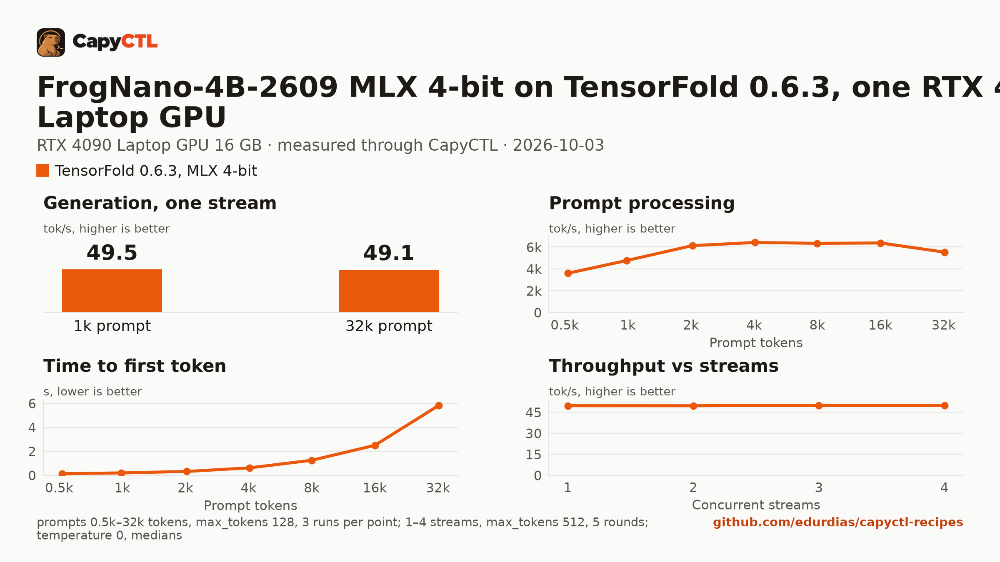

# FrogNano-4B-2609 MLX 4-bit on TensorFold 0.6.3, one RTX 4090 Laptop GPU

| | |
|---|---|
| Hardware | 1x NVIDIA GeForce RTX 4090 Laptop GPU, 16 GB (16376 MiB), compute capability 8.9; Intel Core i9-14900HX, 64 GB RAM, x86_64 |
| System | Ubuntu 26.04, NVIDIA driver 615.71.09, CUDA 13.4 toolkit in `/usr/local/cuda` (TensorFold builds its kernels with it) |
| Engine | TensorFold 0.6.3 in a venv (torch 2.13.0+cu130) |
| Model | [`capyctl/FrogNano-4B-2609-MLX-4bit`](https://huggingface.co/capyctl/FrogNano-4B-2609-MLX-4bit) at `f779b2f71f8f87a1357f526a83e35be691a976cc`, MLX affine 4-bit, groups of 64, text only, 2.7 GB; converted from [`microsoft/FrogNano-4B-2609`](https://huggingface.co/microsoft/FrogNano-4B-2609) at `b90468c11a913c1916b4542b4b7a530ec42024a4` |
| Drafter | none (`--no-drafts`) |
| CapyCTL | `main` at `c5ebc1a` (prints `capyctl 0.1.1`); `capyctl start standalone` |
| Measured | 2026-10-03 |

TensorFold's CUDA engine reads quantized MLX weights only and refuses the tied
output layer FrogNano ships with, so this recipe serves a converted checkpoint.
[`convert/`](convert/) has the script and the steps; it reproduces the
published weights byte for byte. The
[model card](https://huggingface.co/capyctl/FrogNano-4B-2609-MLX-4bit) lists
what changed from the original: an untied `lm_head` (an exact copy of the
embeddings), no vision tower, no MTP layer, the original tokenizer and chat
template, and an added `generation_config.json`.

On this GPU only 4-bit with groups of 64 is fast: TensorFold re-tiles that
format for its fast matmul. An 8-bit conversion of the same model loaded and
answered correctly but decoded at 7.6 tokens/s.

For the same model in BF16, see
[vllm/frognano-4b-rtx4090](../../vllm/frognano-4b-rtx4090/).

## Run it

The API key comes from the credentials file the start banner names:

```bash
KEY=$(sed -n 's/^api_key: //p' ~/.local/state/capyctl/identity/credentials)
```

```bash
capyctl engine add ~/tensorfold-0.6.3-venv
```

```text
Registered tensorfold (tensorfold 0.6.3)

  Executable     /home/me/tensorfold-0.6.3-venv/bin/tensorfold
  Deep park      disabled
  CUDA           /usr/local/cuda
  Engines file   /home/me/.config/capyctl/engines.yaml (revision 1)
  Published      yes
```

```bash
capyctl deploy model --file deployment.yaml
```

```text
Request identity: 01M410C55DZR45AWY85ESAZDV2 (reuse --request-id 01M410C55DZR45AWY85ESAZDV2 to recover this command)
Deployment frognano-4b-tf created (revision 1)

  Deployment ID       01M410C55RDQFE4SMCG9CZAW8T
  Operation           01M410C55R6FJD3W70VR186WDR
  Checkpoint digest   being measured
the checkpoint digest of frognano-4b-tf is being measured; `capyctl start deployment frognano-4b-tf --wait` waits for it and starts the deployment
```

The first start downloads the checkpoint into the model store:

```bash
capyctl start deployment frognano-4b-tf --wait
```

```text
Request identity: 01M40YFVD9JSJXFFWHK2MVDX70 (reuse --request-id 01M40YFVD9JSJXFFWHK2MVDX70 to recover this command)
Waiting for the model source of frognano-4b-tf to be downloaded and verified (at most 1800s)
Started frognano-4b-tf: ready

  Ready       1/1
  Hosts       host-a
  Operation   initialize succeeded
```

FrogNano thinks before it answers and returns the thinking in
`reasoning_content`:

```bash
curl -s http://127.0.0.1:8443/v1/chat/completions \
  -H "Authorization: Bearer $KEY" -H 'Content-Type: application/json' \
  -d '{"model": "frognano-4b-tf", "messages": [{"role": "user", "content": "Name the largest planet in one sentence."}]}' \
  | jq -r '.choices[0].message.content'
```

```text
Jupiter is the largest planet in our solar system.
```

Tool calls come back structured, with `finish_reason: tool_calls`:

```bash
curl -s http://127.0.0.1:8443/v1/chat/completions \
  -H "Authorization: Bearer $KEY" -H 'Content-Type: application/json' \
  -d '{"model": "frognano-4b-tf", "messages": [{"role": "user", "content": "What is the weather in Lisbon, in celsius?"}],
       "tools": [{"type": "function", "function": {"name": "get_weather", "description": "Get the current weather for a city.",
         "parameters": {"type": "object", "properties": {"city": {"type": "string"}, "unit": {"type": "string", "enum": ["celsius", "fahrenheit"]}}, "required": ["city"]}}}]}' \
  | jq -c '.choices[0] | {finish_reason, tool_calls: .message.tool_calls}'
```

```json
{"finish_reason":"tool_calls","tool_calls":[{"function":{"arguments":"{\"city\":\"Lisbon\",\"unit\":\"celsius\"}","name":"get_weather"},"id":"call_02097b3ff71543f3a44d3871","type":"function"}]}
```

## Measured through CapyCTL

| | |
|---|---|
| Ready, first start | 338 s on a fresh state directory: downloading the 2.7 GB checkpoint, verifying it, measuring the checkpoint digest and building TensorFold's CUDA kernels |
| Ready, cold | 6.2 s (`start` after `deploy model`, weights already in the model store and kernels already built) |
| Ready, warm | 6.7 s (`start` after `stop` finished) |
| Time to first token | 0.053 s median (0.049 to 0.066) |
| Decode, one stream | 51.5 tokens/s median (50.4 to 51.7) |
| Peak memory | 3.5 GiB of GPU memory after the three requests below; 11.0 GiB at most in the benchmark, after 32k-token prompts. The deployment reserves 11 GiB of GPU memory and 2 GiB of RAM. Whole-card `nvidia-smi` readings: CapyCTL reports no measured peak for a deployment that states its resources |
| Context | 32,768 tokens, declared |

Three streaming chat completions through the CapyCTL endpoint, one at a time,
`max_tokens: 512`, `temperature: 0`, thinking on (the model's default; the
first token counted is the first `reasoning_content` token). Two requests
generated all 512 tokens; the third finished on its own at 479.

TensorFold starts at about 3.3 GiB and keeps the memory its longest prompt
needed: one 16k-token prompt took it to 5.4 GiB and one 32k-token prompt to
8.1 GiB. The reservation in `deployment.yaml` covers the 11.0 GiB peak of the
benchmark.

## Benchmark

[`bench/`](bench/) has the capyctl-bench results and report
([`report.html`](bench/report.html), [`summary.md`](bench/summary.md),
[`data.csv`](bench/data.csv)). Context sweep 0.5k to 32k tokens, three runs per
point, `max_tokens: 128`; concurrency 1 to 4 streams, five rounds each,
`max_tokens: 512`; `temperature: 0`, thinking on; GPU memory sampled with
`nvidia-smi`.

| Context | Time to first token | Decode, one stream | GPU memory, peak |
|---|---|---|---|
| 0.5k | 0.14 s | 48.6 tokens/s | 3.8 GiB |
| 2k | 0.33 s | 49.5 tokens/s | 4.3 GiB |
| 8k | 1.26 s | 48.3 tokens/s | 6.2 GiB |
| 16k | 2.51 s | 48.4 tokens/s | 7.3 GiB |
| 32k | 5.84 s | 49.1 tokens/s | 11.0 GiB |

Decode stays at 48 to 50 tokens/s up to 32k tokens of context. TensorFold
0.6.3 runs this model one request at a time on CUDA: with 1 to 4 streams the
aggregate stays at 49.7 to 50.0 tokens/s and later requests wait in line
(median time to first token 5.2 s at 2 streams, 15.5 s at 4).



## Quality against BF16

A spot check, not a benchmark: 80 greedy prompts with thinking off and
`max_tokens: 1024`, this checkpoint on TensorFold against the original BF16 on
vLLM 0.30.0, on this machine. Generated code was run against unit tests in a
sandbox; tool calls had to name the right tool with every required argument.

| Prompts | This checkpoint | BF16 |
|---|---|---|
| Python code, 30 | 27 | 26 |
| Tool calls, 30 | 26 | 28 |
| Reasoning and math, 20 | 20 | 20 |
| Total, 80 | 73 | 74 |

Every tool call from both was valid JSON. The two tool-call misses that BF16
did not have were a `read_file` or `search` before the expected `edit_file`.
With thinking on (10 prompts, `max_tokens: 4096`) this checkpoint passed 8 and
BF16 9: the miss was one reply whose reasoning repeated itself until the token
limit. Set `max_tokens` on requests with thinking on.
