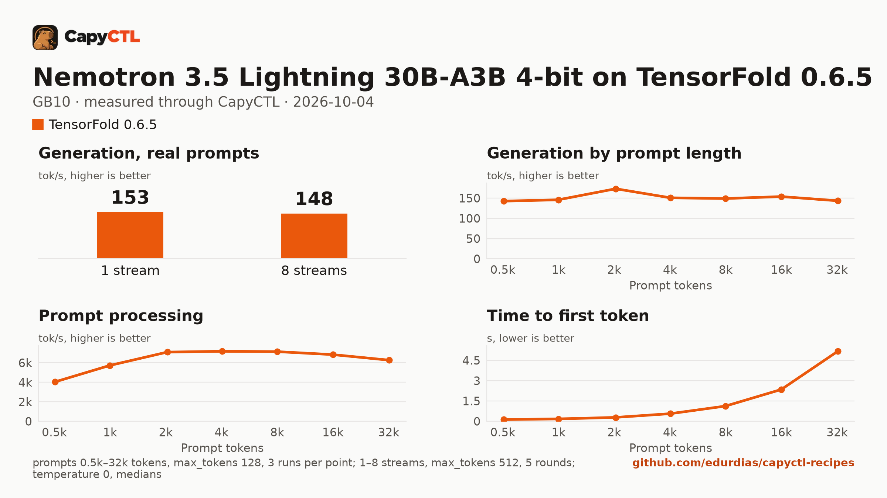

# Nemotron 3.5 Lightning 30B-A3B 4-bit on TensorFold 0.6.5, one GB10

| | |
|---|---|
| Hardware | 1x NVIDIA GB10 (DGX Spark class), compute capability 12.1, 128 GB unified memory, aarch64 |
| System | Ubuntu 24.04, NVIDIA driver 580.173.02, CUDA 13.0 toolkit in `/usr/local/cuda` (TensorFold builds its kernels with it) |
| Engine | TensorFold 0.6.5 in a venv (tag `v0.6.5`, torch 2.13.0+cu130) |
| Model | [`Vontra/NVIDIA-Nemotron-3.5-Lightning-30B-A3B-MLX-4bit`](https://huggingface.co/Vontra/NVIDIA-Nemotron-3.5-Lightning-30B-A3B-MLX-4bit) at `d9d758fb83953437f7263256b0d96157e2a348b8`, MLX affine 4-bit, 18.5 GB |
| Drafter | none external; the checkpoint's built-in MTP heads draft (`"drafts":true`) |
| CapyCTL | `main` at `1f2cfc7` (prints `capyctl 0.1.1`), release build; `capyctl start standalone` |
| Measured | 2026-10-04 |

This recipe needs CapyCTL newer than the 0.1.1 release (`main` at `1f2cfc7`
or later, until the next release), the first commit that verifies TensorFold
0.6.5. The deployment file itself validates with 0.1.1, which is what this
repository's check runs.

TensorFold 0.6.5 decodes this model family (`nemotron_h`) one request at a
time on CUDA. CapyCTL starts it with `--parallel 8` for other models; for this
one, `capyctl status deployment` says so:

```text
Streams 1 request at a time (CapyCTL default): TensorFold serves this model family (nemotron_h) one request at a time on CUDA
```

Requests sent together wait their turn; see the concurrency table below.

## Run it

The API key comes from the credentials file the start banner names:

```bash
KEY=$(sed -n 's/^api_key: //p' ~/.local/state/capyctl/identity/credentials)
```

```bash
capyctl engine add ~/tensorfold-0.6.5-venv
```

```text
Registered tensorfold (tensorfold 0.6.5)

  Executable     /home/me/tensorfold-0.6.5-venv/bin/tensorfold
  Deep park      disabled
  CUDA           /usr/local/cuda
  Engines file   /home/me/.config/capyctl/engines.yaml (revision 5)
  Published      yes
```

The revision is 5 because this ran after the vLLM recipes' profiles were added
and removed.

```bash
capyctl deploy model --file deployment.yaml
```

```text
Request identity: 01M4405FCSJ59MNF7KCK199GSX (reuse --request-id 01M4405FCSJ59MNF7KCK199GSX to recover this command)
Deployment nemotron-30b created (revision 1)

  Deployment ID       01M4405FDCEBF64VGH46NRAZ7Z
  Operation           01M4405FDC9TV8D6ZWEGWWFK20
  Checkpoint digest   being measured
the checkpoint digest of nemotron-30b is being measured; `capyctl start deployment nemotron-30b --wait` waits for it and starts the deployment
```

```bash
capyctl start deployment nemotron-30b --wait
```

```text
Request identity: 01M4405FDYTMFC51HVKG7P0ESV (reuse --request-id 01M4405FDYTMFC51HVKG7P0ESV to recover this command)
Waiting for the model source of nemotron-30b to be downloaded and verified (at most 1800s)
Started nemotron-30b: ready

  Ready       1/1
  Hosts       host-a
  Operation   initialize succeeded
```

Nemotron thinks before it answers and returns the thinking in
`reasoning_content`:

```bash
curl -s http://127.0.0.1:8443/v1/chat/completions \
  -H "Authorization: Bearer $KEY" -H 'Content-Type: application/json' \
  -d '{"model": "nemotron-30b", "messages": [{"role": "user", "content": "Name the largest planet in one sentence."}]}' \
  | jq -r '.choices[0].message.content'
```

```text
Jupiter is the largest planet in our solar system.
```

The response's `tensorfold` record counts the drafts:

```json
{"accepted": 213, "cached": 0, "decode_s": 1.7636, "decode_tps": 168.97, "drafted": 323, "drafts": true, "min_rows": 2, "prefill_s": 0.0461, "rounds": 85, "token_sha": "a2fc7cd0b0b7"}
```

## Measured through CapyCTL

| | |
|---|---|
| Ready, cold | 100 s (weights already in the model store; includes verifying them, measuring the checkpoint digest and building TensorFold's kernels in a fresh state directory) |
| Ready, warm | 12 s (`start` after `stop` finished) |
| Time to first token | 0.072 s median (0.072 to 0.074) |
| Decode, one stream | 135 tokens/s median (124 to 149), MTP drafts on |
| Peak memory | 24.0 GiB measured by CapyCTL, against the declared 32 GiB `cold` and 30 GiB `ready` reservations; CapyCTL caps TensorFold at the 30 GiB `ready` allocation |
| Concurrency | one request at a time (see above) |
| Context | 32,768 tokens, declared |

Three streaming chat completions through the CapyCTL endpoint, one at a time,
`max_tokens: 512`, `temperature: 0.6`, thinking on (the model's default; the
first token counted is the first `reasoning_content` token). The three prompts
are the first three of capyctl-bench's prompt set (`explain-tcp`,
`python-lru`, `history-printing`); every request generated all 512 tokens. The
same three requests after the warm start gave 0.075 s and 137 tokens/s (124 to
149). Decode varies with the prompt because the number of accepted drafts
does.

On TensorFold 0.6.1 (2026-10-02, other prompts) this recipe measured 132
tokens/s. In the [0.6.3 vs 0.6.5 comparison](../../comparisons/tensorfold-0.6.3-vs-0.6.5-qwen3.8-27b-nvfp4-gb10/)
on this machine (greedy, capyctl-bench prompts), one stream went from 147.5 to
152.5 tokens/s; the one-stream aggregate in the benchmark below is 152.8.

## Benchmark

[`bench/`](bench/) has the capyctl-bench results and report
([`report.html`](bench/report.html), [`summary.md`](bench/summary.md),
[`data.csv`](bench/data.csv)). Context sweep 0.5k to 32k tokens, three runs per
point, `max_tokens: 128`; concurrency 1 to 8 streams, five rounds each,
`max_tokens: 512`; `temperature: 0`, thinking on; machine memory in use
(`MemTotal - MemAvailable`) sampled every 0.5 s.

| Context | Time to first token | Decode, one stream | Memory in use, peak |
|---|---|---|---|
| 0.5k | 0.13 s | 142.6 tokens/s | 25.5 GiB |
| 1k | 0.17 s | 145.9 tokens/s | 25.4 GiB |
| 2k | 0.29 s | 173.2 tokens/s | 25.3 GiB |
| 4k | 0.56 s | 150.8 tokens/s | 25.2 GiB |
| 8k | 1.12 s | 149.0 tokens/s | 25.1 GiB |
| 16k | 2.34 s | 153.9 tokens/s | 24.9 GiB |
| 32k | 5.16 s | 143.5 tokens/s | 24.7 GiB |

| Streams | Together | Each | Time to first token |
|---|---|---|---|
| 1 | 152.8 tokens/s | 156.4 tokens/s | 0.07 s |
| 2 | 145.5 tokens/s | 155.9 tokens/s | 1.65 s |
| 3 | 148.3 tokens/s | 154.5 tokens/s | 3.45 s |
| 4 | 152.6 tokens/s | 154.5 tokens/s | 5.28 s |
| 5 | 148.2 tokens/s | 155.0 tokens/s | 7.07 s |
| 6 | 149.6 tokens/s | 154.7 tokens/s | 8.79 s |
| 7 | 149.5 tokens/s | 155.0 tokens/s | 10.40 s |
| 8 | 148.3 tokens/s | 152.6 tokens/s | 12.15 s |

With one stream on CUDA, the aggregate stays at about 150 tokens/s from 1 to 8
streams; each added stream waits for the ones before it, so the median time to
first token grows by about 1.7 s per stream.



A downloaded copy needs about 18.5 GB in the model store; with the download,
the first start takes as long as the download plus the time above.
