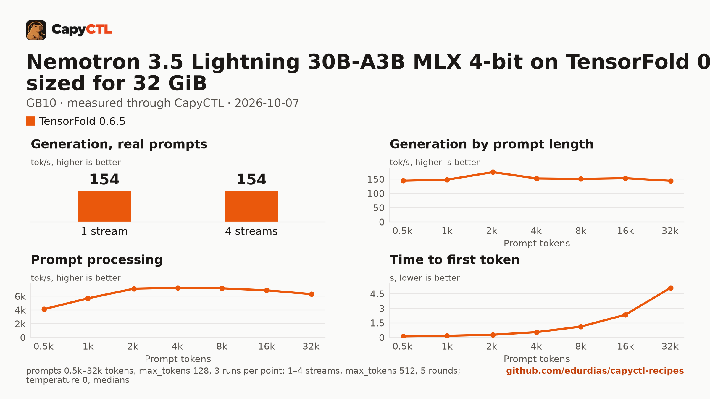

# Nemotron 3.5 Lightning 30B-A3B MLX 4-bit on TensorFold 0.6.5 with MTP drafts, sized for 32 GiB, one GB10

| | |
|---|---|
| Hardware | 1x NVIDIA GB10 (DGX Spark class), compute capability 12.1, 128 GB unified memory, aarch64 |
| System | Ubuntu 24.04, NVIDIA driver 580.173.02, CUDA 13.0 toolkit in `/usr/local/cuda` (TensorFold builds its kernels with it) |
| Engine | TensorFold 0.6.5 in a venv (torch 2.13.0+cu130) |
| Model | [`TensorFold/NVIDIA-Nemotron-3.5-Lightning-30B-A3B-MLX-4bit`](https://huggingface.co/TensorFold/NVIDIA-Nemotron-3.5-Lightning-30B-A3B-MLX-4bit) at `d9d758fb83953437f7263256b0d96157e2a348b8`, MLX affine 4-bit, 18.5 GB |
| Drafter | MTP, in the checkpoint |
| CapyCTL | `main` at `7e50aa9` (prints `capyctl 0.1.2`), release build; `capyctl start standalone` with its default limits |
| Measured | 2026-10-07 |

Nemotron 3.5 Lightning for a GPU with 32 GB: the deployment is sized so the
model, once ready, fits in 32 GiB. It was validated on a GB10, not on a 24 or
32 GB card. The
[vLLM](../../vllm/nemotron-3.5-lightning-30b-a3b-nvfp4-32gib-gb10/) and
[SGLang](../../sglang/nemotron-3.5-lightning-30b-a3b-nvfp4-32gib-gb10/)
recipes sized for the same 32 GiB serve NVIDIA's NVFP4 export. The
[earlier recipe](../nemotron-3.5-lightning-30b-a3b-4bit-gb10/) serves the same
weights without a 32 GiB reservation.

### The checkpoint

TensorFold serves Nemotron 3.5 Lightning on CUDA from its MLX 4-bit export,
which carries the MTP drafter; it does not read
`nvidia/NVIDIA-Nemotron-3.5-Lightning-30B-A3B-NVFP4`. The quantization
differs from the vLLM and SGLang recipes (MLX 4-bit against NVFP4 experts
with FP8 mixer projections), so their numbers are not a one-to-one engine
comparison.

### Memory

The deployment reserves 32 GiB in every phase but `parked`, and CapyCTL caps
TensorFold at it (`TENSORFOLD_CUDA_MEMORY_LIMIT_GB`). TensorFold 0.6.5 serves
this model family one request at a time on CUDA, which CapyCTL states in the
deployment's status; later requests wait their turn.

| | |
|---|---|
| Ready footprint | 22.2 GiB after the first (cold) start (21.7 after the first requests), 18.7 to 19.9 GiB after later starts, 18.4 GiB after the benchmark: machine memory in use once ready, less what was in use before the start. TensorFold's own GPU allocations are 18.5 GiB at rest and peaked at 18.8 GiB during the benchmark |
| Loading peak | 23.0 GiB during the cold start (`MemAvailable` drop; CapyCTL measured 22.6 GiB), 19.4 to 20.1 GiB during later starts |
| Fits | 32 GiB: yes. 24 GiB: yes as measured, with 1.8 GiB to spare |

On the GB10's unified memory the loading peak and the engine's CPU-side
memory come out of the same pool as the GPU's. On a discrete card most of
that lands in system RAM, so the ready footprint is the number to compare
with a card's VRAM.

On CapyCTL newer than 0.1.2 the same reservation is written
`resources: {gpu: 30GiB, ram: 2GiB}`. The file keeps the long form because
this repository's check validates with the 0.1.2 release.

TensorFold cannot free its memory while it runs, so the model does not park:
`capyctl park deployment` refuses it (`error [unsupported]:
unsupported_capability`), and CapyCTL stops it and starts it again when it
needs the memory (`residency: restart_only`).

## Run it

The API key comes from the credentials file the start banner names:

```bash
KEY=$(sed -n 's/^api_key: //p' ~/.local/state/capyctl/identity/credentials)
```

```bash
capyctl engine add ~/tensorfold-0.6.5-venv
```

```text
Registered tensorfold (tensorfold 0.6.5)

  Executable     /home/me/tensorfold-0.6.5-venv/bin/tensorfold
  Deep park      disabled
  CUDA           /usr/local/cuda
  Engines file   /home/me/.config/capyctl/engines.yaml (revision 1)
  Published      yes
```

```bash
capyctl deploy model --file deployment.yaml
```

```text
Request identity: 01M4BY39Z0FBAF2JEX9NJ4WJQ3 (reuse --request-id 01M4BY39Z0FBAF2JEX9NJ4WJQ3 to recover this command)
Deployment nemotron35-30b-tf created (revision 1)

  Deployment ID       01M4BY39ZKMN2N45RVTCBXV0QY
  Operation           01M4BY39ZKRPYSYEPBR04CAVFJ
  Checkpoint digest   being measured
the checkpoint digest of nemotron35-30b-tf is being measured; `capyctl start deployment nemotron35-30b-tf --wait` waits for it and starts the deployment
```

```bash
capyctl start deployment nemotron35-30b-tf --wait
```

```text
Request identity: 01M4BY3AM578XFA6APNWW4TMDS (reuse --request-id 01M4BY3AM578XFA6APNWW4TMDS to recover this command)
Started nemotron35-30b-tf: ready

  Ready       1/1
  Hosts       host-a
  Operation   initialize succeeded
```

`capyctl status deployment nemotron35-30b-tf`:

```text
NAME                STATE   READY   REVISION   STARTUP    INITIALIZE   LAST OPERATION
nemotron35-30b-tf   ready   1/1     1          32.0 GiB   1800s        initialize succeeded

INSTANCE   HOST     STATE   LIFECYCLE   DEVICES   LAST ERROR
0          host-a   ready   active      gpu0      -

Engine  tensorfold 0.6.5 (/home/me/tensorfold-0.6.5-venv/bin/tensorfold)
Streams 1 request at a time (CapyCTL default): TensorFold serves this model family (nemotron_h) one request at a time on CUDA
note: deployment nemotron35-30b-tf serves /v1, /health, /metrics without authentication on its loopback listener (inference; a known and accepted limitation)
```

Nemotron reasons before it answers; TensorFold returns the reasoning in
`reasoning_content` and the answer in `content`:

```bash
curl -s http://127.0.0.1:8443/v1/chat/completions \
  -H "Authorization: Bearer $KEY" -H 'Content-Type: application/json' \
  -d '{"model": "nemotron35-30b-tf", "messages": [{"role": "user", "content": "Name the largest planet in one sentence."}]}' \
  | jq -r '.choices[0].message.content'
```

```text
Jupiter is the largest planet in our solar system.
```

## Measured through CapyCTL

| | |
|---|---|
| Ready, cold | 48 s (the first start of the deployment; weights already on disk, page cache dropped; includes measuring the checkpoint digest) |
| Ready, warm | 11.7 s (`start` after `stop` finished, page cache dropped again) |
| Time to first token | 0.073 s median (0.072 to 0.074) |
| Decode, one stream | 137 tokens/s median (126 to 151), with MTP drafts |
| Peak memory | 22.6 GiB measured by CapyCTL; ready footprint in [Memory](#memory) |
| Park | refused (`unsupported_capability`); the model restarts instead |
| Concurrency | one request at a time |
| Context | 32,768 tokens, declared |

Three streaming chat completions through the CapyCTL endpoint, one at a time,
`max_tokens: 512`, `temperature: 0.6`, reasoning on (the model's default).
The three prompts are the first three of capyctl-bench's prompt set
(`explain-tcp`, `python-lru`, `history-printing`); every request generated
all 512 tokens. TensorFold accepted 40% to 51% of its MTP drafts on them, so
decode varies from request to request. The same three requests after the
warm start gave 0.074 s and 138 tokens/s.

## Benchmark

[`bench/`](bench/) has the capyctl-bench results and report
([`report.html`](bench/report.html), [`summary.md`](bench/summary.md),
[`data.csv`](bench/data.csv)). Context sweep 0.5k to 32k tokens, three runs per
point, `max_tokens: 128`; concurrency 1 to 4 streams, five rounds each,
`max_tokens: 512`; `temperature: 0`, reasoning on; machine memory in use
(`MemTotal - MemAvailable`, 5.3 GiB before the model started) sampled every
0.5 s.

| Context | Time to first token | Decode, one stream | Memory in use, peak |
|---|---|---|---|
| 0.5k | 0.12 s | 145 tokens/s | 24.0 GiB |
| 1k | 0.18 s | 148 tokens/s | 23.9 GiB |
| 2k | 0.29 s | 175 tokens/s | 23.9 GiB |
| 4k | 0.56 s | 153 tokens/s | 23.8 GiB |
| 8k | 1.12 s | 151 tokens/s | 23.8 GiB |
| 16k | 2.34 s | 154 tokens/s | 23.7 GiB |
| 32k | 5.13 s | 144 tokens/s | 23.6 GiB |

| Streams | Together | Each | Time to first token |
|---|---|---|---|
| 1 | 154 tokens/s | 158 tokens/s | 0.07 s |
| 2 | 147 tokens/s | 157 tokens/s | 1.64 s |
| 3 | 151 tokens/s | 156 tokens/s | 3.62 s |
| 4 | 154 tokens/s | 156 tokens/s | 5.05 s |

Requests run one at a time: more streams do not raise the total, and each
extra stream waits for the ones ahead of it. Decode with drafts depends on
how many drafts the reply accepts, so the context sweep is not monotonic.
Machine memory in use stayed between 23.5 and 24.0 GiB through the whole
benchmark.



The model needs about 18.5 GB in the model store; with the download, the first
start takes as long as the download plus the time above.
