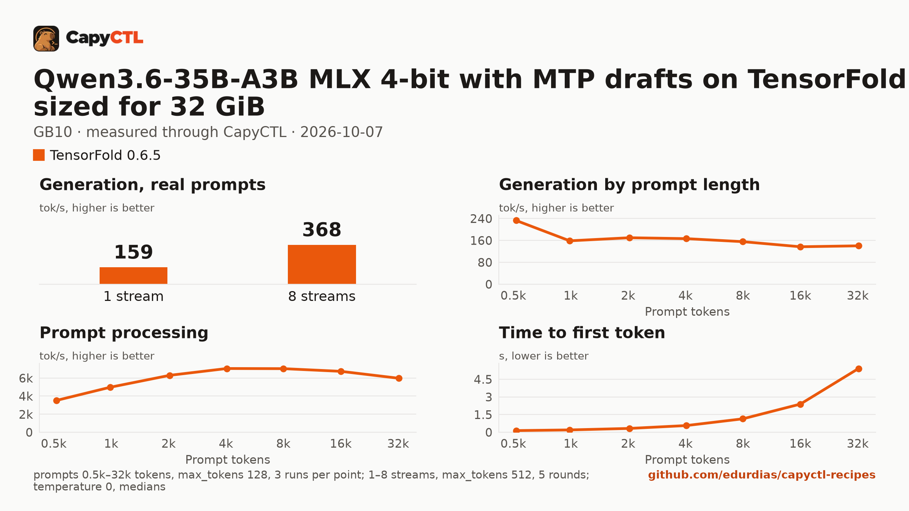

# Qwen3.6-35B-A3B MLX 4-bit on TensorFold 0.6.5 with MTP drafts, sized for 32 GiB, one GB10

| | |
|---|---|
| Hardware | 1x NVIDIA GB10 (DGX Spark class), compute capability 12.1, 128 GB unified memory, aarch64 |
| System | Ubuntu 24.04, NVIDIA driver 580.173.02, CUDA 13.0 toolkit in `/usr/local/cuda` (TensorFold builds its kernels with it) |
| Engine | TensorFold 0.6.5 in a venv (torch 2.13.0+cu130) |
| Model | [`TensorFold/Qwen3.6-35B-A3B-MLX-4bit-MTP`](https://huggingface.co/TensorFold/Qwen3.6-35B-A3B-MLX-4bit-MTP) at `f84b054c5677b6e59bdb969ae61915b0983d68bb`, MLX 4-bit (affine, groups of 64; some layers 8-bit), 20.9 GB |
| Drafter | MTP, in the checkpoint (`mtp-4bit.safetensors`) |
| CapyCTL | `main` at `0c4ccb4` (prints `capyctl 0.1.2`), release build; `capyctl start standalone` with its default limits |
| Measured | 2026-10-07 |

Qwen3.6-35B-A3B for a GPU with 32 GB: the deployment is sized so the model,
once ready, fits in 32 GiB. It was validated on a GB10, not on a 32 GB card.
The [vLLM](../../vllm/qwen3.6-35b-a3b-nvfp4-32gib-gb10/) and
[SGLang](../../sglang/qwen3.6-35b-a3b-nvfp4-32gib-gb10/) recipes sized for the
same 32 GiB serve NVIDIA's NVFP4 export.

### The checkpoint

TensorFold serves Qwen3.6-35B-A3B on CUDA from its own MLX 4-bit export, which
carries the MTP drafter; it does not read `nvidia/Qwen3.6-35B-A3B-NVFP4`. The
quantization differs from the vLLM and SGLang recipes (MLX 4-bit against
NVFP4 experts with FP8 attention projections), so their numbers are not a
one-to-one engine comparison.

### Memory

The deployment reserves 32 GiB in every phase but `parked`, and CapyCTL caps
TensorFold at it (`TENSORFOLD_CUDA_MEMORY_LIMIT_GB`). With a 32,768-token
context TensorFold decodes up to 8 requests together (CapyCTL's default).

| | |
|---|---|
| Ready footprint | 23.8 GiB after the first (cold) start, 21.4 GiB after a warm start, 22.9 GiB after the benchmark: machine memory in use once ready, less what was in use before the start. TensorFold's own GPU allocations are 19.5 GiB at rest and peaked at 24.2 GiB during the benchmark |
| Loading peak | 28.4 GiB during the cold start (`MemAvailable` drop; CapyCTL measured 24.4 GiB), 21.5 GiB during a warm start |
| Fits | 32 GiB: yes. 24 GiB: not as measured; TensorFold grew to 24.2 GiB under the benchmark's load, and a lower cap was not tried |

On the GB10's unified memory the loading peak and the engine's CPU-side
memory come out of the same pool as the GPU's. On a discrete card most of
that lands in system RAM, so the ready footprint is the number to compare
with a card's VRAM.

On CapyCTL newer than 0.1.2 the same reservation is written
`resources: {gpu: 30GiB, ram: 2GiB}`. The file keeps the long form because
this repository's check validates with the 0.1.2 release.

TensorFold cannot free its memory while it runs, so the model does not park:
`capyctl park deployment` refuses it (`unsupported_capability`, as in the
[Qwen3.8-27B recipe](../qwen3.8-27b-nvfp4-32gib-gb10/)), and CapyCTL stops it
and starts it again when it needs the memory (`residency: restart_only`).

## Run it

The API key comes from the credentials file the start banner names:

```bash
KEY=$(sed -n 's/^api_key: //p' ~/.local/state/capyctl/identity/credentials)
```

```bash
capyctl engine add ~/tensorfold-0.6.5-venv
```

```text
Registered tensorfold (tensorfold 0.6.5)

  Executable     /home/me/tensorfold-0.6.5-venv/bin/tensorfold
  Deep park      disabled
  CUDA           /usr/local/cuda
  Engines file   /home/me/.config/capyctl/engines.yaml (revision 1)
  Published      yes
```

```bash
capyctl deploy model --file deployment.yaml
```

```text
Request identity: 01M4B5N333WQAJSVPNR1GDVX9J (reuse --request-id 01M4B5N333WQAJSVPNR1GDVX9J to recover this command)
Deployment qwen36-35b-tf created (revision 1)

  Deployment ID       01M4B5N33QNSHT0HD1HX4W88KK
  Operation           01M4B5N33QDA3D2JXMAKFZV06T
  Checkpoint digest   being measured
the checkpoint digest of qwen36-35b-tf is being measured; `capyctl start deployment qwen36-35b-tf --wait` waits for it and starts the deployment
```

```bash
capyctl start deployment qwen36-35b-tf --wait
```

```text
Request identity: 01M4B5N394TC8WCYK373RHMX23 (reuse --request-id 01M4B5N394TC8WCYK373RHMX23 to recover this command)
Started qwen36-35b-tf: ready

  Ready       1/1
  Hosts       host-a
  Operation   initialize succeeded
```

`capyctl status deployment qwen36-35b-tf` shows the reservation and the
streams:

```text
NAME            STATE   READY   REVISION   STARTUP    INITIALIZE   LAST OPERATION
qwen36-35b-tf   ready   1/1     1          32.0 GiB   1800s        initialize succeeded

INSTANCE   HOST     STATE   LIFECYCLE   DEVICES   LAST ERROR
0          host-a   ready   active      gpu0      -

Engine  tensorfold 0.6.5 (/home/me/tensorfold-0.6.5-venv/bin/tensorfold)
Streams up to 8 requests decoded together (CapyCTL default)
note: deployment qwen36-35b-tf serves /v1, /health, /metrics without authentication on its loopback listener (inference; a known and accepted limitation)
```

Qwen3.6 thinks before it answers; TensorFold returns the thinking in
`reasoning_content` and the answer in `content`:

```bash
curl -s http://127.0.0.1:8443/v1/chat/completions \
  -H "Authorization: Bearer $KEY" -H 'Content-Type: application/json' \
  -d '{"model": "qwen36-35b-tf", "messages": [{"role": "user", "content": "Name the largest planet in one sentence."}]}' \
  | jq -r '.choices[0].message.content'
```

```text
Jupiter is the largest planet in our solar system.
```

## Measured through CapyCTL

| | |
|---|---|
| Ready, cold | 114 s (the first start of the deployment; weights already on disk, page cache dropped; includes measuring the checkpoint digest) |
| Ready, warm | 7.7 s (`start` after `stop` finished, page cache dropped again) |
| Time to first token | 0.069 s median (0.068 to 0.179) |
| Decode, one stream | 164 tokens/s median (154 to 178), MTP drafts on |
| Peak memory | 24.4 GiB measured by CapyCTL, against the 32 GiB reservation; ready footprint in [Memory](#memory) |
| Concurrency | up to 8 requests decoded together (CapyCTL's default) |
| Context | 32,768 tokens, declared |
| Park | not supported by TensorFold; the model restarts instead |

Three streaming chat completions through the CapyCTL endpoint, one at a time,
`max_tokens: 512`, `temperature: 0.6`, thinking on (the model's default; the
first token counted is the first `reasoning_content` token). The three prompts
are the first three of capyctl-bench's prompt set (`explain-tcp`,
`python-lru`, `history-printing`); every request generated all 512 tokens. The
same three requests after the warm start gave 0.070 s and 164 tokens/s (149
to 177).

## Benchmark

[`bench/`](bench/) has the capyctl-bench results and report
([`report.html`](bench/report.html), [`summary.md`](bench/summary.md),
[`data.csv`](bench/data.csv)). Context sweep 0.5k to 32k tokens, three runs per
point, `max_tokens: 128`; concurrency 1 to 8 streams, five rounds each,
`max_tokens: 512`; `temperature: 0`, thinking on; machine memory in use
(`MemTotal - MemAvailable`, 4.3 GiB before the model started) sampled every
0.5 s.

| Context | Time to first token | Decode, one stream | Memory in use, peak |
|---|---|---|---|
| 0.5k | 0.14 s | 233 tokens/s | 26.6 GiB |
| 1k | 0.20 s | 159 tokens/s | 26.6 GiB |
| 2k | 0.33 s | 170 tokens/s | 27.1 GiB |
| 4k | 0.57 s | 167 tokens/s | 27.4 GiB |
| 8k | 1.14 s | 155 tokens/s | 27.8 GiB |
| 16k | 2.39 s | 137 tokens/s | 28.5 GiB |
| 32k | 5.42 s | 140 tokens/s | 29.8 GiB |

| Streams | Together | Each | Time to first token |
|---|---|---|---|
| 1 | 159 tokens/s | 162 tokens/s | 0.06 s |
| 2 | 214 tokens/s | 111 tokens/s | 0.07 s |
| 3 | 249 tokens/s | 90 tokens/s | 0.12 s |
| 4 | 279 tokens/s | 74 tokens/s | 0.16 s |
| 5 | 304 tokens/s | 64 tokens/s | 0.19 s |
| 6 | 325 tokens/s | 58 tokens/s | 0.24 s |
| 7 | 347 tokens/s | 53 tokens/s | 0.29 s |
| 8 | 368 tokens/s | 50 tokens/s | 0.30 s |

Eight streams decode 2.3 times as many tokens as one. The MTP drafter's
acceptance stayed at 61 to 62% at every stream count. The 0.5k sweep point
decodes at 233 tokens/s because the drafter accepts more of the sweep's
repeated filler text; the three real prompts above are the one-stream figure
to use. At 32k tokens, machine memory in use peaked 25.6 GiB above what was in
use before the start.



The model needs about 20.9 GB in the model store; with the download, the first
start takes as long as the download plus the time above.
