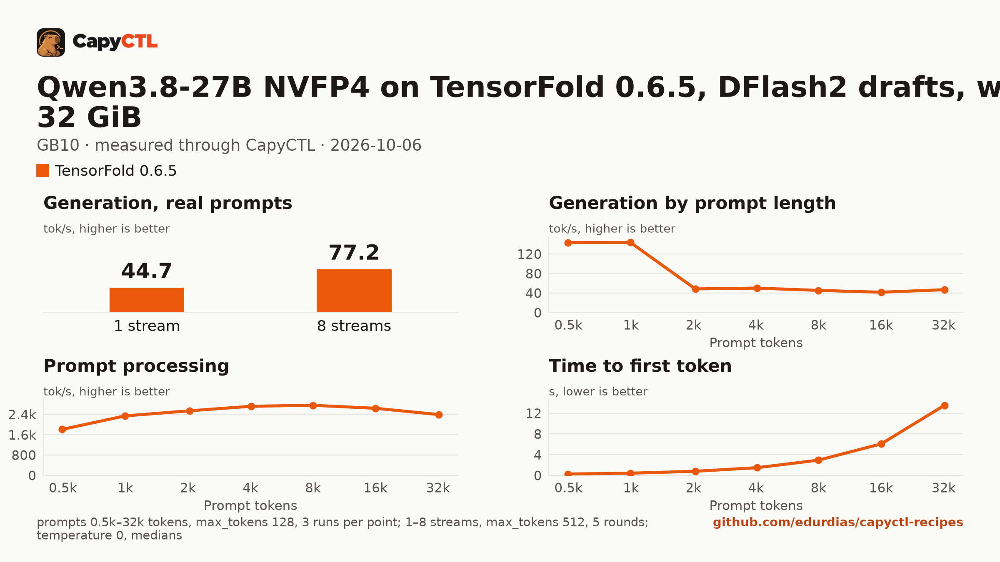

# Qwen3.8-27B NVFP4 on TensorFold 0.6.5 with DFlash2 drafts within 32 GiB, one GB10

| | |
|---|---|
| Hardware | 1x NVIDIA GB10 (DGX Spark class), compute capability 12.1, 128 GB unified memory, aarch64, held to 32 GiB (below) |
| System | Ubuntu 24.04, NVIDIA driver 580.173.02, CUDA 13.0 toolkit in `/usr/local/cuda` (TensorFold builds its kernels with it) |
| Engine | TensorFold 0.6.5 in a venv (torch 2.13.0+cu130) |
| Model | [`nvidia/Qwen3.8-27B-NVFP4`](https://huggingface.co/nvidia/Qwen3.8-27B-NVFP4) at `482ca0f3832238542f8f5295dde86b5f22711d80`, NVFP4 with FP8 layers, 21.9 GB |
| Drafter | [`z-lab/Qwen3.8-27B-DFlash2`](https://huggingface.co/z-lab/Qwen3.8-27B-DFlash2) at `50307d4c4cde6860d4eee73e2547cd786fe8e8a4`, 3.8 GB |
| CapyCTL | `main` at `a6b2560` (prints `capyctl 0.1.2`), release build; `capyctl start standalone --set host.resource_policy.memory.system.managed_limit=32GiB` |
| Measured | 2026-10-06 |

Qwen3.8-27B for a machine with 32 GiB for the model, such as a 32 GB GPU: this
recipe holds CapyCTL to 32 GiB of the GB10's memory and runs the model inside
it. The [128 GB recipe](../qwen3.8-27b-nvfp4-gb10/) runs 8 streams with the
whole machine. The [SGLang](../../sglang/qwen3.8-27b-nvfp4-32gib-gb10/) and
[vLLM](../../vllm/qwen3.8-27b-nvfp4-32gib-gb10/) recipes for the same 32 GiB
serve the same weights without a drafter.

Of the two NVFP4 exports the SGLang cookbook lists, this uses NVIDIA's, which
packs the `lm_head` to NVFP4 too: its weights are 21.9 GB against 23.8 GB for
`RadixArk/Qwen3.8-27B-NVFP4-BF16-LMHead`, and the cookbook puts the BF16 head
at about 3.2 GB more at runtime, room that 32 GiB does not have.

### Memory

The standalone's managed limit is 32 GiB:

```bash
capyctl start standalone --set host.resource_policy.memory.system.managed_limit=32GiB
```

The deployment reserves the whole 32 GiB in every phase but `parked`, and
CapyCTL caps TensorFold at it (`TENSORFOLD_CUDA_MEMORY_LIMIT_GB`). With the
DFlash2 drafter and a 32,768-token context, that holds two streams
(`max_concurrent_requests: 2`); requests past two wait in TensorFold's queue.
CapyCTL measured a 28.3 GiB peak.

On CapyCTL newer than 0.1.2 the same reservation is written
`resources: {gpu: 30GiB, ram: 2GiB}`. The measurements below ran with that
short form, except the park attempt, which ran the file as it is here; both
reserve 32 GiB and cap TensorFold at 32 GiB on a GB10. The file keeps the long
form because this repository's check validates with the 0.1.2 release.

TensorFold cannot free its memory while it runs, so the model does not park:
`capyctl park deployment` refuses it, and CapyCTL stops it and starts it again
when it needs the memory (`residency: restart_only`).

## Run it

CapyCTL does not download drafters. Download it into a directory of drafters:

```bash
hf download z-lab/Qwen3.8-27B-DFlash2 \
  --revision 50307d4c4cde6860d4eee73e2547cd786fe8e8a4 \
  --local-dir ~/drafters/Qwen3.8-27B-DFlash2
```

The API key comes from the credentials file the start banner names:

```bash
KEY=$(sed -n 's/^api_key: //p' ~/.local/state/capyctl/identity/credentials)
```

Register the engine and allow the drafter option for paths inside that
directory:

```bash
capyctl engine add ~/tensorfold-0.6.5-venv \
  --approve-option=--drafter --approve-path /home/me/drafters
```

```text
Registered tensorfold (tensorfold 0.6.5)

  Executable     /home/me/tensorfold-0.6.5-venv/bin/tensorfold
  Deep park      disabled
  CUDA           /usr/local/cuda
  Engines file   /home/me/.config/capyctl/engines.yaml (revision 1)
  Published      yes
```

```bash
capyctl deploy model --file deployment.yaml
```

```text
Request identity: 01M49GMPTZGYHH8B5CQYQDG02W (reuse --request-id 01M49GMPTZGYHH8B5CQYQDG02W to recover this command)
Deployment qwen38-27b-tf created (revision 1)

  Deployment ID       01M49GMPVJJWWJ6C2WFFX66T8A
  Operation           01M49GMPVJZ1N3PC9BGDHNM882
  Checkpoint digest   being measured
the checkpoint digest of qwen38-27b-tf is being measured; `capyctl start deployment qwen38-27b-tf --wait` waits for it and starts the deployment
```

```bash
capyctl start deployment qwen38-27b-tf --wait
```

```text
Request identity: 01M498GCNZ4EBKHJJBAPCNG8BP (reuse --request-id 01M498GCNZ4EBKHJJBAPCNG8BP to recover this command)
Started qwen38-27b-tf: ready

  Ready       1/1
  Hosts       host-a
  Operation   initialize succeeded
```

`capyctl status deployment qwen38-27b-tf` shows the reservation and the
streams:

```text
NAME            STATE   READY   REVISION   STARTUP    INITIALIZE   LAST OPERATION
qwen38-27b-tf   ready   1/1     1          32.0 GiB   1800s        initialize succeeded

INSTANCE   HOST         STATE   LIFECYCLE   DEVICES   LAST ERROR
0          host-a   ready   active      gpu0      -

Engine  tensorfold 0.6.5 (/home/me/tensorfold-0.6.5-venv/bin/tensorfold)
Streams up to 2 requests decoded together (engine_config.max_concurrent_requests)
note: deployment qwen38-27b-tf serves /v1, /health, /metrics without authentication on its loopback listener (inference; a known and accepted limitation)
```

Qwen3.8 thinks before it answers; TensorFold returns the thinking in
`reasoning_content` and the answer in `content`:

```bash
curl -s http://127.0.0.1:8443/v1/chat/completions \
  -H "Authorization: Bearer $KEY" -H 'Content-Type: application/json' \
  -d '{"model": "qwen38-27b-tf", "messages": [{"role": "user", "content": "Name the largest planet in one sentence."}]}' \
  | jq -r '.choices[0].message.content'
```

```text
Jupiter is the largest planet in our solar system.
```

Parking is refused:

```bash
capyctl park deployment qwen38-27b-tf
```

```text
Request identity: 01M49GN3VC7J8WBJMQCMRWMK4K (reuse --request-id 01M49GN3VC7J8WBJMQCMRWMK4K to recover this command)
error [unsupported]: unsupported_capability: Requested capability is unavailable
```

## Measured through CapyCTL

| | |
|---|---|
| Ready, cold | 133 s (the first start of the deployment; weights already in the model store; includes measuring the checkpoint digest) |
| Ready, warm | 12.7 s (`start` after `stop` finished); 12.2 s for a later start of a new deployment of the same file |
| Time to first token | 0.110 s median (0.108 to 0.111) |
| Decode, one stream | 41.5 tokens/s median (40.6 to 47.1), DFlash2 drafts on |
| Peak memory | 28.3 GiB measured by CapyCTL, against the 32 GiB reservation; `MemAvailable` fell by 30.5 GiB at most during the cold start |
| Concurrency | 2 requests decoded together (`max_concurrent_requests: 2`) |
| Context | 32,768 tokens, declared |
| Park | not supported by TensorFold; `capyctl park deployment` is refused and the model restarts instead |

Three streaming chat completions through the CapyCTL endpoint, one at a time,
`max_tokens: 512`, `temperature: 0.6`, thinking on (the model's default; the
first token counted is the first `reasoning_content` token). The three prompts
are the first three of capyctl-bench's prompt set (`explain-tcp`,
`python-lru`, `history-printing`); every request generated all 512 tokens. The
same three requests after the warm start gave 0.111 s and 41.3 tokens/s (40.5
to 46.7).

## Benchmark

[`bench/`](bench/) has the capyctl-bench results and report
([`report.html`](bench/report.html), [`summary.md`](bench/summary.md),
[`data.csv`](bench/data.csv)). Context sweep 0.5k to 32k tokens, three runs per
point, `max_tokens: 128`; concurrency 1 to 8 streams, five rounds each,
`max_tokens: 512`; `temperature: 0`, thinking on; machine memory in use
(`MemTotal - MemAvailable`, about 3.5 GiB before the model starts) sampled
every 0.5 s.

| Context | Time to first token | Decode, one stream | Memory in use, peak |
|---|---|---|---|
| 0.5k | 0.27 s | 143.6 tokens/s | 27.8 GiB |
| 1k | 0.43 s | 143.7 tokens/s | 27.9 GiB |
| 2k | 0.80 s | 48.6 tokens/s | 28.1 GiB |
| 4k | 1.49 s | 50.2 tokens/s | 29.0 GiB |
| 8k | 2.94 s | 45.5 tokens/s | 30.3 GiB |
| 16k | 6.08 s | 41.8 tokens/s | 31.4 GiB |
| 32k | 13.53 s | 46.9 tokens/s | 34.5 GiB |

| Streams | Together | Each | Time to first token |
|---|---|---|---|
| 1 | 44.7 tokens/s | 45.0 tokens/s | 0.11 s |
| 2 | 73.5 tokens/s | 41.5 tokens/s | 0.13 s |
| 3 | 65.0 tokens/s | 41.7 tokens/s | 0.14 s |
| 4 | 77.6 tokens/s | 41.1 tokens/s | 5.72 s |
| 5 | 70.0 tokens/s | 41.5 tokens/s | 12.11 s |
| 6 | 76.1 tokens/s | 40.9 tokens/s | 12.64 s |
| 7 | 72.5 tokens/s | 41.6 tokens/s | 14.40 s |
| 8 | 77.2 tokens/s | 41.3 tokens/s | 18.88 s |

Two streams decode 1.6 times as many tokens as one. From three streams on,
the requests past two wait in TensorFold's queue: the total stays at 65 to 78
tokens/s and the time to first token grows with the wait. The 0.5k and 1k
sweep points decode at 144 tokens/s because the drafter accepts most of the
sweep's repeated filler text; the three real prompts above are the one-stream
figure to use.



A downloaded copy needs about 21.9 GB in the model store and 3.8 GB for the
drafter; with the download, the first start takes as long as the download plus
the time above.
