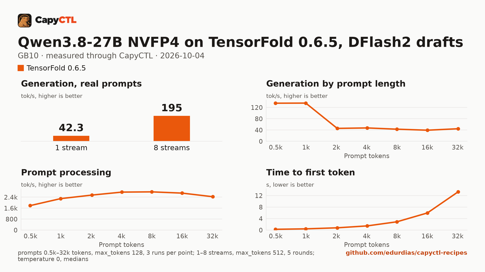

# Qwen3.8-27B NVFP4 on TensorFold 0.6.5 with DFlash2 drafts, one GB10

| | |
|---|---|
| Hardware | 1x NVIDIA GB10 (DGX Spark class), compute capability 12.1, 128 GB unified memory, aarch64 |
| System | Ubuntu 24.04, NVIDIA driver 580.173.02, CUDA 13.0 toolkit in `/usr/local/cuda` (TensorFold builds its kernels with it) |
| Engine | TensorFold 0.6.5 in a venv (tag `v0.6.5`, torch 2.13.0+cu130) |
| Model | [`nvidia/Qwen3.8-27B-NVFP4`](https://huggingface.co/nvidia/Qwen3.8-27B-NVFP4) at `482ca0f3832238542f8f5295dde86b5f22711d80`, NVFP4 with FP8 layers, 21.9 GB |
| Drafter | [`z-lab/Qwen3.8-27B-DFlash2`](https://huggingface.co/z-lab/Qwen3.8-27B-DFlash2) at `50307d4c4cde6860d4eee73e2547cd786fe8e8a4`, 3.8 GB |
| CapyCTL | `main` at `1f2cfc7` (prints `capyctl 0.1.1`), release build; `capyctl start standalone` |
| Measured | 2026-10-04 |

This recipe needs CapyCTL newer than the 0.1.1 release: `main` at `1f2cfc7`
or later, until the next release. It uses changes made after 0.1.1:
`capyctl engine add --approve-option/--approve-path`, which allows the
`--drafter` option; the first-request kernel build; `--parallel 8` by default,
so TensorFold decodes up to 8 requests together (before, it served them one at
a time); the memory cap, which holds TensorFold to the `ready` allocation the
file declares (`TENSORFOLD_CUDA_MEMORY_LIMIT_GB`); and the verification of
TensorFold 0.6.5. The deployment file itself validates with the 0.1.1 release,
which is what this repository's check runs.

`capyctl status deployment` shows the streams:

```text
Streams up to 8 requests decoded together (CapyCTL default)
```

TensorFold runs the checkpoint in its own precision on compute
capability 12.x; the engine log said so at every start on 0.6.1:

```text
[tensorfold] precision: checkpoint (the checkpoint's own math: its NVFP4 layers FP4 x FP4, per-16 scales under its static input scales; its FP8 layers FP8 x FP8)
```

## Run it

CapyCTL does not download drafters. Download it into a directory of drafters:

```bash
hf download z-lab/Qwen3.8-27B-DFlash2 \
  --revision 50307d4c4cde6860d4eee73e2547cd786fe8e8a4 \
  --local-dir ~/drafters/Qwen3.8-27B-DFlash2
```

The API key comes from the credentials file the start banner names:

```bash
KEY=$(sed -n 's/^api_key: //p' ~/.local/state/capyctl/identity/credentials)
```

Register the engine and allow the drafter option for paths inside that
directory:

```bash
capyctl engine add ~/tensorfold-0.6.5-venv \
  --approve-option=--drafter --approve-path /home/me/drafters
```

```text
Registered tensorfold (tensorfold 0.6.5)

  Executable     /home/me/tensorfold-0.6.5-venv/bin/tensorfold
  Deep park      disabled
  CUDA           /usr/local/cuda
  Engines file   /home/me/.config/capyctl/engines.yaml (revision 7)
  Published      yes
```

The revision is 7 because this ran after the vLLM recipes' and the
[Nemotron recipe](../nemotron-3.5-lightning-30b-a3b-4bit-gb10/)'s profiles were
added and removed.

```bash
capyctl deploy model --file deployment.yaml
```

```text
Request identity: 01M441263HV29AGBZFA0C9XRYV (reuse --request-id 01M441263HV29AGBZFA0C9XRYV to recover this command)
Deployment qwen38-27b created (revision 1)

  Deployment ID       01M4412645TZ58YQ3NE9TJM3QG
  Operation           01M4412645PHCXPCAW4ZGVQEPH
  Checkpoint digest   being measured
the checkpoint digest of qwen38-27b is being measured; `capyctl start deployment qwen38-27b --wait` waits for it and starts the deployment
```

```bash
capyctl start deployment qwen38-27b --wait
```

```text
Request identity: 01M441264QCE5MJ9R4NFER0MAT (reuse --request-id 01M441264QCE5MJ9R4NFER0MAT to recover this command)
Started qwen38-27b: ready

  Ready       1/1
  Hosts       host-a
  Operation   initialize succeeded
```

Qwen3.8 thinks before it answers and returns the thinking in
`reasoning_content`:

```bash
curl -s http://127.0.0.1:8443/v1/chat/completions \
  -H "Authorization: Bearer $KEY" -H 'Content-Type: application/json' \
  -d '{"model": "qwen38-27b", "messages": [{"role": "user", "content": "Name the largest planet in one sentence."}]}' \
  | jq -r '.choices[0].message.content'
```

```text
Jupiter is the largest planet in our solar system.
```

The response's `tensorfold` record counts the drafts:

```json
{"accepted": 53, "cached": 0, "decode_s": 0.7854, "drafted": 120, "drafts": true, "min_rows": 16, "prefill_s": 0.1144, "rounds": 8, "token_sha": "18388734e4b6"}
```

## Measured through CapyCTL

| | |
|---|---|
| Ready, cold | 62 s (weights already in the model store; includes verifying them and measuring the checkpoint digest) |
| Ready, warm | 14 s (`start` after `stop` finished; the kernels are reused) |
| Time to first token | 0.115 s median (0.115 to 0.118) |
| Decode, one stream | 38.9 tokens/s median (38.3 to 44.1), DFlash2 drafts on |
| Peak memory | 30.3 GiB measured by CapyCTL, against the declared 36 GiB `cold` and 34 GiB `ready` reservations; CapyCTL caps TensorFold at the 34 GiB `ready` allocation |
| Concurrency | up to 8 requests decoded together (`--parallel 8`, CapyCTL's default) |
| Context | 32,768 tokens, declared |

Three streaming chat completions through the CapyCTL endpoint, one at a time,
`max_tokens: 512`, `temperature: 0.6`, thinking on (the model's default; the
first token counted is the first `reasoning_content` token). The three prompts
are the first three of capyctl-bench's prompt set (`explain-tcp`,
`python-lru`, `history-printing`); every request generated all 512 tokens. The
same three requests after the warm start gave the same numbers (0.117 s, 38.9
tokens/s). The 2026-10-02 measurement on TensorFold 0.6.1 (48.2 tokens/s) used
other prompts on another GB10 machine and is not comparable; on this machine
the [0.6.3 vs 0.6.5 comparison](../../comparisons/tensorfold-0.6.3-vs-0.6.5-qwen3.8-27b-nvfp4-gb10/)
found one stream within 2%.

### What the drafter does

The same deployment with drafts turned off, on the same machine, the same
three requests:

| | DFlash2 drafts | No drafts |
|---|---|---|
| Decode, one stream | 38.9 tokens/s (38.3 to 44.1) | 11.7 tokens/s (11.6 to 11.7) |
| Time to first token | 0.115 s | 0.115 s |
| Ready, first start of the deployment | 62 s | 12 s |
| Peak memory (CapyCTL) | 30.3 GiB | 20.8 GiB |

Drafts make decode about 3.3 times faster and cost about 9.5 GiB. The outputs
were identical token for token (the same `token_sha` in each pair). Accepted
of drafted, per request: 377 of 2,010, 393 of 1,770 and 375 of 2,040, in 134,
118 and 136 rounds.

Leaving the drafter out of the deployment does not give you the no-drafts
numbers: CapyCTL then starts TensorFold with `--drafter none`, and TensorFold
refuses to start this model that way, naming the drafter it wants. To run
without drafts, turn them off in place of the drafter; `--no-drafts` needs no
approval when you add the engine:

```yaml
  accept_extra_args: true
  extra_args: [--no-drafts]
```

## Benchmark

[`bench/`](bench/) has the capyctl-bench results and report
([`report.html`](bench/report.html), [`summary.md`](bench/summary.md),
[`data.csv`](bench/data.csv)). Context sweep 0.5k to 32k tokens, three runs per
point, `max_tokens: 128`; concurrency 1 to 8 streams, five rounds each,
`max_tokens: 512`; `temperature: 0`, thinking on; machine memory in use
(`MemTotal - MemAvailable`) sampled every 0.5 s.

| Context | Time to first token | Decode, one stream | Memory in use, peak |
|---|---|---|---|
| 0.5k | 0.28 s | 135.2 tokens/s | 29.0 GiB |
| 1k | 0.43 s | 135.5 tokens/s | 28.7 GiB |
| 2k | 0.79 s | 45.9 tokens/s | 28.9 GiB |
| 4k | 1.46 s | 47.5 tokens/s | 29.8 GiB |
| 8k | 2.89 s | 43.0 tokens/s | 31.1 GiB |
| 16k | 5.96 s | 39.4 tokens/s | 32.2 GiB |
| 32k | 13.30 s | 44.6 tokens/s | 35.2 GiB |

| Streams | Together | Each | Time to first token |
|---|---|---|---|
| 1 | 42.3 tokens/s | 42.7 tokens/s | 0.11 s |
| 2 | 69.6 tokens/s | 39.4 tokens/s | 0.14 s |
| 3 | 95.4 tokens/s | 36.6 tokens/s | 0.18 s |
| 4 | 120.8 tokens/s | 34.5 tokens/s | 0.22 s |
| 5 | 137.3 tokens/s | 32.0 tokens/s | 0.20 s |
| 6 | 157.0 tokens/s | 30.7 tokens/s | 0.23 s |
| 7 | 176.2 tokens/s | 29.4 tokens/s | 0.25 s |
| 8 | 194.6 tokens/s | 28.4 tokens/s | 0.43 s |

Eight streams decode 4.6 times as many tokens as one, each stream at two
thirds of the speed of one alone. One-stream decode is 135 tokens/s at 0.5k
and 1k, where the sweep's filler replies are easy to draft, and 39 to 48
tokens/s from 2k to 32k. Machine memory in use (about 4.4 GiB before
TensorFold starts) grows with the context, from 29 GiB at 0.5k to 35 GiB at
32k.



A downloaded copy needs about 21.9 GB in the model store and 3.8 GB for the
drafter; with the download, the first start takes as long as the download plus
the time above.
