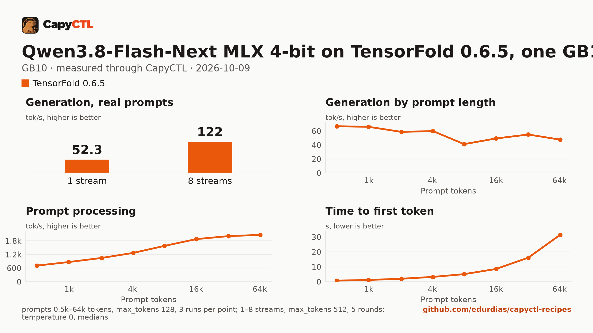

# Qwen3.8-Flash-Next MLX 4-bit on TensorFold 0.6.5 with MTP drafts, n-gram table on disk, one GB10

| | |
|---|---|
| Hardware | 1x NVIDIA GB10 (DGX Spark class), compute capability 12.1, 128 GB unified memory, aarch64, local NVMe |
| System | Ubuntu 24.04, NVIDIA driver 580.173.02, CUDA 13.0 toolkit in `/usr/local/cuda` (TensorFold builds its kernels with it) |
| Engine | TensorFold 0.6.5 in a venv (torch 2.13.0+cu130) |
| Model | [`TensorFold/Qwen3.8-Flash-Next-MLX-4bit-MTP`](https://huggingface.co/TensorFold/Qwen3.8-Flash-Next-MLX-4bit-MTP) at `2b170fa6309d5d1ee380b35636075fac7945f286`, MLX affine 4-bit (groups of 32), 113.2 GB |
| Drafter | MTP, in the checkpoint |
| CapyCTL | `main` at `eb214aa` (prints `capyctl 0.1.2`), release build; `capyctl start standalone` with the managed limit raised to 110 GiB and the free reserve lowered to 11 GiB |
| Measured | 2026-10-09 |

Qwen3.8-Flash-Next on one GB10, with the full 262,144-token context and up to
8 requests together. The checkpoint holds 105.4 GiB of tensors, and 29.8 GiB of
them are the model's n-gram (per-layer embedding) table. With `--ple-on-ssd`
TensorFold reads the table's rows from the checkpoint's own files at each
lookup and keeps none of it in memory, so the model needs about 83 GiB once
ready. That is still above the standalone's default managed limit (half the
memory, 60.8 GiB), so the limit has to be raised.

The [SGLang recipe](../../sglang/qwen3.8-flash-next-nvfp4-gb10/) serves
RadixArk's NVFP4 export with the table in a file on disk. vLLM 0.30.0 has no
way to keep the table out of memory, so it cannot serve this model on one
GB10 (see the SGLang recipe).

### The checkpoint

TensorFold reads the n-gram table from disk only from its MLX export. Started
on `RadixArk/Qwen3.8-Flash-Next-NVFP4` with `--ple-on-ssd`, TensorFold 0.6.5
refuses (see [The NVFP4 checkpoint](#the-nvfp4-checkpoint)). The quantization
differs from the SGLang recipe (MLX 4-bit everywhere, the table included,
against NVFP4 experts with the rest in BF16 and an FP8 table), so their
numbers are not a one-to-one engine comparison.

### Memory

The deployment reserves 94 GiB in every phase but `parked`, and CapyCTL caps
TensorFold at it (`TENSORFOLD_CUDA_MEMORY_LIMIT_GB`). TensorFold sized itself
inside the cap at start:

```text
[tensorfold] CUDA rank 0 startup estimate 89.06 GiB within 94.00 GiB; native 262144, allocated prompt/reply window 262144, cache slots 262151
[tensorfold] Flash Next on CUDA: 1 to 6 MTP drafts a round, a chain stops before a later draft under 70%; up to 8 streams, each growing to 262144 prompt/reply tokens while memory lasts (14.5 GiB free for their caches, 7.52 GiB for one at the full window), eager; n-gram tables read from SSD at each lookup; 0 decode graphs captured; idle prompt pieces 4096 rows; prompt kernels warmed in 16.6s
```

| | |
|---|---|
| Ready footprint | 82.6 GiB after the cold start, 82.5 and 82.8 GiB after two later starts, 83.6 to 83.7 GiB after the first requests, 94.1 GiB after the benchmark (the streams' caches grow with long prompts, up to the cap): machine memory in use once ready, less what was in use before the start. TensorFold's own GPU allocations are 80.2 GiB at rest and peaked at 91.8 GiB during the benchmark |
| Loading peak | 87.3 GiB during the cold start, 86.2 and 87.0 GiB during two later starts (`MemAvailable` drop); CapyCTL measured 85.3 GiB on the cold start and 87.1 GiB on the third |
| Fits | one 128 GB GB10 with the managed limit raised; not the standalone's default limit (60.8 GiB) |
| Disk | the table is read from the model store's copy of the checkpoint; nothing else is written |

On the GB10's unified memory the loading peak and the engine's CPU-side
memory come out of the same pool as the GPU's, so nothing else large should
run on the machine while the model starts. The table's reads go through the
page cache, which the kernel can reclaim; it does not count as memory in use.

The standalone's managed limit and free reserve together have to fit in the
machine's 121.7 GiB; this recipe was validated with a 110 GiB limit and an
11 GiB free reserve (the [SGLang recipe](../../sglang/qwen3.8-flash-next-nvfp4-gb10/#the-managed-limit-and-the-free-reserve)
needs the reserve lowered to 8 GiB):

```bash
capyctl start standalone \
  --set host.resource_policy.memory.system.managed_limit=110GiB \
  --set host.resource_policy.memory.system.free_reserve=11GiB
```

On CapyCTL newer than 0.1.2 the same reservation is written
`resources: {gpu: 90GiB, ram: 4GiB}`, the form it was measured with. The file
keeps the long form because this repository's check validates with the 0.1.2
release.

TensorFold cannot free its memory while it runs, so the model does not park:
`capyctl park deployment` refuses it (`error [unsupported]:
unsupported_capability: Requested capability is unavailable`; the model kept
serving and answered the next request), and CapyCTL stops it and starts it
again when it needs the memory (`residency: restart_only`).

### The NVFP4 checkpoint

The same file with `model:` pointing at `RadixArk/Qwen3.8-Flash-Next-NVFP4`
(`7b719225`, the SGLang recipe's checkpoint) did not start. TensorFold 0.6.5
refused before it loaded anything, and CapyCTL reported the exit:

```text
tensorfold: CUDA startup memory budget cannot fit requested context 262144; estimated largest fitting prompt-plus-reply window: 0 tokens across the ranks. Please free memory or use smaller/quantized weights; no model weights or KV caches have been loaded. KV precision is unchanged.
```

```text
error [operation_failed]: Operation 01M4G4PSK23SRYVNF2SG6CATE0 failed: launch failed: engine launch failed: the engine exited before readiness; TensorFold's memory cap cannot hold context_length beside its streams: lower max_concurrent_requests or context_length, or raise the ready allocation in resources
```

In TensorFold 0.6.5's source, `--ple-on-ssd` reads the tables only from the
MLX export: for an NVFP4 checkpoint the loader keeps them memory-mapped and
raises `--ple-on-ssd reads the MLX checkpoint's n-gram shards from disk; an
NVFP4 checkpoint's tables stay memory-mapped, so drop --ple-on-ssd`. This
start stopped earlier, at TensorFold's memory estimate, with the NVFP4
checkpoint's 126 GiB counted against the 94 GiB cap.

## Run it

The API key comes from the credentials file the start banner names:

```bash
KEY=$(sed -n 's/^api_key: //p' ~/.local/state/capyctl/identity/credentials)
```

```bash
capyctl engine add ~/tensorfold-0.6.5-venv
```

```text
Registered tensorfold (tensorfold 0.6.5)

  Executable     /home/me/tensorfold-0.6.5-venv/bin/tensorfold
  Deep park      disabled
  CUDA           /usr/local/cuda
  Engines file   /home/me/.config/capyctl/engines.yaml (revision 1)
  Published      yes
```

```bash
capyctl deploy model --file deployment.yaml
```

```text
Request identity: 01M4FWCQYP8KM64EFDV3TCV5EN (reuse --request-id 01M4FWCQYP8KM64EFDV3TCV5EN to recover this command)
Deployment qwen38-flash-next-tf created (revision 1)

  Deployment ID       01M4FWCQZP78X11117G3RQF1TX
  Operation           01M4FWCQZPAGMGMVHTQGM462Z3
  Checkpoint digest   being measured
the checkpoint digest of qwen38-flash-next-tf is being measured; `capyctl start deployment qwen38-flash-next-tf --wait` waits for it and starts the deployment
```

```bash
capyctl start deployment qwen38-flash-next-tf --wait
```

```text
Request identity: 01M4FWFZ0Q61SSPA2JKK4VX3TE (reuse --request-id 01M4FWFZ0Q61SSPA2JKK4VX3TE to recover this command)
Started qwen38-flash-next-tf: ready

  Ready       1/1
  Hosts       host-a
  Operation   initialize succeeded
```

`capyctl status deployment qwen38-flash-next-tf`:

```text
NAME                   STATE   READY   REVISION   STARTUP    INITIALIZE   LAST OPERATION
qwen38-flash-next-tf   ready   1/1     1          94.0 GiB   1800s        initialize succeeded

INSTANCE   HOST     STATE   LIFECYCLE   DEVICES   LAST ERROR
0          host-a   ready   active      gpu0      -

Engine  tensorfold 0.6.5 (/home/me/tensorfold-0.6.5-venv/bin/tensorfold)
Streams up to 8 requests decoded together (engine_config.max_concurrent_requests)
note: deployment qwen38-flash-next-tf serves /v1, /health, /metrics without authentication on its loopback listener (inference; a known and accepted limitation)
```

The model always reasons before it answers; TensorFold returns the reasoning
in `reasoning_content` and the answer in `content`:

```bash
curl -s http://127.0.0.1:8443/v1/chat/completions \
  -H "Authorization: Bearer $KEY" -H 'Content-Type: application/json' \
  -d '{"model": "qwen38-flash-next-tf", "messages": [{"role": "user", "content": "Name the largest planet in one sentence."}]}' \
  | jq -r '.choices[0].message.content'
```

```text
Jupiter is the largest planet.
```

## Measured through CapyCTL

| | |
|---|---|
| Ready, cold | 109 s (the first start of the deployment; weights already on disk, page cache dropped; TensorFold built its CUDA kernels, which later starts reuse) |
| Ready, warm | 19.2 s (`start` after `stop` finished, page cache dropped again). A third start took 20.3 s |
| Time to first token | 0.271 s median (0.256 to 0.497) |
| Decode, one stream | 54.7 tokens/s median (52.1 to 56.4), with MTP drafts |
| Peak memory | 87.1 GiB measured by CapyCTL, against the 94 GiB reservation; ready footprint in [Memory](#memory) |
| Park | refused (`unsupported_capability`); the model restarts instead |
| Concurrency | up to 8 requests together (`max_concurrent_requests: 8`) |
| Context | 262,144 tokens, declared |

Three streaming chat completions through the CapyCTL endpoint, one at a time,
`max_tokens: 512`, `temperature: 0.6`, reasoning on (the model's default).
The three prompts are the first three of capyctl-bench's prompt set
(`explain-tcp`, `python-lru`, `history-printing`); every request generated
all 512 tokens. TensorFold accepted 71% of its MTP drafts on them. The same
three requests after the warm start gave 0.273 s and 54.6 tokens/s.

## Benchmark

[`bench/`](bench/) has the capyctl-bench results and report
([`report.html`](bench/report.html), [`summary.md`](bench/summary.md),
[`data.csv`](bench/data.csv)). Context sweep 0.5k to 64k tokens, three runs per
point, `max_tokens: 128`; concurrency 1 to 8 streams, five rounds each,
`max_tokens: 512`; `temperature: 0`, reasoning on; machine memory in use
(`MemTotal - MemAvailable`, 4.7 GiB before the model started) sampled every
0.5 s.

| Context | Time to first token | Decode, one stream | Memory in use, peak |
|---|---|---|---|
| 0.5k | 0.71 s | 66.9 tokens/s | 90.0 GiB |
| 1k | 1.17 s | 66.0 tokens/s | 90.2 GiB |
| 2k | 1.99 s | 58.8 tokens/s | 90.5 GiB |
| 4k | 3.21 s | 59.9 tokens/s | 90.6 GiB |
| 8k | 5.07 s | 41.3 tokens/s | 91.2 GiB |
| 16k | 8.55 s | 49.4 tokens/s | 91.6 GiB |
| 32k | 16.1 s | 55.0 tokens/s | 93.6 GiB |
| 64k | 31.4 s | 47.7 tokens/s | 98.9 GiB |

| Streams | Together | Each | Time to first token |
|---|---|---|---|
| 1 | 52.3 tokens/s | 53.7 tokens/s | 0.25 s |
| 2 | 69.3 tokens/s | 36.2 tokens/s | 0.18 s |
| 3 | 82.5 tokens/s | 29.3 tokens/s | 0.10 s |
| 4 | 96.8 tokens/s | 24.8 tokens/s | 0.30 s |
| 5 | 102 tokens/s | 21.4 tokens/s | 0.14 s |
| 6 | 110 tokens/s | 19.4 tokens/s | 0.14 s |
| 7 | 116 tokens/s | 17.6 tokens/s | 0.16 s |
| 8 | 122 tokens/s | 16.0 tokens/s | 0.17 s |

Eight streams decode 2.3 times as many tokens as one. Decode with drafts
depends on how many drafts each reply accepts (67% to 79% across the sweep),
so the context sweep is not monotonic. Machine memory in use went from 88.4 to
100.1 GiB during the benchmark (95.4 GiB above what was in use before the
start), growing with the 64k prompts' caches.



The model needs about 113.2 GB in the model store; with the download, the
first start takes as long as the download plus the time above.
