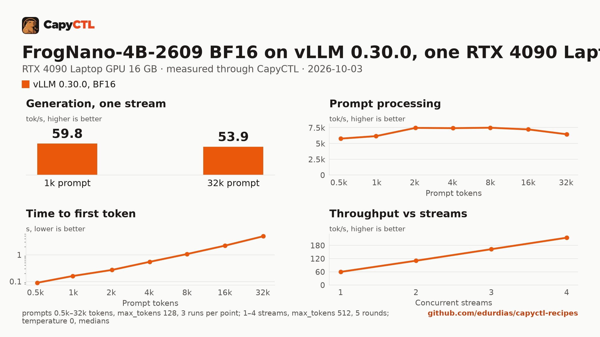

# FrogNano-4B-2609 on vLLM 0.30.0, one RTX 4090 Laptop GPU

| | |
|---|---|
| Hardware | 1x NVIDIA GeForce RTX 4090 Laptop GPU, 16 GB (16376 MiB), compute capability 8.9; Intel Core i9-14900HX, 64 GB RAM, x86_64 |
| System | Ubuntu 26.04, NVIDIA driver 615.71.09, CUDA 13.4 toolkit in `/usr/local/cuda` |
| Engine | vLLM 0.30.0 in a venv (torch 2.13.0+cu130) |
| Model | [`microsoft/FrogNano-4B-2609`](https://huggingface.co/microsoft/FrogNano-4B-2609) at `b90468c11a913c1916b4542b4b7a530ec42024a4`, BF16, 9.3 GB |
| Drafter | none |
| CapyCTL | `main` at `c5ebc1a` (prints `capyctl 0.1.1`); `capyctl start standalone` |
| Measured | 2026-10-03 |
| Rechecked | 2026-10-04 on CapyCTL `main` at `1f2cfc7`: the same file started and answered, with the same fitted context and the same 14.5 GiB GPU and 4 GiB RAM reservation; CapyCTL now starts vLLM with `--max-num-seqs 32`. The numbers below are from `c5ebc1a` |

This recipe needs CapyCTL newer than the 0.1.1 release: `main` at `c5ebc1a`
or later, until the next release. The deployment file sets no memory and no
parsers. CapyCTL picks the tool-call and reasoning parsers from the model
family (`qwen3_coder` and `qwen3` for `qwen3_5`), and it sizes vLLM to fit a
16 GB card. The deployment file itself validates with the 0.1.1 release, which
is what this repository's check runs.

For the same model in 4-bit on TensorFold, with 3.5 GiB of GPU memory at
short prompts, see
[tensorfold/frognano-4b-mlx-4bit-rtx4090](../../tensorfold/frognano-4b-mlx-4bit-rtx4090/).
The same checkpoint on SGLang 0.5.21:
[sglang/frognano-4b-rtx4090](../../sglang/frognano-4b-rtx4090/).

## Run it

The API key comes from the credentials file the start banner names:

```bash
KEY=$(sed -n 's/^api_key: //p' ~/.local/state/capyctl/identity/credentials)
```

```bash
capyctl engine add ~/vllm-0.30.0-venv
```

```text
Registered vllm (vllm 0.30.0)

  Executable     /home/me/vllm-0.30.0-venv/bin/vllm
  Deep park      enabled
  CUDA           /usr/local/cuda
  Engines file   /home/me/.config/capyctl/engines.yaml (revision 2)
  Published      yes
```

```bash
capyctl deploy model --file deployment.yaml
```

```text
Request identity: 01M41216QF3XCPJ14RYEHFXPGB (reuse --request-id 01M41216QF3XCPJ14RYEHFXPGB to recover this command)
Deployment frognano-4b-vllm created (revision 1)

  Deployment ID       01M41216QQKPA6M0QJHS39S7K3
  Operation           01M41216QQEDQMQ5N5M5CWGASP
  Checkpoint digest   being measured
the checkpoint digest of frognano-4b-vllm is being measured; `capyctl start deployment frognano-4b-vllm --wait` waits for it and starts the deployment
```

The first start downloads the checkpoint into the model store:

```bash
capyctl start deployment frognano-4b-vllm --wait
```

```text
Request identity: 01M4115EZY2E5N5W23D79S03NS (reuse --request-id 01M4115EZY2E5N5W23D79S03NS to recover this command)
Waiting for the model source of frognano-4b-vllm to be downloaded and verified (at most 900s)
Started frognano-4b-vllm: ready

  Ready       1/1
  Hosts       host-a
  Operation   initialize succeeded
```

`capyctl status deployment frognano-4b-vllm` names the parsers it chose:

```text
Parsers tool calls: qwen3_coder, reasoning: qwen3 (model family qwen3_5)
```

FrogNano thinks before it answers; vLLM returns the thinking in `reasoning`:

```bash
curl -s http://127.0.0.1:8443/v1/chat/completions \
  -H "Authorization: Bearer $KEY" -H 'Content-Type: application/json' \
  -d '{"model": "frognano-4b-vllm", "messages": [{"role": "user", "content": "Name the largest planet in one sentence."}]}' \
  | jq -r '.choices[0].message.content'
```

```text
Jupiter is the largest planet in our solar system.
```

Tool calls come back structured, with `finish_reason: tool_calls`:

```bash
curl -s http://127.0.0.1:8443/v1/chat/completions \
  -H "Authorization: Bearer $KEY" -H 'Content-Type: application/json' \
  -d '{"model": "frognano-4b-vllm", "messages": [{"role": "user", "content": "What is the weather in Lisbon, in celsius?"}],
       "tools": [{"type": "function", "function": {"name": "get_weather", "description": "Get the current weather for a city.",
         "parameters": {"type": "object", "properties": {"city": {"type": "string"}, "unit": {"type": "string", "enum": ["celsius", "fahrenheit"]}}, "required": ["city"]}}}]}' \
  | jq -c '.choices[0] | {finish_reason, tool_calls: .message.tool_calls}'
```

```json
{"finish_reason":"tool_calls","tool_calls":[{"function":{"arguments":"{\"city\": \"Lisbon\", \"unit\": \"celsius\"}","name":"get_weather"},"id":"chatcmpl-tool-93e6c5e59748fc52","type":"function"}]}
```

## Measured through CapyCTL

| | |
|---|---|
| Ready, first start | 826 s on a fresh state directory: downloading the 9.3 GB checkpoint, verifying it, measuring the checkpoint digest, and vLLM's first start (226 s, including its compile) |
| Ready, cold | 78 s (`start` after `deploy model`, weights already in the model store) |
| Ready, warm | 77 s (`start` after `stop` finished) |
| Time to first token | 0.054 s median (0.053 to 0.065) |
| Decode, one stream | 59.9 tokens/s median (59.9 to 60.5) |
| Peak memory | 13.1 GiB of GPU memory, whole-card `nvidia-smi`, against the 14.5 GiB GPU and 4 GiB RAM reservation CapyCTL sized for the card (its default startup size); the same at 32k-token prompts, since vLLM allocates its KV cache at start |
| Context | 116,160 tokens, fitted by CapyCTL |

Three streaming chat completions through the CapyCTL endpoint, one at a time,
`max_tokens: 512`, `temperature: 0`, thinking on (the model's default; the
first token counted is the first `reasoning` token). Two requests generated
all 512 tokens; the third finished on its own at 363.

The model runs with deep parking on (CapyCTL's default for vLLM), so
`capyctl status deployment` warns that vLLM development mode is on.

## Benchmark

[`bench/`](bench/) has the capyctl-bench results and report
([`report.html`](bench/report.html), [`summary.md`](bench/summary.md),
[`data.csv`](bench/data.csv)). Context sweep 0.5k to 32k tokens, three runs per
point, `max_tokens: 128`; concurrency 1 to 4 streams, five rounds each,
`max_tokens: 512`; `temperature: 0`, thinking on; GPU memory sampled with
`nvidia-smi`.

| Context | Time to first token | Decode, one stream |
|---|---|---|
| 0.5k | 0.09 s | 60.3 tokens/s |
| 2k | 0.27 s | 58.7 tokens/s |
| 8k | 1.07 s | 58.5 tokens/s |
| 16k | 2.22 s | 56.9 tokens/s |
| 32k | 5.00 s | 53.9 tokens/s |

| Streams | Aggregate | Per stream | Time to first token, median |
|---|---|---|---|
| 1 | 59.9 tokens/s | 60.2 tokens/s | 0.06 s |
| 2 | 110.6 tokens/s | 55.8 tokens/s | 0.10 s |
| 4 | 215.1 tokens/s | 54.3 tokens/s | 0.11 s |


