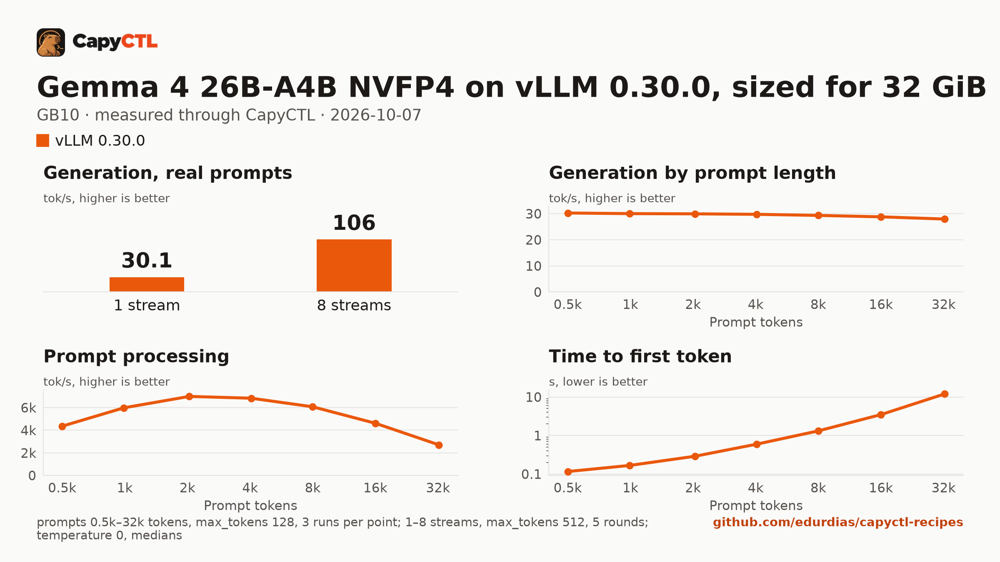

# Gemma 4 26B-A4B NVFP4 on vLLM 0.30.0, sized for 32 GiB, one GB10

| | |
|---|---|
| Hardware | 1x NVIDIA GB10 (DGX Spark class), compute capability 12.1, 128 GB unified memory, aarch64 |
| System | Ubuntu 24.04, NVIDIA driver 580.173.02, CUDA 13.0 toolkit in `/usr/local/cuda` |
| Engine | vLLM 0.30.0 in a venv (torch 2.13.0+cu130, FlashInfer 0.6.18.post1) |
| Model | [`nvidia/Gemma-4-26B-A4B-NVFP4`](https://huggingface.co/nvidia/Gemma-4-26B-A4B-NVFP4) at `a19cfe00be84568a6867111c9a68c9c44fdcffe6`, NVFP4 W4A4 (ModelOpt), 18.8 GB |
| Drafter | none |
| CapyCTL | `main` at `7e50aa9` (prints `capyctl 0.1.2`), release build; `capyctl start standalone` with its default limits |
| Measured | 2026-10-07 |

Gemma 4 26B-A4B for a GPU with 32 GB: the deployment is sized so the model,
once ready, fits in 32 GiB, with up to 4 requests together. It was validated
on a GB10, not on a 32 GB card. The
[SGLang](../../sglang/gemma-4-26b-a4b-nvfp4-32gib-gb10/) recipe sized for the
same 32 GiB serves the same weights. TensorFold 0.6.5: not supported on GB10;
Gemma 4 has only an MLX engine (no CUDA engine). Needs new model support in
TensorFold.

### What the file sets, and why

- `language_model_only: true`: text only; vLLM skips the vision tower.
- `memory.kv_cache: 3GiB`: an FP8 KV cache of 122,521 tokens (vLLM reports
  3.74 requests of 32,768 tokens at full length).
- `residency: restart_only`: see [below](#restart-instead-of-deep-parking).

### Memory

Up to 4 requests run together (`max_concurrent_requests: 4`).

| | |
|---|---|
| Ready footprint | 24.1 to 24.3 GiB after a cold start, 24.6 to 24.8 GiB after a warm one, 25.0 GiB after the benchmark: machine memory in use once ready, less what was in use before the start. vLLM's own GPU allocations are 20.6 to 20.7 GiB at rest and peaked at 21.0 GiB during the benchmark; the weights take 17.05 GiB |
| Loading peak | 29.8 GiB during the cold start, 30.4 GiB during a warm one (`MemAvailable` drop); CapyCTL measured 29.8 GiB, then 30.4 GiB |
| Fits | 32 GiB: yes, with 7 GiB to spare. 24 GiB: no as measured (24.1 to 25.0 GiB) |

On the GB10's unified memory the loading peak and the engine's CPU-side
memory come out of the same pool as the GPU's. On a discrete card most of
that lands in system RAM, so the ready footprint is the number to compare
with a card's VRAM.

### Restart instead of deep parking

CapyCTL parks vLLM deep by default: vLLM sleeps, drops the weights, and
reloads them from disk on wake. The same file without
`residency: restart_only`, measured on the same machine:

- Deep parking needs vLLM's sleep mode and eager weight loading, which keep
  about 16 GiB more on the CPU side: ready footprint 40.2 GiB (39.7 after
  the first requests), loading peak 47.8 GiB (CapyCTL measured 47.9 GiB).
  That does not fit 32 GiB.
- Park works. Parked, vLLM held 0.5, then 2.3, then 3.6 GiB of
  GPU memory over three cycles, and CapyCTL's measured parked charge grew
  from 17.8 to 22.5 to 24.0 GiB.
- The wake does not restore the model correctly. On every wake vLLM logs
  `Gemma4Model: Failed to load weights`, `Gemma4RotaryEmbedding: Failed to
  load weights` and `ParallelLMHead: Failed to load weights` while it
  reloads in place. After the first wake the model answered garbled text
  (`Jupiter is the largest planet,,` followed by runs of backticks and stray
  characters); that answer took 1,159 s to come back. The second and third wakes
  answered in 15.7 s and 16.0 s with plausible text, after the same warnings.

So this file sets `residency: restart_only`: CapyCTL stops the model and
starts it again when it needs the memory.

## Run it

The API key comes from the credentials file the start banner names:

```bash
KEY=$(sed -n 's/^api_key: //p' ~/.local/state/capyctl/identity/credentials)
```

```bash
capyctl engine add ~/vllm-0.30.0-venv
```

```text
Registered vllm (vllm 0.30.0)

  Executable     /home/me/vllm-0.30.0-venv/bin/vllm
  Deep park      enabled
  CUDA           /usr/local/cuda
  Engines file   /home/me/.config/capyctl/engines.yaml (revision 1)
  Published      yes
```

```bash
capyctl deploy model --file deployment.yaml
```

```text
Request identity: 01M4BK77P7PDNXHD354ZFKJ5CG (reuse --request-id 01M4BK77P7PDNXHD354ZFKJ5CG to recover this command)
Deployment gemma4-26b-a4b-vllm created (revision 1)

  Deployment ID       01M4BK77PSNJ602EE1X3DNJ2SJ
  Operation           01M4BK77PSCA9N2JNBN7QZEC15
  Checkpoint digest   being measured
the checkpoint digest of gemma4-26b-a4b-vllm is being measured; `capyctl start deployment gemma4-26b-a4b-vllm --wait` waits for it and starts the deployment
```

```bash
capyctl start deployment gemma4-26b-a4b-vllm --wait
```

```text
Request identity: 01M4BK77Y7JWDA3M33D81E7PWX (reuse --request-id 01M4BK77Y7JWDA3M33D81E7PWX to recover this command)
Waiting for the checkpoint digest of gemma4-26b-a4b-vllm to be measured (at most 900s)
Started gemma4-26b-a4b-vllm: ready

  Ready       1/1
  Hosts       host-a
  Operation   initialize succeeded
```

`capyctl status deployment gemma4-26b-a4b-vllm`:

```text
NAME                  STATE   READY   REVISION   STARTUP    INITIALIZE   LAST OPERATION
gemma4-26b-a4b-vllm   ready   1/1     1          48.6 GiB   790s         initialize succeeded

INSTANCE   HOST     STATE   LIFECYCLE   DEVICES   LAST ERROR
0          host-a   ready   active      gpu0      -

Engine  vllm 0.30.0 (/home/me/vllm-0.30.0-venv/bin/vllm)
Parsers tool calls: gemma4, reasoning: gemma4
```

Gemma 4 answers without thinking unless a request turns it on, so the answer
is all in `content`:

```bash
curl -s http://127.0.0.1:8443/v1/chat/completions \
  -H "Authorization: Bearer $KEY" -H 'Content-Type: application/json' \
  -d '{"model": "gemma4-26b-a4b-vllm", "messages": [{"role": "user", "content": "Name the largest planet in one sentence."}]}' \
  | jq -r '.choices[0].message.content'
```

```text
The largest planet in our solar system is Jupiter.
```

## Measured through CapyCTL

| | |
|---|---|
| Ready, cold | 189 s (the first start of the deployment; weights already on disk, page cache dropped; includes measuring the checkpoint digest and vLLM's compile and warmup) |
| Ready, warm | 152 s (`start` after `stop` finished, page cache dropped again; vLLM repeats its startup) |
| Time to first token | 0.083 s median (0.081 to 0.083) |
| Decode, one stream | 30.3 tokens/s median (30.2 to 30.3) |
| Peak memory | 29.8 GiB measured by CapyCTL on the cold start, 30.4 GiB on the warm one; ready footprint in [Memory](#memory) |
| Park | refused (`restart_only`); see [Restart instead of deep parking](#restart-instead-of-deep-parking) |
| Concurrency | up to 4 requests together (`max_concurrent_requests: 4`) |
| Context | 32,768 tokens, declared |

Three streaming chat completions through the CapyCTL endpoint, one at a time,
`max_tokens: 512`, `temperature: 0.6`, thinking off (the model's default).
The three prompts are the first three of capyctl-bench's prompt set
(`explain-tcp`, `python-lru`, `history-printing`); every request generated
all 512 tokens. The same three requests after the warm start gave 0.080 s and
30.3 tokens/s.

## Benchmark

[`bench/`](bench/) has the capyctl-bench results and report
([`report.html`](bench/report.html), [`summary.md`](bench/summary.md),
[`data.csv`](bench/data.csv)). Context sweep 0.5k to 32k tokens, three runs per
point, `max_tokens: 128`; concurrency 1 to 8 streams, five rounds each,
`max_tokens: 512`; `temperature: 0`, thinking off; machine memory in use
(`MemTotal - MemAvailable`, 3.6 GiB before the model started) sampled every
0.5 s.

| Context | Time to first token | Decode, one stream | Memory in use, peak |
|---|---|---|---|
| 0.5k | 0.12 s | 30.3 tokens/s | 28.6 GiB |
| 1k | 0.17 s | 30.0 tokens/s | 28.6 GiB |
| 2k | 0.29 s | 29.9 tokens/s | 28.6 GiB |
| 4k | 0.60 s | 29.8 tokens/s | 28.6 GiB |
| 8k | 1.32 s | 29.3 tokens/s | 28.6 GiB |
| 16k | 3.50 s | 28.8 tokens/s | 28.6 GiB |
| 32k | 12.0 s | 28.0 tokens/s | 28.6 GiB |

| Streams | Together | Each | Time to first token |
|---|---|---|---|
| 1 | 30.1 tokens/s | 30.2 tokens/s | 0.08 s |
| 2 | 63.3 tokens/s | 31.8 tokens/s | 0.08 s |
| 3 | 79.0 tokens/s | 26.5 tokens/s | 0.12 s |
| 4 | 105 tokens/s | 26.4 tokens/s | 0.14 s |
| 5 | 70.3 tokens/s | 26.6 tokens/s | 0.14 s |
| 6 | 86.4 tokens/s | 26.5 tokens/s | 0.14 s |
| 7 | 92.3 tokens/s | 26.5 tokens/s | 0.17 s |
| 8 | 106 tokens/s | 26.6 tokens/s | 9.60 s |

Four streams decode 3.5 times as many tokens as one. Past four, the extra
requests wait for a running one to finish: at 5 to 8 streams the total falls
back to 70 to 106 tokens/s, and at 8 the median time to first token is 9.6 s.
Machine memory in use stayed between 28.1 and 28.7 GiB through the whole
benchmark, 25.2 GiB above what was in use before the start.



The model needs about 18.8 GB in the model store; with the download, the first
start takes as long as the download plus the time above.
