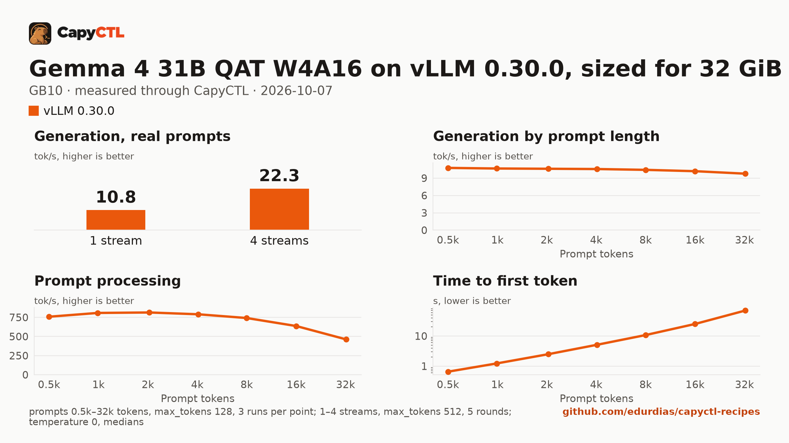

# Gemma 4 31B QAT W4A16 on vLLM 0.30.0, sized for 32 GiB, one GB10

| | |
|---|---|
| Hardware | 1x NVIDIA GB10 (DGX Spark class), compute capability 12.1, 128 GB unified memory, aarch64 |
| System | Ubuntu 24.04, NVIDIA driver 580.173.02, CUDA 13.0 toolkit in `/usr/local/cuda` |
| Engine | vLLM 0.30.0 in a venv (torch 2.13.0+cu130, FlashInfer 0.6.18.post1) |
| Model | [`google/gemma-4-31B-it-qat-w4a16-ct`](https://huggingface.co/google/gemma-4-31B-it-qat-w4a16-ct) at `52f3f65bc7a02d555763bc923bd1d9094898219d`, Google's quantization-aware INT4 W4A16 checkpoint (compressed-tensors), 23.3 GB |
| Drafter | none |
| CapyCTL | `main` at `7e50aa9` (prints `capyctl 0.1.2`), release build; `capyctl start standalone` with its default limits |
| Measured | 2026-10-07 |

Gemma 4 31B for a GPU with 32 GB: the deployment is sized so the model, once
ready, fits in 32 GiB, with up to 2 requests together. It was validated on a
GB10, not on a 32 GB card. TensorFold 0.6.5: not supported on GB10; Gemma 4
has only an MLX engine (no CUDA engine). Needs new model support in
TensorFold.

SGLang 0.5.21 did not serve this checkpoint on the GB10, so there is no
SGLang recipe for it:

- As it is, the start fails while SGLang repacks the INT4 weights for its
  Marlin kernels: `size_n = 8608 is not divisible by tile_n_size = 64`. The
  vision tower is quantized too, and its MLP (2 x 4,304 columns) does not fit
  Marlin's tiles.
- `language_model_only: true`, which skips the vision tower in vLLM, is
  refused: `--language-model-only does not support
  ['Gemma4ForConditionalGeneration']`.
- Loading the text model class instead
  (`--json-model-override-args '{"architectures": ["Gemma4ForCausalLM"]}'`)
  failed at startup, before the weights loaded.

### What the file sets, and why

- `language_model_only: true`: text only; vLLM skips the vision tower. vLLM
  serves the INT4 weights with its Marlin kernels (`MarlinLinearKernel for
  CompressedTensorsWNA16`); they take 18.7 GiB.
- `memory.kv_cache: 4GiB`: an FP8 KV cache of 40,832 tokens. vLLM needs
  3.21 GiB for one request of 32,768 tokens; with 2 GiB it refused to start
  (`To serve at least one request with the model's max seq len (32768),
  (3.21 GiB KV cache is needed, ...`). Two requests run together while they
  share the 40,832 tokens.
- `residency: restart_only`: see [below](#restart-instead-of-deep-parking).

### Memory

Up to 2 requests run together (`max_concurrent_requests: 2`).

| | |
|---|---|
| Ready footprint | 26.9 to 27.4 GiB after a cold start, 26.9 to 27.5 GiB after a warm one, 27.5 GiB after the benchmark: machine memory in use once ready, less what was in use before the start. vLLM's own GPU allocations are 23.2 GiB at rest and peaked at 23.7 GiB during the benchmark |
| Loading peak | 46.6 GiB during the cold start and during a warm one (`MemAvailable` drop); CapyCTL measured 46.6 GiB both times |
| Fits | 32 GiB: yes, with 4.5 GiB to spare. 24 GiB: no |

On the GB10's unified memory the loading peak and the engine's CPU-side
memory come out of the same pool as the GPU's. On a discrete card most of
that lands in system RAM, so the ready footprint is the number to compare
with a card's VRAM. Loading this checkpoint briefly needs 19 GiB more than
the ready footprint on the GB10.

### Restart instead of deep parking

CapyCTL parks vLLM deep by default, which needs vLLM's sleep mode and eager
weight loading. The same file without `residency: restart_only`, measured on
the same machine: ready footprint 33.0 GiB (32.3 after the first requests),
which does not fit 32 GiB, and a loading peak of 69.4 GiB (CapyCTL measured
69.0 GiB). Under CapyCTL's default limit on the GB10 (60.8 GiB, half the
machine) that deployment could not start a second time:
`capacity_blocked: Capacity is unavailable: host ... needs 69.0 GiB of
unified memory, 60.8 GiB free of its 60.8 GiB limit`. Park and wake were not
measured.

So this file sets `residency: restart_only`: CapyCTL stops the model and
starts it again when it needs the memory, and `capyctl park` answers
`error [unsupported]: unsupported_capability`.

## Run it

The API key comes from the credentials file the start banner names:

```bash
KEY=$(sed -n 's/^api_key: //p' ~/.local/state/capyctl/identity/credentials)
```

```bash
capyctl engine add ~/vllm-0.30.0-venv
```

```text
Registered vllm (vllm 0.30.0)

  Executable     /home/me/vllm-0.30.0-venv/bin/vllm
  Deep park      enabled
  CUDA           /usr/local/cuda
  Engines file   /home/me/.config/capyctl/engines.yaml (revision 1)
  Published      yes
```

```bash
capyctl deploy model --file deployment.yaml
```

```text
Request identity: 01M4BRAM7AMFZCBXZ7J1M18EP4 (reuse --request-id 01M4BRAM7AMFZCBXZ7J1M18EP4 to recover this command)
Deployment gemma4-31b-vllm created (revision 1)

  Deployment ID       01M4BRAM8027YBC6ESG1D0ADCM
  Operation           01M4BRAM80SBHA12DQDHM34DP1
  Checkpoint digest   being measured
the checkpoint digest of gemma4-31b-vllm is being measured; `capyctl start deployment gemma4-31b-vllm --wait` waits for it and starts the deployment
```

```bash
capyctl start deployment gemma4-31b-vllm --wait
```

```text
Request identity: 01M4BRAMAW1ENZR0D6QYHXF4V2 (reuse --request-id 01M4BRAMAW1ENZR0D6QYHXF4V2 to recover this command)
Waiting for the checkpoint digest of gemma4-31b-vllm to be measured (at most 900s)
Started gemma4-31b-vllm: ready

  Ready       1/1
  Hosts       host-a
  Operation   initialize succeeded
```

`capyctl status deployment gemma4-31b-vllm`:

```text
NAME              STATE   READY   REVISION   STARTUP    INITIALIZE   LAST OPERATION
gemma4-31b-vllm   ready   1/1     1          58.0 GiB   840s         initialize succeeded

INSTANCE   HOST     STATE   LIFECYCLE   DEVICES   LAST ERROR
0          host-a   ready   active      gpu0      -

Engine  vllm 0.30.0 (/home/me/vllm-0.30.0-venv/bin/vllm)
Parsers tool calls: gemma4, reasoning: gemma4
```

Gemma 4 answers without thinking unless a request turns it on, so the answer
is all in `content`:

```bash
curl -s http://127.0.0.1:8443/v1/chat/completions \
  -H "Authorization: Bearer $KEY" -H 'Content-Type: application/json' \
  -d '{"model": "gemma4-31b-vllm", "messages": [{"role": "user", "content": "Name the largest planet in one sentence."}]}' \
  | jq -r '.choices[0].message.content'
```

```text
The largest planet in our solar system is Jupiter.
```

## Measured through CapyCTL

| | |
|---|---|
| Ready, cold | 171 s (the first start of the deployment; weights already on disk, page cache dropped; includes measuring the checkpoint digest and vLLM's compile and warmup) |
| Ready, warm | 181 s (`start` after `stop` finished, page cache dropped again; vLLM repeats its startup) |
| Time to first token | 0.124 s median (0.121 to 0.126) |
| Decode, one stream | 10.8 tokens/s median (10.8 to 10.8) |
| Peak memory | 46.6 GiB measured by CapyCTL on the cold and the warm start; ready footprint in [Memory](#memory) |
| Park | refused (`restart_only`); see [Restart instead of deep parking](#restart-instead-of-deep-parking) |
| Concurrency | up to 2 requests together (`max_concurrent_requests: 2`) |
| Context | 32,768 tokens, declared |

Three streaming chat completions through the CapyCTL endpoint, one at a time,
`max_tokens: 512`, `temperature: 0.6`, thinking off (the model's default).
The three prompts are the first three of capyctl-bench's prompt set
(`explain-tcp`, `python-lru`, `history-printing`); every request generated
all 512 tokens. The same three requests after the warm start gave 0.123 s and
10.8 tokens/s.

## Benchmark

[`bench/`](bench/) has the capyctl-bench results and report
([`report.html`](bench/report.html), [`summary.md`](bench/summary.md),
[`data.csv`](bench/data.csv)). Context sweep 0.5k to 32k tokens, three runs per
point, `max_tokens: 128`; concurrency 1 to 4 streams, five rounds each,
`max_tokens: 512`; `temperature: 0`, thinking off; machine memory in use
(`MemTotal - MemAvailable`, 3.6 GiB before the model started) sampled every
0.5 s.

| Context | Time to first token | Decode, one stream | Memory in use, peak |
|---|---|---|---|
| 0.5k | 0.65 s | 10.8 tokens/s | 31.0 GiB |
| 1k | 1.23 s | 10.7 tokens/s | 31.0 GiB |
| 2k | 2.49 s | 10.6 tokens/s | 31.0 GiB |
| 4k | 5.12 s | 10.6 tokens/s | 31.0 GiB |
| 8k | 10.8 s | 10.4 tokens/s | 31.0 GiB |
| 16k | 25.2 s | 10.2 tokens/s | 31.0 GiB |
| 32k | 70.0 s | 9.8 tokens/s | 31.0 GiB |

| Streams | Together | Each | Time to first token |
|---|---|---|---|
| 1 | 10.8 tokens/s | 10.8 tokens/s | 0.12 s |
| 2 | 22.3 tokens/s | 11.2 tokens/s | 0.20 s |
| 3 | 16.5 tokens/s | 11.2 tokens/s | 0.21 s |
| 4 | 22.3 tokens/s | 11.2 tokens/s | 23.1 s |

Two streams decode 2.1 times as many tokens as one. A third or fourth
request waits for a running one to finish. Prompt processing runs at about
460 to 800 tokens/s, so a 32k-token prompt takes 70 s before the first token.
Machine memory in use stayed between 30.5 and 31.2 GiB through the whole
benchmark, 27.6 GiB above what was in use before the start.



The model needs about 23.3 GB in the model store; with the download, the first
start takes as long as the download plus the time above.
