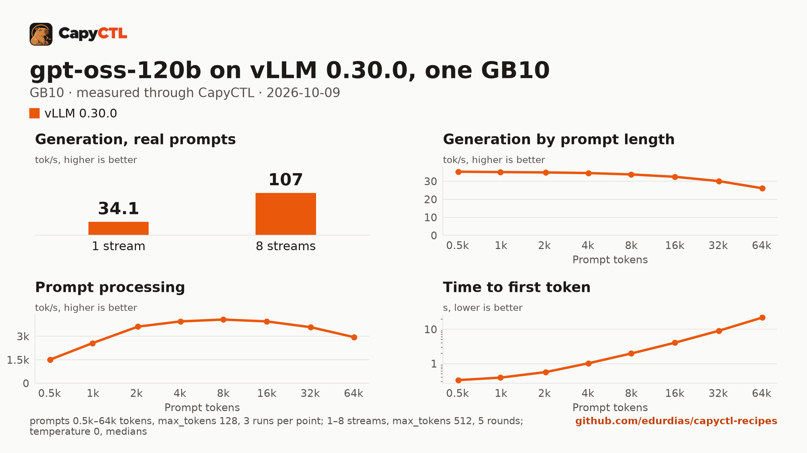

# gpt-oss-120b on vLLM 0.30.0, one GB10

| | |
|---|---|
| Hardware | 1x NVIDIA GB10 (DGX Spark class), compute capability 12.1, 128 GB unified memory, aarch64 |
| System | Ubuntu 24.04, NVIDIA driver 580.173.02, CUDA 13.0 toolkit in `/usr/local/cuda` |
| Engine | vLLM 0.30.0 in a venv (torch 2.13.0+cu130, FlashInfer 0.6.18.post1, openai-harmony 0.0.8) |
| Model | [`openai/gpt-oss-120b`](https://huggingface.co/openai/gpt-oss-120b) at `b5c939de8f754692c1647ca79fbf85e8c1e70f8a`, MXFP4 experts with the rest in BF16, 65.3 GB |
| Drafter | none |
| CapyCTL | `main` at `31dbf26` (prints `capyctl 0.1.2`), release build; `capyctl start standalone` with the managed limit raised to 96 GiB. `capyctl engine add --env` is newer than the 0.1.2 release |
| Measured | 2026-10-09 |

gpt-oss-120b on one GB10: the whole model on one machine, with the full
131,072-token context and up to 8 requests together. Once ready it holds about
80 GiB of the machine's memory, and loading it takes about 94 GiB, so the
standalone's managed limit has to be raised from its default (half the
memory) to 96 GiB. TensorFold 0.6.5: not supported on GB10; gpt-oss is not a
TensorFold model family. Needs new model support in TensorFold.

### SGLang 0.5.21 does not load it on one GB10

There is no SGLang recipe for this model: on the GB10, SGLang 0.5.21 ran out
of the machine's memory while it loaded the weights, every time. The file
tried was the same model, context and concurrency with
`memory: {request: 90GiB, startup: 90GiB}`, the SGLang parsers
(`gpt-oss`), `residency: restart_only` and the same 96 GiB managed limit.
What SGLang did while loading:

- It allocates every parameter before it reads a file: `Peak GPU memory
  before loading weights: 64.617 GiB`, for 60.8 GiB of weights on disk.
- While it then reads the 15 weight files, the engine process's own
  anonymous memory keeps growing, about 3 to 4 GiB per file (from 4.5 to
  45.4 GiB over the first 10 files in one start), on top of those
  parameters.

Each start was stopped when the machine had less than 5 GiB of memory left
(CapyCTL then reported `launch failed: engine launch failed: the engine
exited before readiness`); in use is machine memory in use less what was in
use before the start:

| Loader | How far it got | In use, peak | Stopped after |
|---|---|---|---|
| SGLang's default (files read by 8 threads) | all 15 files read | 112.7 GiB | 415 s |
| one thread (`--model-loader-extra-config '{"enable_multithread_load": false}'`) | all 15 files read | 113.2 GiB | 387 s |
| one thread, `--weight-loader-drop-cache-after-load` | 10 of 15 files | 113.2 GiB | 295 s |
| one thread, allowed to use the machine's 15.9 GiB of swap | 11 of 15 files | 104.8 GiB plus 11.8 GiB of swap | 337 s |

The first two read every file and were stopped before SGLang logged the end
of the weight load. The last one was stopped when less than 4 GiB of swap was
left, with 4 of the 15 files still to read: this machine's swap did not get
the load through. The first
start of SGLang with gpt-oss on a machine also tunes FlashInfer's MoE
kernels, which took 93 GiB above the baseline for gpt-oss-20b (see the
[gpt-oss-20b SGLang recipe](../../sglang/gpt-oss-20b-32gib-gb10/#the-first-start-on-a-machine));
none of these starts got that far.

### The tokenizer vocabulary

vLLM serves gpt-oss through `openai-harmony`, which loads the `o200k_base`
vocabulary when the server starts. It downloads the file unless
`TIKTOKEN_ENCODINGS_BASE` names a directory holding it, and CapyCTL starts
engines with a closed environment, so the recipe keeps the file in a
directory and passes the variable through the vLLM profile's engine
environment, as the [gpt-oss-20b recipe](../gpt-oss-20b-32gib-gb10/#the-tokenizer-vocabulary)
does:

```bash
mkdir -p ~/tiktoken-encodings
curl -fsSL -o ~/tiktoken-encodings/o200k_base.tiktoken \
  https://openaipublic.blob.core.windows.net/encodings/o200k_base.tiktoken
sha256sum ~/tiktoken-encodings/o200k_base.tiktoken
```

```text
446a9538cb6c348e3516120d7c08b09f57c36495e2acfffe59a5bf8b0cfb1a2d  /home/me/tiktoken-encodings/o200k_base.tiktoken
```

### What the file sets, and why

- `memory.kv_cache: 8GiB` for up to 8 requests (`max_concurrent_requests: 8`)
  at 131,072 tokens each. vLLM reported a KV cache of 225,706 tokens (enough
  for 1.72 requests of the full context at once; shorter requests share it).
- `memory.startup: 90GiB`: without it CapyCTL estimates the startup peak from
  the weights (`STARTUP 146.0 GiB` in `capyctl status`), more than the
  managed limit, and the start waits with `gave up: resource or evidence
  check failed: insufficient resources`. CapyCTL measured 93.9 GiB on the
  first start and keeps that figure for later starts.
- The standalone's managed limit: 96 GiB. The limit and the standalone's
  24.3 GiB free reserve together have to fit in the machine's 121.7 GiB, so
  104 GiB was refused (`the managed limit (104.0 GiB) and the free reserve
  (24.3 GiB) together exceed the 121.7 GiB of memory this host has`):

  ```bash
  capyctl start standalone --set host.resource_policy.memory.system.managed_limit=96GiB
  ```

### Memory

| | |
|---|---|
| Ready footprint | 80.7 to 80.8 GiB after the cold start, 79.8 to 79.9 GiB after a warm one, 80.0 GiB after the benchmark, 80.7 GiB after a third start: machine memory in use once ready, less what was in use before the start. vLLM's own GPU allocations are 76.0 to 76.1 GiB at rest and during the benchmark |
| Loading peak | 94.3 GiB during the cold start, 93.3 and 93.7 GiB during two warm ones (`MemAvailable` drop); CapyCTL measured 93.9 GiB |
| Fits | one 128 GB GB10 with the managed limit at 96 GiB; not the standalone's default limit (half the memory, 60.8 GiB) |

vLLM loads the weights as 66.1 GiB of GPU memory. On the GB10's unified
memory the loading peak and the engine's CPU-side memory come out of the same
pool as the GPU's, so nothing else large should run on the machine while the
model starts.

### Restart instead of deep parking

CapyCTL parks vLLM deep by default: vLLM sleeps, drops the weights, and
reloads them from disk on wake. vLLM 0.30.0 does not restore gpt-oss that
way: on the [gpt-oss-20b recipe](../gpt-oss-20b-32gib-gb10/#restart-instead-of-deep-parking)
every wake logged `OAIAttention: Failed to load weights` for each attention
layer, the woken model answered broken output, and the request sent to the
parked model failed after 778 s. CapyCTL now refuses to start a parking
gpt-oss deployment on vLLM and SGLang. The same file without
`residency: restart_only`, on this machine:

```text
error [capability_missing:deep_park]: Operation 01M4FFES7SCZ7F1CKTBHRY3E6A failed: launch failed: host policy refused the launch before any effect: capability_missing:deep_park (this engine installation lacks what parking (deep or host_backed) needs; declare residency restart_only, or use a build that provides it) (hint: this engine installation lacks what parking (deep or host_backed) needs; declare residency restart_only, or use a build that provides it)
```

So this file sets `residency: restart_only`: CapyCTL stops the model and
starts it again when it needs the memory, and `capyctl park` answers
`error [unsupported]: unsupported_capability: Requested capability is unavailable`
(the model kept serving and answered the next request).

## Run it

The API key comes from the credentials file the start banner names:

```bash
KEY=$(sed -n 's/^api_key: //p' ~/.local/state/capyctl/identity/credentials)
```

```bash
capyctl engine add ~/vllm-0.30.0-venv --env TIKTOKEN_ENCODINGS_BASE=$HOME/tiktoken-encodings
```

```text
Registered vllm (vllm 0.30.0)

  Executable     /home/me/vllm-0.30.0-venv/bin/vllm
  Deep park      enabled
  CUDA           /usr/local/cuda
  Engines file   /home/me/.config/capyctl/engines.yaml (revision 1)
  Published      yes
```

```bash
capyctl deploy model --file deployment.yaml
```

```text
Request identity: 01M4FFFS46ZQN35JB1YCMAMGD6 (reuse --request-id 01M4FFFS46ZQN35JB1YCMAMGD6 to recover this command)
Deployment gpt-oss-120b-vllm created (revision 1)

  Deployment ID       01M4FFFS4YNJMZVS0FCMSYRVN4
  Operation           01M4FFFS4YC3031AVFXWB4WBPP
  Checkpoint digest   being measured
the checkpoint digest of gpt-oss-120b-vllm is being measured; `capyctl start deployment gpt-oss-120b-vllm --wait` waits for it and starts the deployment
```

```bash
capyctl start deployment gpt-oss-120b-vllm --wait
```

```text
Request identity: 01M4FFFT735CK9MY69GRBD795N (reuse --request-id 01M4FFFT735CK9MY69GRBD795N to recover this command)
Started gpt-oss-120b-vllm: ready

  Ready       1/1
  Hosts       host-a
  Operation   initialize succeeded
```

`capyctl status deployment gpt-oss-120b-vllm`:

```text
NAME                STATE   READY   REVISION   STARTUP    INITIALIZE   LAST OPERATION
gpt-oss-120b-vllm   ready   1/1     1          91.2 GiB   1260s        initialize succeeded

INSTANCE   HOST     STATE   LIFECYCLE   DEVICES   LAST ERROR
0          host-a   ready   active      gpu0      -

Engine  vllm 0.30.0 (/home/me/vllm-0.30.0-venv/bin/vllm)
Parsers tool calls: openai, reasoning: openai_gptoss
```

gpt-oss reasons before it answers; with the `openai_gptoss` reasoning parser
vLLM returns the reasoning in `reasoning` and the answer in `content`:

```bash
curl -s http://127.0.0.1:8443/v1/chat/completions \
  -H "Authorization: Bearer $KEY" -H 'Content-Type: application/json' \
  -d '{"model": "gpt-oss-120b-vllm", "messages": [{"role": "user", "content": "Name the largest planet in one sentence."}]}' \
  | jq -r '.choices[0].message.content'
```

```text
The largest planet in our solar system is Jupiter.
```

## Measured through CapyCTL

| | |
|---|---|
| Ready, cold | 507 s (the first start of the deployment; weights already on disk, page cache dropped; vLLM spent 390 s reading the weights, then its compile and warmup) |
| Ready, warm | 479 s (`start` after `stop` finished, page cache dropped again; vLLM repeats its startup). A third start took 435 s |
| Time to first token | 0.240 s median (0.236 to 0.341) |
| Decode, one stream | 34.2 tokens/s median (34.2 to 34.4) |
| Peak memory | 93.9 GiB measured by CapyCTL on the cold start, against the 91.2 GiB startup reservation (`memory.startup: 90GiB` plus the engine's CUDA context); ready footprint in [Memory](#memory) |
| Park | refused (`restart_only`); see [Restart instead of deep parking](#restart-instead-of-deep-parking) |
| Concurrency | up to 8 requests together (`max_concurrent_requests: 8`) |
| Context | 131,072 tokens, declared |

Three streaming chat completions through the CapyCTL endpoint, one at a time,
`max_tokens: 512`, `temperature: 0.6`, reasoning on (the model's default
effort; the first token counted is the first `reasoning` token). The three
prompts are the first three of capyctl-bench's prompt set (`explain-tcp`,
`python-lru`, `history-printing`); every request generated all 512 tokens.
The same three requests after the warm start gave 0.232 s and 34.8 tokens/s.

## Benchmark

[`bench/`](bench/) has the capyctl-bench results and report
([`report.html`](bench/report.html), [`summary.md`](bench/summary.md),
[`data.csv`](bench/data.csv)). Context sweep 0.5k to 64k tokens, three runs per
point, `max_tokens: 128`; concurrency 1 to 8 streams, five rounds each,
`max_tokens: 512`; `temperature: 0`, reasoning on; machine memory in use
(`MemTotal - MemAvailable`, 4.1 GiB before the model started) sampled every
0.5 s.

| Context | Time to first token | Decode, one stream | Memory in use, peak |
|---|---|---|---|
| 0.5k | 0.33 s | 35.3 tokens/s | 84.1 GiB |
| 1k | 0.39 s | 35.1 tokens/s | 84.1 GiB |
| 2k | 0.57 s | 34.9 tokens/s | 84.1 GiB |
| 4k | 1.02 s | 34.5 tokens/s | 84.1 GiB |
| 8k | 1.97 s | 33.8 tokens/s | 84.1 GiB |
| 16k | 4.06 s | 32.5 tokens/s | 84.1 GiB |
| 32k | 9.06 s | 30.1 tokens/s | 84.1 GiB |
| 64k | 22.0 s | 26.1 tokens/s | 84.1 GiB |

| Streams | Together | Each | Time to first token |
|---|---|---|---|
| 1 | 34.1 tokens/s | 34.6 tokens/s | 0.24 s |
| 2 | 58.4 tokens/s | 29.6 tokens/s | 0.25 s |
| 3 | 71.8 tokens/s | 24.2 tokens/s | 0.26 s |
| 4 | 81.1 tokens/s | 20.5 tokens/s | 0.29 s |
| 5 | 89.6 tokens/s | 18.1 tokens/s | 0.32 s |
| 6 | 96.6 tokens/s | 16.3 tokens/s | 0.35 s |
| 7 | 102 tokens/s | 14.6 tokens/s | 0.39 s |
| 8 | 107 tokens/s | 13.5 tokens/s | 0.37 s |

Eight streams decode 3.1 times as many tokens as one. Machine memory in use
stayed at 84.1 GiB through the whole benchmark, 80.0 GiB above what was in use
before the start.



The model needs about 65.3 GB in the model store; with the download, the first
start takes as long as the download plus the time above.
