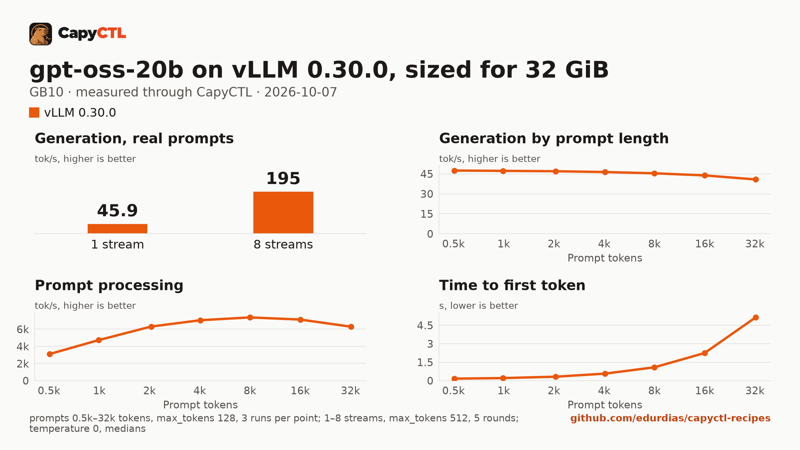

# gpt-oss-20b on vLLM 0.30.0, sized for 32 GiB, one GB10

| | |
|---|---|
| Hardware | 1x NVIDIA GB10 (DGX Spark class), compute capability 12.1, 128 GB unified memory, aarch64 |
| System | Ubuntu 24.04, NVIDIA driver 580.173.02, CUDA 13.0 toolkit in `/usr/local/cuda` |
| Engine | vLLM 0.30.0 in a venv (torch 2.13.0+cu130, FlashInfer 0.6.18.post1, openai-harmony 0.0.8) |
| Model | [`openai/gpt-oss-20b`](https://huggingface.co/openai/gpt-oss-20b) at `6cee5e81ee83917806bbde320786a8fb61efebee`, MXFP4 experts with the rest in BF16, 13.8 GB |
| Drafter | none |
| CapyCTL | `main` at `7e50aa9` (prints `capyctl 0.1.2`), release build; `capyctl start standalone` with its default limits. `capyctl engine add --env` is newer than the 0.1.2 release |
| Measured | 2026-10-07 |

gpt-oss-20b for a GPU with 32 GB: the deployment is sized so the model, once
ready, fits in 32 GiB, with up to 8 requests together. It was validated on a
GB10, not on a 24 or 32 GB card. The
[SGLang](../../sglang/gpt-oss-20b-32gib-gb10/) recipe sized for the same
32 GiB serves the same weights. TensorFold 0.6.5: not supported on GB10;
gpt-oss is not a TensorFold model family. Needs new model support in
TensorFold.

### The tokenizer vocabulary

vLLM serves gpt-oss through `openai-harmony`, which loads the `o200k_base`
vocabulary when the server starts. It downloads the file unless
`TIKTOKEN_ENCODINGS_BASE` names a directory holding it. On the GB10 the
download failed (`openai_harmony.HarmonyError: error downloading or loading
vocab file`; vLLM answered CapyCTL's first chat request with an error and the
start failed), and CapyCTL
starts engines with a closed environment, so the recipe keeps the file in a
directory and passes the variable through the vLLM profile's engine
environment:

```bash
mkdir -p ~/tiktoken-encodings
curl -fsSL -o ~/tiktoken-encodings/o200k_base.tiktoken \
  https://openaipublic.blob.core.windows.net/encodings/o200k_base.tiktoken
sha256sum ~/tiktoken-encodings/o200k_base.tiktoken
```

```text
446a9538cb6c348e3516120d7c08b09f57c36495e2acfffe59a5bf8b0cfb1a2d  /home/me/tiktoken-encodings/o200k_base.tiktoken
```

The variable is part of the profile, so every deployment of that profile
gets it.

### Memory

The deployment asks for a 4 GiB KV cache (`memory.kv_cache: 4GiB`). Up to 8
requests run together (`max_concurrent_requests: 8`).

| | |
|---|---|
| Ready footprint | 23.1 GiB after a cold start, 23.2 GiB after a warm one and after the benchmark: machine memory in use once ready, less what was in use before the start. vLLM's own GPU allocations are 19.5 GiB at rest and peaked at 19.6 GiB during the benchmark |
| Loading peak | 23.2 GiB during the cold start, 23.2 GiB during a warm one (`MemAvailable` drop); CapyCTL measured 23.2 GiB both times |
| Fits | 32 GiB: yes. 24 GiB: yes as measured, with 0.8 GiB to spare |

On the GB10's unified memory the loading peak and the engine's CPU-side
memory come out of the same pool as the GPU's. On a discrete card most of
that lands in system RAM, so the ready footprint is the number to compare
with a card's VRAM.

### Restart instead of deep parking

CapyCTL parks vLLM deep by default: vLLM sleeps, drops the weights, and
reloads them from disk on wake. vLLM 0.30.0 does not restore gpt-oss that
way. The same file without `residency: restart_only`, measured on the same
machine:

- Start and park work: ready 23.6 GiB (loading peak 29.9 GiB, eager load);
  parked, vLLM held 1.7 GiB of GPU memory, machine memory in use fell from
  27.2 to 8.9 GiB, and CapyCTL measured a 3.8 GiB parked charge.
- On wake vLLM reloads the weights in place and logs
  `OAIAttention: Failed to load weights` for each of the 24 attention layers
  (and once `YaRNScalingRotaryEmbedding: Failed to load weights`). CapyCTL's
  check request after the wake then gets broken output
  (`Harmony parser ended in a non-terminal state; returning the recovered raw
  output`), so CapyCTL does not mark the model active. The request sent to the
  parked model was answered after 778 s with
  `{"code":"engine_error","message":"backend completion unverified"}`.
  On the earlier CapyCTL `0c4ccb4` the same wake failed the same way, three
  times out of three (`activation_failed`, `park_deadline`).

So this file sets `residency: restart_only`: CapyCTL stops the model and
starts it again when it needs the memory.

## Run it

The API key comes from the credentials file the start banner names:

```bash
KEY=$(sed -n 's/^api_key: //p' ~/.local/state/capyctl/identity/credentials)
```

```bash
capyctl engine add ~/vllm-0.30.0-venv --env TIKTOKEN_ENCODINGS_BASE=$HOME/tiktoken-encodings
```

```text
Registered vllm (vllm 0.30.0)

  Executable     /home/me/vllm-0.30.0-venv/bin/vllm
  Deep park      enabled
  CUDA           /usr/local/cuda
  Engines file   /home/me/.config/capyctl/engines.yaml (revision 1)
  Published      yes
```

```bash
capyctl deploy model --file deployment.yaml
```

```text
Request identity: 01M4BCSEZ7XR2FVH9EF6D0GVXS (reuse --request-id 01M4BCSEZ7XR2FVH9EF6D0GVXS to recover this command)
Deployment gpt-oss-20b-vllm created (revision 1)

  Deployment ID       01M4BCSF07PXB4VXWPTFEJP4Q1
  Operation           01M4BCSF07JSVHZEQ283C8EM90
  Checkpoint digest   being measured
the checkpoint digest of gpt-oss-20b-vllm is being measured; `capyctl start deployment gpt-oss-20b-vllm --wait` waits for it and starts the deployment
```

```bash
capyctl start deployment gpt-oss-20b-vllm --wait
```

```text
Request identity: 01M4BCSF4NK35C2H2Y7GDSTGT5 (reuse --request-id 01M4BCSF4NK35C2H2Y7GDSTGT5 to recover this command)
Waiting for the checkpoint digest of gpt-oss-20b-vllm to be measured (at most 900s)
Started gpt-oss-20b-vllm: ready

  Ready       1/1
  Hosts       host-a
  Operation   initialize succeeded
```

`capyctl status deployment gpt-oss-20b-vllm`:

```text
NAME               STATE   READY   REVISION   STARTUP    INITIALIZE   LAST OPERATION
gpt-oss-20b-vllm   ready   1/1     1          38.1 GiB   740s         initialize succeeded

INSTANCE   HOST     STATE   LIFECYCLE   DEVICES   LAST ERROR
0          host-a   ready   active      gpu0      -

Engine  vllm 0.30.0 (/home/me/vllm-0.30.0-venv/bin/vllm)
Parsers tool calls: openai, reasoning: openai_gptoss
```

gpt-oss reasons before it answers; with the `openai_gptoss` reasoning parser
vLLM returns the reasoning in `reasoning` and the answer in `content`:

```bash
curl -s http://127.0.0.1:8443/v1/chat/completions \
  -H "Authorization: Bearer $KEY" -H 'Content-Type: application/json' \
  -d '{"model": "gpt-oss-20b-vllm", "messages": [{"role": "user", "content": "Name the largest planet in one sentence."}]}' \
  | jq -r '.choices[0].message.content'
```

```text
Jupiter is the largest planet in our Solar System.
```

## Measured through CapyCTL

| | |
|---|---|
| Ready, cold | 106 s (the first start of the deployment; weights already on disk, page cache dropped; includes measuring the checkpoint digest and vLLM's compile and warmup) |
| Ready, warm | 119 s (`start` after `stop` finished, page cache dropped again; vLLM repeats its startup) |
| Time to first token | 0.134 s median (0.131 to 0.285) |
| Decode, one stream | 46.7 tokens/s median (46.6 to 46.7) |
| Peak memory | 23.2 GiB measured by CapyCTL on the cold and the warm start; ready footprint in [Memory](#memory) |
| Park | refused (`restart_only`); see [Restart instead of deep parking](#restart-instead-of-deep-parking) |
| Concurrency | up to 8 requests together (`max_concurrent_requests: 8`) |
| Context | 32,768 tokens, declared |

Three streaming chat completions through the CapyCTL endpoint, one at a time,
`max_tokens: 512`, `temperature: 0.6`, reasoning on (the model's default
effort; the first token counted is the first `reasoning` token). The three
prompts are the first three of capyctl-bench's prompt set (`explain-tcp`,
`python-lru`, `history-printing`); every request generated all 512 tokens.
The same three requests after the warm start gave 0.133 s and 46.7 tokens/s.

## Benchmark

[`bench/`](bench/) has the capyctl-bench results and report
([`report.html`](bench/report.html), [`summary.md`](bench/summary.md),
[`data.csv`](bench/data.csv)). Context sweep 0.5k to 32k tokens, three runs per
point, `max_tokens: 128`; concurrency 1 to 8 streams, five rounds each,
`max_tokens: 512`; `temperature: 0`, reasoning on; machine memory in use
(`MemTotal - MemAvailable`, 3.6 GiB before the model started) sampled every
0.5 s.

| Context | Time to first token | Decode, one stream | Memory in use, peak |
|---|---|---|---|
| 0.5k | 0.16 s | 47.5 tokens/s | 26.9 GiB |
| 1k | 0.21 s | 47.2 tokens/s | 26.9 GiB |
| 2k | 0.32 s | 47.0 tokens/s | 26.9 GiB |
| 4k | 0.57 s | 46.4 tokens/s | 26.9 GiB |
| 8k | 1.09 s | 45.4 tokens/s | 26.9 GiB |
| 16k | 2.25 s | 43.8 tokens/s | 26.9 GiB |
| 32k | 5.14 s | 40.8 tokens/s | 26.9 GiB |

| Streams | Together | Each | Time to first token |
|---|---|---|---|
| 1 | 45.9 tokens/s | 46.4 tokens/s | 0.13 s |
| 2 | 84.5 tokens/s | 42.7 tokens/s | 0.14 s |
| 3 | 107 tokens/s | 36.1 tokens/s | 0.17 s |
| 4 | 126 tokens/s | 31.8 tokens/s | 0.18 s |
| 5 | 145 tokens/s | 29.3 tokens/s | 0.19 s |
| 6 | 163 tokens/s | 27.3 tokens/s | 0.19 s |
| 7 | 179 tokens/s | 25.7 tokens/s | 0.20 s |
| 8 | 195 tokens/s | 24.6 tokens/s | 0.20 s |

Eight streams decode 4.3 times as many tokens as one. Machine memory in use
stayed at 26.9 GiB through the whole benchmark, 23.3 GiB above what was in use
before the start.



The model needs about 13.8 GB in the model store; with the download, the first
start takes as long as the download plus the time above.
