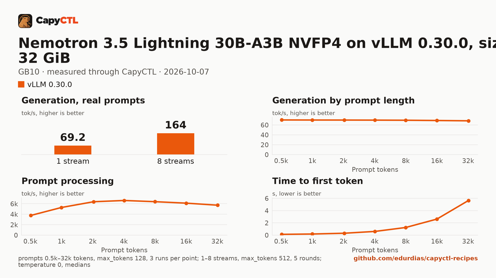

# Nemotron 3.5 Lightning 30B-A3B NVFP4 on vLLM 0.30.0, sized for 32 GiB, one GB10

| | |
|---|---|
| Hardware | 1x NVIDIA GB10 (DGX Spark class), compute capability 12.1, 128 GB unified memory, aarch64 |
| System | Ubuntu 24.04, NVIDIA driver 580.173.02, CUDA 13.0 toolkit in `/usr/local/cuda` |
| Engine | vLLM 0.30.0 in a venv (torch 2.13.0+cu130, FlashInfer 0.6.18.post1) |
| Model | [`nvidia/NVIDIA-Nemotron-3.5-Lightning-30B-A3B-NVFP4`](https://huggingface.co/nvidia/NVIDIA-Nemotron-3.5-Lightning-30B-A3B-NVFP4) at `bee7596271d1495f6992ae224aefde4410e816b8`, ModelOpt mixed precision (NVFP4 weight-only experts, FP8 mixer projections), 21.6 GB |
| Drafter | none |
| CapyCTL | `main` at `7e50aa9` (prints `capyctl 0.1.2`), release build; `capyctl start standalone` with its default limits |
| Measured | 2026-10-07 |

Nemotron 3.5 Lightning for a GPU with 32 GB: the deployment is sized so the
model, once ready, fits in 32 GiB, with up to 4 requests together, and it
parks deep. It was validated on a GB10, not on a 32 GB card. The
[SGLang](../../sglang/nemotron-3.5-lightning-30b-a3b-nvfp4-32gib-gb10/) recipe
sized for the same 32 GiB serves the same weights; the
[TensorFold](../../tensorfold/nemotron-3.5-lightning-30b-a3b-mlx-4bit-32gib-gb10/)
one serves TensorFold's MLX 4-bit export.

### Memory

The deployment asks for a 2 GiB FP8 KV cache (`memory.kv_cache: 2GiB`):
342,016 tokens beside the Mamba state, which vLLM reports as 10.4 requests of
32,768 tokens. Up to 4 requests run together (`max_concurrent_requests: 4`).
The weights take 17.8 GiB.

| | |
|---|---|
| Ready footprint | 25.6 to 26.1 GiB after a cold start, 25.4 to 26.0 GiB after a warm one and after the benchmark, 28.1 to 28.8 GiB after a wake from a deep park: machine memory in use once ready, less what was in use before the start. vLLM's own GPU allocations are 21.3 to 21.7 GiB at rest, 21.5 GiB at most during the benchmark, and 23.8 to 24.4 GiB after a wake |
| Loading peak | 28.8 GiB during the cold start, 27.7 GiB during a warm one (`MemAvailable` drop); CapyCTL measured 26.7 GiB, then 27.9 GiB |
| Fits | 32 GiB: yes, with 3.2 GiB to spare after a wake. 24 GiB: no |

On the GB10's unified memory the loading peak and the engine's CPU-side
memory come out of the same pool as the GPU's. On a discrete card most of
that lands in system RAM, so the ready footprint is the number to compare
with a card's VRAM.

### Deep parking

CapyCTL parks this model deep (its default): vLLM sleeps, drops the weights
and the KV cache, and reloads the weights from disk on wake. Three park and
wake cycles on the same deployment:

| Cycle | GPU memory parked | Machine memory parked (above the base) | CapyCTL's parked charge | Wake and first answer |
|---|---|---|---|---|
| 1 | 1.4 GiB | 4.9 GiB | 3.6 GiB | 26.2 s |
| 2 | 3.9 GiB | 7.3 GiB | 6.2 GiB | 23.9 s |
| 3 | 4.6 GiB | 8.0 GiB | 6.8 GiB | 29.1 s |

Each wake reloads the weights in about 20 s (`Reloading and processing
weights took 19.86 seconds`), and every answer after a wake named Jupiter
correctly. What stays behind
grows: the GPU memory vLLM keeps while parked rose every cycle, and the ready
footprint after a wake rose from 28.1 to 28.8 GiB, then held at the third
cycle.

The status of a deployment that parks deep warns that vLLM runs with its
development endpoints on (sleep mode); CapyCTL keeps them on the loopback
listener behind a per-launch key. Use it on a machine you control.

## Run it

The API key comes from the credentials file the start banner names:

```bash
KEY=$(sed -n 's/^api_key: //p' ~/.local/state/capyctl/identity/credentials)
```

```bash
capyctl engine add ~/vllm-0.30.0-venv
```

```text
Registered vllm (vllm 0.30.0)

  Executable     /home/me/vllm-0.30.0-venv/bin/vllm
  Deep park      enabled
  CUDA           /usr/local/cuda
  Engines file   /home/me/.config/capyctl/engines.yaml (revision 1)
  Published      yes
```

```bash
capyctl deploy model --file deployment.yaml
```

```text
Request identity: 01M4BVBER64S24KMVQCF5136XG (reuse --request-id 01M4BVBER64S24KMVQCF5136XG to recover this command)
Deployment nemotron35-30b-vllm created (revision 1)

  Deployment ID       01M4BVBERX4Q62AKT8XEED57K5
  Operation           01M4BVBERX304626KVQFWGB09T
  Checkpoint digest   being measured
the checkpoint digest of nemotron35-30b-vllm is being measured; `capyctl start deployment nemotron35-30b-vllm --wait` waits for it and starts the deployment
```

```bash
capyctl start deployment nemotron35-30b-vllm --wait
```

```text
Request identity: 01M4BVBEVJFBSDTGDB297NZPSW (reuse --request-id 01M4BVBEVJFBSDTGDB297NZPSW to recover this command)
Waiting for the checkpoint digest of nemotron35-30b-vllm to be measured (at most 900s)
Started nemotron35-30b-vllm: ready

  Ready       1/1
  Hosts       host-a
  Operation   initialize succeeded
```

`capyctl status deployment nemotron35-30b-vllm`:

```text
NAME                  STATE   READY   REVISION   STARTUP    INITIALIZE   LAST OPERATION
nemotron35-30b-vllm   ready   1/1     1          54.4 GiB   820s         initialize succeeded

INSTANCE   HOST     STATE   LIFECYCLE   DEVICES   LAST ERROR
0          host-a   ready   active      gpu0      -

Engine  vllm 0.30.0 (/home/me/vllm-0.30.0-venv/bin/vllm)
Parsers tool calls: qwen3_coder, reasoning: nemotron_v3
warning: deployment nemotron35-30b-vllm launches with vLLM development mode on (deep_park enabled (host_policy), sleep mode); exposed controls: /sleep, /wake_up, /is_sleeping, /collective_rpc; mitigations in force: loopback_engine_listener, per_launch_engine_key, engine_key_guard_middleware, no_ingress_or_router_path; not production-safe; use it on isolated hosts only
```

Nemotron reasons before it answers; with the `nemotron_v3` reasoning parser
vLLM returns the reasoning in `reasoning` and the answer in `content`:

```bash
curl -s http://127.0.0.1:8443/v1/chat/completions \
  -H "Authorization: Bearer $KEY" -H 'Content-Type: application/json' \
  -d '{"model": "nemotron35-30b-vllm", "messages": [{"role": "user", "content": "Name the largest planet in one sentence."}]}' \
  | jq -r '.choices[0].message.content'
```

```text
Jupiter is the largest planet in the solar system.
```

Park it, then send a request; CapyCTL wakes the model first:

```bash
capyctl park deployment nemotron35-30b-vllm
```

```text
Request identity: 01M4BWGD8AEM77Y6SRYA7R956V (reuse --request-id 01M4BWGD8AEM77Y6SRYA7R956V to recover this command)
Park requested for nemotron35-30b-vllm
  Operation   01M4BWGD98GYJS5FJF7P8DQWA2
```

## Measured through CapyCTL

| | |
|---|---|
| Ready, cold | 123 s (the first start of the deployment; weights already on disk, page cache dropped; includes measuring the checkpoint digest and vLLM's compile and warmup) |
| Ready, warm | 53 s (`start` after `stop` finished, page cache dropped again) |
| Time to first token | 0.083 s median (0.081 to 0.084) |
| Decode, one stream | 69.9 tokens/s median (69.9 to 70.0) |
| Peak memory | 26.7 GiB measured by CapyCTL on the cold start, 27.9 GiB on the warm one; ready footprint in [Memory](#memory) |
| Park | deep; wake and first answer 23.9 to 29.1 s ([Deep parking](#deep-parking)) |
| Concurrency | up to 4 requests together (`max_concurrent_requests: 4`) |
| Context | 32,768 tokens, declared |

Three streaming chat completions through the CapyCTL endpoint, one at a time,
`max_tokens: 512`, `temperature: 0.6`, reasoning on (the model's default; the
first token counted is the first `reasoning` token). The three prompts are the
first three of capyctl-bench's prompt set (`explain-tcp`, `python-lru`,
`history-printing`); every request generated all 512 tokens. The same three
requests after the warm start gave 0.084 s and 70.0 tokens/s.

## Benchmark

[`bench/`](bench/) has the capyctl-bench results and report
([`report.html`](bench/report.html), [`summary.md`](bench/summary.md),
[`data.csv`](bench/data.csv)). Context sweep 0.5k to 32k tokens, three runs per
point, `max_tokens: 128`; concurrency 1 to 8 streams, five rounds each,
`max_tokens: 512`; `temperature: 0`, reasoning on; machine memory in use
(`MemTotal - MemAvailable`, 3.6 GiB before the model started) sampled every
0.5 s.

| Context | Time to first token | Decode, one stream | Memory in use, peak |
|---|---|---|---|
| 0.5k | 0.13 s | 70.2 tokens/s | 29.1 GiB |
| 1k | 0.19 s | 70.1 tokens/s | 29.0 GiB |
| 2k | 0.32 s | 70.0 tokens/s | 28.9 GiB |
| 4k | 0.61 s | 69.8 tokens/s | 28.9 GiB |
| 8k | 1.25 s | 69.6 tokens/s | 28.9 GiB |
| 16k | 2.62 s | 69.1 tokens/s | 28.9 GiB |
| 32k | 5.66 s | 68.4 tokens/s | 29.0 GiB |

| Streams | Together | Each | Time to first token |
|---|---|---|---|
| 1 | 69.2 tokens/s | 70.0 tokens/s | 0.08 s |
| 2 | 112 tokens/s | 56.8 tokens/s | 0.15 s |
| 3 | 124 tokens/s | 42.0 tokens/s | 0.17 s |
| 4 | 164 tokens/s | 41.5 tokens/s | 0.18 s |
| 5 | 129 tokens/s | 41.4 tokens/s | 0.19 s |
| 6 | 142 tokens/s | 41.4 tokens/s | 0.18 s |
| 7 | 144 tokens/s | 41.6 tokens/s | 0.21 s |
| 8 | 164 tokens/s | 41.4 tokens/s | 6.40 s |

Four streams decode 2.4 times as many tokens as one. Past four, the extra
requests wait for a running one to finish: at 5 to 8 streams the total stays
between 129 and 164 tokens/s. Machine memory in use stayed between 28.9 and
29.2 GiB through the whole benchmark, 25.6 GiB above what was in use before
the start.



The model needs about 21.6 GB in the model store; with the download, the first
start takes as long as the download plus the time above.
