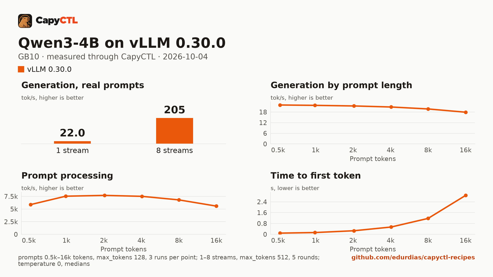

# Qwen3-4B on vLLM 0.30.0, one GB10

| | |
|---|---|
| Hardware | 1x NVIDIA GB10 (DGX Spark class), compute capability 12.1, 128 GB unified memory, aarch64 |
| System | Ubuntu 24.04, NVIDIA driver 580.173.02, CUDA 13.0 toolkit in `/usr/local/cuda` |
| Engine | vLLM 0.30.0 in a venv (torch 2.13.0+cu130) |
| Model | [`Qwen/Qwen3-4B`](https://huggingface.co/Qwen/Qwen3-4B) at `1cfa9a7208912126459214e8b04321603b3df60c`, bf16, 8.0 GB |
| Drafter | none |
| CapyCTL | `main` at `1f2cfc7` (prints `capyctl 0.1.1`), release build; `capyctl start standalone` |
| Measured | 2026-10-04 |

CapyCTL `main` at `1f2cfc7` starts vLLM with `--max-num-seqs 32` and picks
the `qwen3` reasoning parser (and `hermes` for tool calls) for this model
family, so the thinking comes back in `reasoning`, apart from the answer.

## Run it

The API key comes from the credentials file the start banner names:

```bash
KEY=$(sed -n 's/^api_key: //p' ~/.local/state/capyctl/identity/credentials)
```

```bash
capyctl engine add ~/vllm-0.30.0-venv
```

```text
Registered vllm (vllm 0.30.0)

  Executable     /home/me/vllm-0.30.0-venv/bin/vllm
  Deep park      enabled
  CUDA           /usr/local/cuda
  Engines file   /home/me/.config/capyctl/engines.yaml (revision 1)
  Published      yes
```

```bash
capyctl deploy model --file deployment.yaml
```

```text
Request identity: 01M43XWDRHA8JET0F5XRY8T6FV (reuse --request-id 01M43XWDRHA8JET0F5XRY8T6FV to recover this command)
Deployment qwen3-4b-vllm created (revision 1)

  Deployment ID       01M43XWDSGX50KHQP3KZXDFTQN
  Operation           01M43XWDSGGYZ04QANRYR11Q1R
  Checkpoint digest   being measured
the checkpoint digest of qwen3-4b-vllm is being measured; `capyctl start deployment qwen3-4b-vllm --wait` waits for it and starts the deployment
```

```bash
capyctl start deployment qwen3-4b-vllm --wait
```

```text
Request identity: 01M43XWDT1G1VFT4A88GSVAA2C (reuse --request-id 01M43XWDT1G1VFT4A88GSVAA2C to recover this command)
Waiting for the checkpoint digest of qwen3-4b-vllm to be measured (at most 900s)
Started qwen3-4b-vllm: ready

  Ready       1/1
  Hosts       host-a
  Operation   initialize succeeded
```

```bash
curl -s http://127.0.0.1:8443/v1/chat/completions \
  -H "Authorization: Bearer $KEY" -H 'Content-Type: application/json' \
  -d '{"model": "qwen3-4b-vllm", "messages": [{"role": "user", "content": "Name the largest planet in one sentence."}]}' \
  | jq -r '.choices[0].message.content'
```

```text


The largest planet in our solar system is Jupiter.
```

## Measured through CapyCTL

| | |
|---|---|
| Ready, cold | 28 s (weights already in the model store; includes measuring the checkpoint digest; vLLM's compile cache from an earlier start of this model on the machine was reused) |
| Ready, warm | 26 s (`start` after `stop` finished) |
| Time to first token | 0.101 s median (0.100 to 0.106) |
| Decode, one stream | 22.1 tokens/s median (22.1 to 22.1) |
| Peak memory | 21.6 GiB measured by CapyCTL, against a 26.1 GiB startup reservation (CapyCTL's default startup size); `MemAvailable` fell by 21.6 GiB at most |
| Concurrency | up to 32 requests (`--max-num-seqs 32`, CapyCTL's default) |
| Context | 29,104 tokens, fitted by CapyCTL |

Three streaming chat completions through the CapyCTL endpoint, one at a time,
`max_tokens: 512`, `temperature: 0.6`, thinking on (the chat template's
default; the first token counted is the first `reasoning` token). The three
prompts are the first three of capyctl-bench's prompt set (`explain-tcp`,
`python-lru`, `history-printing`); every request generated all 512 tokens. A
second run after the warm start gave the same numbers (0.104 s, 22.1
tokens/s). The time to first token is about 0.05 s longer than on 2026-10-02
(0.052 s), when the deployment had no reasoning parser and `<think>` came back
as the first content token.

## Benchmark

[`bench/`](bench/) has the capyctl-bench results and report
([`report.html`](bench/report.html), [`summary.md`](bench/summary.md),
[`data.csv`](bench/data.csv)). Context sweep 0.5k to 16k tokens, three runs per
point, `max_tokens: 128`; concurrency 1 to 8 streams, five rounds each,
`max_tokens: 512`; `temperature: 0`; machine memory in use
(`MemTotal - MemAvailable`) sampled every 0.5 s. Thinking is off for this run
(`chat_template_kwargs: {"enable_thinking": false}`): with thinking on,
capyctl-bench's one-token calibration requests got no content or reasoning
token back, and the context sweep stopped there.

| Context | Time to first token | Decode, one stream | Memory in use, peak |
|---|---|---|---|
| 0.5k | 0.09 s | 22.0 tokens/s | 19.5 GiB |
| 1k | 0.13 s | 21.8 tokens/s | 19.3 GiB |
| 2k | 0.26 s | 21.4 tokens/s | 19.1 GiB |
| 4k | 0.54 s | 20.8 tokens/s | 18.9 GiB |
| 8k | 1.17 s | 19.7 tokens/s | 18.8 GiB |
| 16k | 2.87 s | 17.9 tokens/s | 18.8 GiB |

| Streams | Together | Each | Time to first token |
|---|---|---|---|
| 1 | 22.0 tokens/s | 22.0 tokens/s | 0.05 s |
| 2 | 53.7 tokens/s | 26.9 tokens/s | 0.08 s |
| 3 | 80.1 tokens/s | 26.8 tokens/s | 0.10 s |
| 4 | 105.9 tokens/s | 26.6 tokens/s | 0.10 s |
| 5 | 131.1 tokens/s | 26.3 tokens/s | 0.09 s |
| 6 | 156.0 tokens/s | 26.1 tokens/s | 0.13 s |
| 7 | 180.4 tokens/s | 25.9 tokens/s | 0.14 s |
| 8 | 204.6 tokens/s | 25.7 tokens/s | 0.14 s |

Every concurrency request generated all 512 tokens. Eight streams decode 9.3
times as many tokens as one: from two streams on, each stream decodes faster
than one alone.



The model runs with deep parking on (CapyCTL's default for vLLM), so
`capyctl status deployment` warns that vLLM development mode is on.
