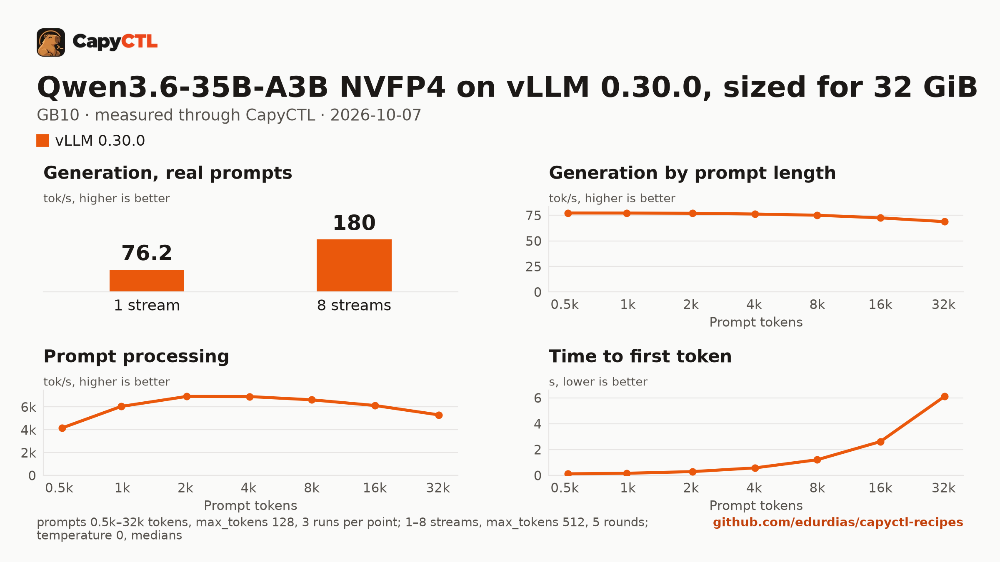

# Qwen3.6-35B-A3B NVFP4 on vLLM 0.30.0, sized for 32 GiB, one GB10

| | |
|---|---|
| Hardware | 1x NVIDIA GB10 (DGX Spark class), compute capability 12.1, 128 GB unified memory, aarch64 |
| System | Ubuntu 24.04, NVIDIA driver 580.173.02, CUDA 13.0 toolkit in `/usr/local/cuda` |
| Engine | vLLM 0.30.0 in a venv (torch 2.13.0+cu130, FlashInfer 0.6.18.post1) |
| Model | [`nvidia/Qwen3.6-35B-A3B-NVFP4`](https://huggingface.co/nvidia/Qwen3.6-35B-A3B-NVFP4) at `1355db6a052410cfd62085d94b58866fd0f2c3c5`, NVFP4 experts (weight-only) with FP8 linear-attention projections, 23.5 GB |
| Drafter | none |
| CapyCTL | `main` at `0c4ccb4` (prints `capyctl 0.1.2`), release build; `capyctl start standalone` with its default limits |
| Measured | 2026-10-07 |

Qwen3.6-35B-A3B for a GPU with 32 GB: the deployment is sized so the model,
once ready, fits in 32 GiB, with up to 4 requests together. It was validated
on a GB10, not on a 32 GB card. The
[SGLang](../../sglang/qwen3.6-35b-a3b-nvfp4-32gib-gb10/) recipe sized for the
same 32 GiB serves the same weights; the
[TensorFold](../../tensorfold/qwen3.6-35b-a3b-mlx-4bit-32gib-gb10/) one serves
TensorFold's MLX 4-bit export with its MTP drafter.

### Memory

The deployment asks for a 2 GiB FP8 KV cache (`memory.kv_cache: 2GiB`). Up to
4 requests run together (`max_concurrent_requests: 4`); the checkpoint is
multimodal and the deployment serves the text model only
(`language_model_only: true`).

| | |
|---|---|
| Ready footprint | 26.4 GiB after a cold start, 27.0 GiB after a warm one, 27.2 GiB after the benchmark: machine memory in use once ready, less what was in use before the start. vLLM's own GPU allocations are 23.0 GiB at rest and peaked at 23.3 GiB during the benchmark |
| Loading peak | 30.2 GiB during the cold start, 30.8 GiB during a warm one (`MemAvailable` drop); CapyCTL measured 30.2 GiB, then 30.8 GiB |
| Fits | 32 GiB: yes. 24 GiB: no |

On the GB10's unified memory the loading peak and the engine's CPU-side
memory come out of the same pool as the GPU's. On a discrete card most of
that lands in system RAM, so the ready footprint is the number to compare
with a card's VRAM.

### Restart instead of deep parking

CapyCTL parks vLLM deep by default. To do that it launches vLLM with sleep
mode on and the weights loaded eagerly into memory, and with this checkpoint
vLLM then keeps about 19 GiB of CPU-side memory for as long as it runs. The
same file without `residency: restart_only`, measured on the same machine:

| | Deep parking (default) | `restart_only` (this file) |
|---|---|---|
| Ready footprint | 42.2 GiB after a cold start, 41.6 GiB after the first requests | 26.4 to 27.2 GiB |
| Loading peak | 50.5 GiB (CapyCTL measured 49.9 GiB) | 30.2 to 30.8 GiB |
| vLLM GPU allocations, ready | 23.0 GiB | 23.0 GiB |
| Parked | GPU 1.5 GiB after the first park, 5.4 GiB after the second and the third; machine memory in use 25.9, 29.1 and 29.6 GiB (4.5 GiB before the start, 47.6 GiB once ready); CapyCTL's measured parked charge 20.0 GiB, then 24.1 GiB twice | not parked: `capyctl park` refuses it (`unsupported_capability`) and the model keeps serving |
| A request to the parked model | answered in 55.6 s, 55.4 s and 56.1 s over three park and wake cycles (wake plus the answer, thinking included) | answered at once |
| Decode, one stream | 77.0 tokens/s | 76.7 tokens/s |

Deep parking keeps the model over 41 GiB once ready, more than 32 GiB, and
its parked charge grows after the first wake, so this file sets
`residency: restart_only`: CapyCTL stops the model and starts it again when
it needs the memory. Remove that line for deep parking on a machine with the
room for it.

## Run it

The API key comes from the credentials file the start banner names:

```bash
KEY=$(sed -n 's/^api_key: //p' ~/.local/state/capyctl/identity/credentials)
```

```bash
capyctl engine add ~/vllm-0.30.0-venv
```

```text
Registered vllm (vllm 0.30.0)

  Executable     /home/me/vllm-0.30.0-venv/bin/vllm
  Deep park      enabled
  CUDA           /usr/local/cuda
  Engines file   /home/me/.config/capyctl/engines.yaml (revision 1)
  Published      yes
```

```bash
capyctl deploy model --file deployment.yaml
```

```text
Request identity: 01M4B5F9ABVN3K8BBY3AYVS9ME (reuse --request-id 01M4B5F9ABVN3K8BBY3AYVS9ME to recover this command)
Deployment qwen36-35b-vllm created (revision 1)

  Deployment ID       01M4B5F9AZR85VKPK0XKXFQ7VX
  Operation           01M4B5F9AZNN73AQHG43YB7ZQT
  Checkpoint digest   being measured
the checkpoint digest of qwen36-35b-vllm is being measured; `capyctl start deployment qwen36-35b-vllm --wait` waits for it and starts the deployment
```

```bash
capyctl start deployment qwen36-35b-vllm --wait
```

```text
Request identity: 01M4B49EG67C10PQTAFZ8JVTRK (reuse --request-id 01M4B49EG67C10PQTAFZ8JVTRK to recover this command)
Waiting for the checkpoint digest of qwen36-35b-vllm to be measured (at most 900s)
Started qwen36-35b-vllm: ready

  Ready       1/1
  Hosts       host-a
  Operation   initialize succeeded
```

`capyctl status deployment qwen36-35b-vllm`:

```text
NAME              STATE   READY   REVISION   STARTUP    INITIALIZE   LAST OPERATION
qwen36-35b-vllm   ready   1/1     1          58.3 GiB   840s         initialize succeeded

INSTANCE   HOST     STATE   LIFECYCLE   DEVICES   LAST ERROR
0          host-a   ready   active      gpu0      -

Engine  vllm 0.30.0 (/home/me/vllm-0.30.0-venv/bin/vllm)
Parsers tool calls: qwen3_coder, reasoning: qwen3 (model family qwen3_5)
```

Qwen3.6 thinks before it answers. CapyCTL picks the `qwen3` reasoning parser
for this model family (and `qwen3_coder` for tool calls), so vLLM returns the
thinking in `reasoning` and the answer in `content`:

```bash
curl -s http://127.0.0.1:8443/v1/chat/completions \
  -H "Authorization: Bearer $KEY" -H 'Content-Type: application/json' \
  -d '{"model": "qwen36-35b-vllm", "messages": [{"role": "user", "content": "Name the largest planet in one sentence."}]}' \
  | jq -r '.choices[0].message.content'
```

```text


The largest planet in our solar system is Jupiter.
```

## Measured through CapyCTL

| | |
|---|---|
| Ready, cold | 176 s (the first start of the deployment; weights already on disk, page cache dropped; includes measuring the checkpoint digest and vLLM's compile and warmup) |
| Ready, warm | 182 s (`start` after `stop` finished, page cache dropped again; vLLM repeats its startup) |
| Time to first token | 0.071 s median (0.071 to 0.097) |
| Decode, one stream | 76.7 tokens/s median (76.6 to 76.7) |
| Peak memory | 30.2 GiB measured by CapyCTL on the cold start, 30.8 GiB on the warm one; ready footprint in [Memory](#memory) |
| Park | refused (`restart_only`); see [Restart instead of deep parking](#restart-instead-of-deep-parking) |
| Concurrency | up to 4 requests together (`max_concurrent_requests: 4`) |
| Context | 32,768 tokens, declared |

Three streaming chat completions through the CapyCTL endpoint, one at a time,
`max_tokens: 512`, `temperature: 0.6`, thinking on (the model's default; the
first token counted is the first `reasoning` token). The three prompts are the
first three of capyctl-bench's prompt set (`explain-tcp`, `python-lru`,
`history-printing`); every request generated all 512 tokens. The same three
requests after the warm start gave 0.069 s and 76.6 tokens/s.

## Benchmark

[`bench/`](bench/) has the capyctl-bench results and report
([`report.html`](bench/report.html), [`summary.md`](bench/summary.md),
[`data.csv`](bench/data.csv)). Context sweep 0.5k to 32k tokens, three runs per
point, `max_tokens: 128`; concurrency 1 to 8 streams, five rounds each,
`max_tokens: 512`; `temperature: 0`, thinking on; machine memory in use
(`MemTotal - MemAvailable`, 3.6 GiB before the model started) sampled every
0.5 s.

| Context | Time to first token | Decode, one stream | Memory in use, peak |
|---|---|---|---|
| 0.5k | 0.12 s | 77.3 tokens/s | 30.8 GiB |
| 1k | 0.17 s | 77.3 tokens/s | 30.8 GiB |
| 2k | 0.29 s | 77.0 tokens/s | 30.8 GiB |
| 4k | 0.58 s | 76.3 tokens/s | 30.8 GiB |
| 8k | 1.21 s | 75.1 tokens/s | 30.8 GiB |
| 16k | 2.62 s | 72.6 tokens/s | 30.8 GiB |
| 32k | 6.11 s | 68.9 tokens/s | 30.9 GiB |

| Streams | Together | Each | Time to first token |
|---|---|---|---|
| 1 | 76.2 tokens/s | 77.1 tokens/s | 0.07 s |
| 2 | 115 tokens/s | 58.4 tokens/s | 0.12 s |
| 3 | 151 tokens/s | 51.0 tokens/s | 0.14 s |
| 4 | 180 tokens/s | 45.5 tokens/s | 0.15 s |
| 5 | 142 tokens/s | 45.4 tokens/s | 0.15 s |
| 6 | 152 tokens/s | 45.6 tokens/s | 0.16 s |
| 7 | 167 tokens/s | 45.5 tokens/s | 0.19 s |
| 8 | 180 tokens/s | 45.4 tokens/s | 5.80 s |

Four streams decode 2.4 times as many tokens as one. Past four, the extra
requests wait for a running one to finish: at 5 to 8 streams the total falls
back to 142 to 180 tokens/s. Machine memory in use stayed within 0.1 GiB of
30.8 GiB through the whole benchmark, 27.2 GiB above what was in use before
the start.



The model needs about 23.5 GB in the model store; with the download, the first
start takes as long as the download plus the time above.
