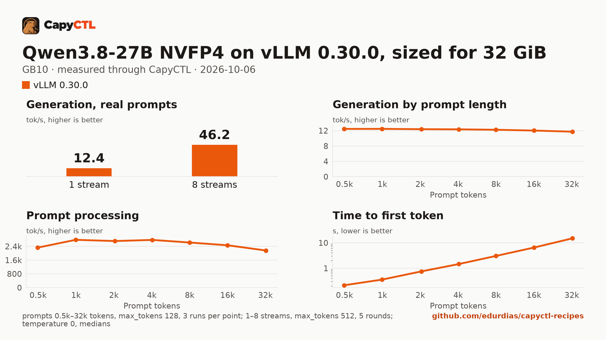

# Qwen3.8-27B NVFP4 on vLLM 0.30.0, sized for 32 GiB, one GB10

| | |
|---|---|
| Hardware | 1x NVIDIA GB10 (DGX Spark class), compute capability 12.1, 128 GB unified memory, aarch64 |
| System | Ubuntu 24.04, NVIDIA driver 580.173.02, CUDA 13.0 toolkit in `/usr/local/cuda` |
| Engine | vLLM 0.30.0 in a venv (torch 2.13.0+cu130, FlashInfer 0.6.18.post1) |
| Model | [`nvidia/Qwen3.8-27B-NVFP4`](https://huggingface.co/nvidia/Qwen3.8-27B-NVFP4) at `482ca0f3832238542f8f5295dde86b5f22711d80`, NVFP4 with FP8 layers, 21.9 GB |
| Drafter | none |
| CapyCTL | `main` at `0c4ccb4` (prints `capyctl 0.1.2`), release build; `capyctl start standalone` with its default limits |
| Measured | 2026-10-06 |

Qwen3.8-27B for a GPU with 32 GB: the deployment is sized so the model, once
ready, fits in 32 GiB, with up to 4 requests together and deep parking. It was
validated on a GB10, not on a 32 GB card. The
[128 GB recipe](../qwen3.8-27b-nvfp4-gb10/) uses the whole machine and a
drafter. The [TensorFold](../../tensorfold/qwen3.8-27b-nvfp4-32gib-gb10/) and
[SGLang](../../sglang/qwen3.8-27b-nvfp4-32gib-gb10/) recipes sized for the same
32 GiB are next to this one.

### The checkpoint

Of the two NVFP4 exports the SGLang cookbook lists, this uses NVIDIA's, which
packs the `lm_head` to NVFP4 too: its weights are 21.9 GB against 23.8 GB for
`RadixArk/Qwen3.8-27B-NVFP4-BF16-LMHead`, and the cookbook puts the BF16 head
at about 3.2 GB more at runtime, room that 32 GiB does not have.

### Memory

The deployment asks for a 1.5 GiB FP8 KV cache (`memory.kv_cache: 1536MiB`).
Up to 4 requests run together (`max_concurrent_requests: 4`); the checkpoint
is multimodal and the deployment serves the text model only
(`language_model_only: true`).

| | |
|---|---|
| Ready footprint | 27.5 GiB after a cold or a warm start, 27.0 GiB after the first requests: machine memory in use once ready, less what was in use before the start. vLLM's own GPU allocations are 22.1 GiB |
| Loading peak | 50.7 GiB during the cold start, 49.9 GiB during a warm one (`MemAvailable` drop); CapyCTL measured 49.6 GiB, then 50.7 GiB |
| Fits | 32 GiB: yes. 24 GiB: no |

On the GB10's unified memory the loading peak and the engine's CPU-side
memory come out of the same pool as the GPU's. On a discrete card most of
that lands in system RAM, so the ready footprint is the number to compare
with a card's VRAM.

CapyCTL reserves a model's measured loading peak for its later starts, so on
the GB10 the standalone's managed limit (half the machine's memory by
default) has to leave about 51 GiB for it.

## Run it

The API key comes from the credentials file the start banner names:

```bash
KEY=$(sed -n 's/^api_key: //p' ~/.local/state/capyctl/identity/credentials)
```

```bash
capyctl engine add ~/vllm-0.30.0-venv
```

```text
Registered vllm (vllm 0.30.0)

  Executable     /home/me/vllm-0.30.0-venv/bin/vllm
  Deep park      enabled
  CUDA           /usr/local/cuda
  Engines file   /home/me/.config/capyctl/engines.yaml (revision 1)
  Published      yes
```

```bash
capyctl deploy model --file deployment.yaml
```

```text
Request identity: 01M49K90TN5VG09N2E17ESTHZ8 (reuse --request-id 01M49K90TN5VG09N2E17ESTHZ8 to recover this command)
Deployment qwen38-27b-vllm created (revision 1)

  Deployment ID       01M49K90VMFD2ZA218141Z75Y8
  Operation           01M49K90VM0TY2Q3BNB9F5PWC4
  Checkpoint digest   being measured
the checkpoint digest of qwen38-27b-vllm is being measured; `capyctl start deployment qwen38-27b-vllm --wait` waits for it and starts the deployment
```

```bash
capyctl start deployment qwen38-27b-vllm --wait
```

```text
Request identity: 01M49K912J8HM4MWJ7SESDPM18 (reuse --request-id 01M49K912J8HM4MWJ7SESDPM18 to recover this command)
Waiting for the model source of qwen38-27b-vllm to be downloaded and verified (at most 900s)
Started qwen38-27b-vllm: ready

  Ready       1/1
  Hosts       host-a
  Operation   initialize succeeded
```

Qwen3.8 thinks before it answers. CapyCTL picks the `qwen3` reasoning parser
for this model family (and `qwen3_coder` for tool calls), so vLLM returns the
thinking in `reasoning` and the answer in `content`:

```bash
curl -s http://127.0.0.1:8443/v1/chat/completions \
  -H "Authorization: Bearer $KEY" -H 'Content-Type: application/json' \
  -d '{"model": "qwen38-27b-vllm", "messages": [{"role": "user", "content": "Name the largest planet in one sentence."}]}' \
  | jq -r '.choices[0].message.content'
```

```text


Jupiter is the largest planet in our solar system.
```

### Park and wake

```bash
capyctl park deployment qwen38-27b-vllm
```

```text
Request identity: 01M49VQW71A2GVQ73MA90SMDR4 (reuse --request-id 01M49VQW71A2GVQ73MA90SMDR4 to recover this command)
Park requested for qwen38-27b-vllm

  Operation   01M49VQW7WGDH7R63KSZ6EMB6Y
```

```bash
capyctl status deployment qwen38-27b-vllm
```

```text
NAME              STATE    READY   REVISION   STARTUP    INITIALIZE   LAST OPERATION
qwen38-27b-vllm   parked   0/1     1          55.2 GiB   820s         park succeeded

INSTANCE   HOST         STATE    LIFECYCLE   DEVICES   LAST ERROR
0          host-a   parked   active      gpu0      -

Engine  vllm 0.30.0 (/home/me/vllm-0.30.0-venv/bin/vllm)
Parsers tool calls: qwen3_coder, reasoning: qwen3 (model family qwen3_5)
warning: deployment qwen38-27b-vllm launches with vLLM development mode on (deep_park enabled (host_policy), sleep mode); exposed controls: /sleep, /wake_up, /is_sleeping, /collective_rpc; mitigations in force: loopback_engine_listener, per_launch_engine_key, engine_key_guard_middleware, no_ingress_or_router_path; not production-safe; use it on isolated hosts only
```

The park itself returns at once. Parked, vLLM holds 1.3 GiB of GPU memory and
CapyCTL measured a 4.7 GiB parked charge; memory in use on the machine fell
from 32.7 GiB to 11.6 GiB (5.2 GiB before the model started). The next request
for it wakes it: the same question as above, sent to the parked model, was
answered in 23.5 s, then 21.9, 18.6 and 19.9 s over four park and wake
cycles; each time includes generating the answer, thinking included.

Each wake leaves CPU-side memory behind. vLLM's GPU memory is back at 22.1 GiB
after every wake, but machine memory in use after the four wakes was 38.0,
41.9, 42.1 and 44.2 GiB, against 32.7 GiB after the start, and CapyCTL's
measured parked charge grew from 4.7 to 9.6 and then 13.4 GiB. On a discrete
card that memory is system RAM; on the GB10 it shares the pool with the GPU,
so restart the deployment (`capyctl stop`, then `start`) after many park and
wake cycles.

## Measured through CapyCTL

| | |
|---|---|
| Ready, cold | 91 s (the first start of the deployment; weights already in the model store; includes verifying the model source and vLLM's compile and warmup) |
| Ready, warm | 60.3 s (`start` after `stop` finished; vLLM repeats its startup) |
| Time to first token | 0.133 s median (0.127 to 0.155) |
| Decode, one stream | 12.5 tokens/s median (12.5 to 12.5) |
| Peak memory | 49.6 GiB measured by CapyCTL on the cold start, 50.7 GiB on the warm one; ready footprint in [Memory](#memory) |
| Parked | 4.7 GiB held on the first park (measured), more after each wake (above); a request wakes it and is answered |
| Concurrency | up to 4 requests together (`max_concurrent_requests: 4`) |
| Context | 32,768 tokens, declared |

Three streaming chat completions through the CapyCTL endpoint, one at a time,
`max_tokens: 512`, `temperature: 0.6`, thinking on (the model's default; the
first token counted is the first `reasoning` token). The three prompts are the
first three of capyctl-bench's prompt set (`explain-tcp`, `python-lru`,
`history-printing`); every request generated all 512 tokens. The same three
requests after the warm start gave 0.131 s and 12.5 tokens/s.

## Benchmark

[`bench/`](bench/) has the capyctl-bench results and report
([`report.html`](bench/report.html), [`summary.md`](bench/summary.md),
[`data.csv`](bench/data.csv)). Context sweep 0.5k to 32k tokens, three runs per
point, `max_tokens: 128`; concurrency 1 to 8 streams, five rounds each,
`max_tokens: 512`; `temperature: 0`, thinking on.

| Context | Time to first token | Decode, one stream |
|---|---|---|
| 0.5k | 0.21 s | 12.5 tokens/s |
| 1k | 0.36 s | 12.5 tokens/s |
| 2k | 0.75 s | 12.4 tokens/s |
| 4k | 1.46 s | 12.3 tokens/s |
| 8k | 3.05 s | 12.2 tokens/s |
| 16k | 6.51 s | 12.0 tokens/s |
| 32k | 14.98 s | 11.7 tokens/s |

| Streams | Together | Each | Time to first token |
|---|---|---|---|
| 1 | 12.4 tokens/s | 12.4 tokens/s | 0.13 s |
| 2 | 24.0 tokens/s | 12.0 tokens/s | 0.24 s |
| 3 | 35.3 tokens/s | 11.8 tokens/s | 0.27 s |
| 4 | 46.2 tokens/s | 11.6 tokens/s | 0.32 s |
| 5 | 29.9 tokens/s | 11.6 tokens/s | 0.32 s |
| 6 | 35.4 tokens/s | 11.6 tokens/s | 0.33 s |
| 7 | 40.9 tokens/s | 11.6 tokens/s | 0.34 s |
| 8 | 46.2 tokens/s | 11.6 tokens/s | 22.41 s |

Four streams decode 3.7 times as many tokens as one. Past four, the extra
requests wait for a running one to finish: at 5 to 8 streams the total falls
back to 30 to 46 tokens/s.

The report's memory column (machine memory in use, sampled every 0.5 s) is
left out here: model downloads for other recipes ran on the machine during
this benchmark, and their buffers are in it. vLLM's own GPU allocations
peaked at 22.4 GiB during the benchmark, against 22.1 GiB at rest.



The model needs about 21.9 GB in the model store; with the download, the first
start takes as long as the download plus the time above. The status warns that
vLLM development mode is on: that is how CapyCTL parks vLLM (deep parking,
CapyCTL's default for vLLM).
