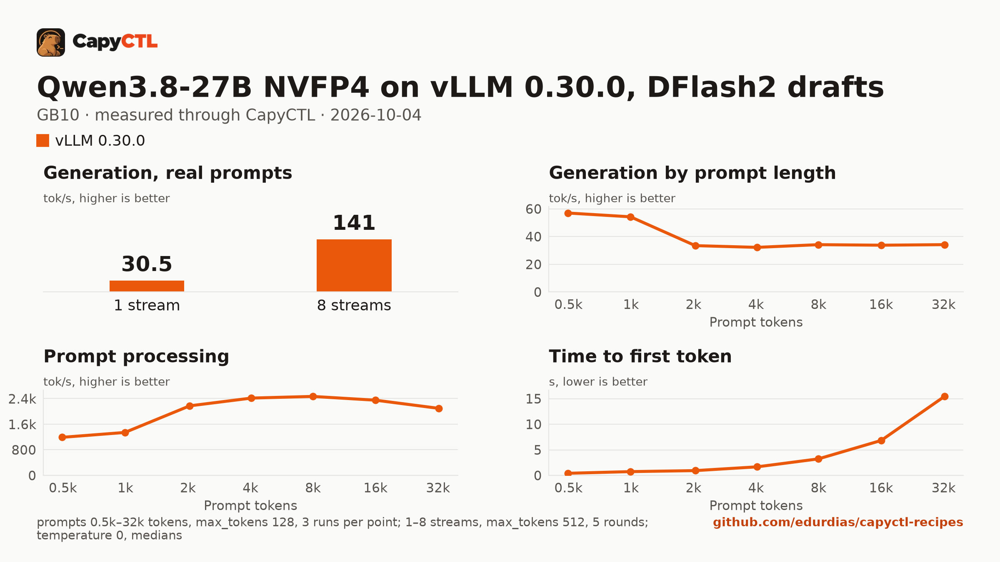

# Qwen3.8-27B NVFP4 on vLLM 0.30.0 with DFlash2 drafts, one GB10

| | |
|---|---|
| Hardware | 1x NVIDIA GB10 (DGX Spark class), compute capability 12.1, 128 GB unified memory, aarch64 |
| System | Ubuntu 24.04, NVIDIA driver 580.173.02, CUDA 13.0 toolkit in `/usr/local/cuda` |
| Engine | vLLM 0.30.0 in a venv (torch 2.13.0+cu130, FlashInfer 0.6.18.post1) |
| Model | [`nvidia/Qwen3.8-27B-NVFP4`](https://huggingface.co/nvidia/Qwen3.8-27B-NVFP4) at `482ca0f3832238542f8f5295dde86b5f22711d80`, NVFP4 with FP8 layers, 21.9 GB |
| Drafter | [`z-lab/Qwen3.8-27B-DFlash2`](https://huggingface.co/z-lab/Qwen3.8-27B-DFlash2) at `50307d4c4cde6860d4eee73e2547cd786fe8e8a4`, 3.8 GB |
| CapyCTL | `main` at `1f2cfc7` (prints `capyctl 0.1.1`), release build; `capyctl start standalone` |
| Measured | 2026-10-04 |

This recipe needs CapyCTL newer than the 0.1.1 release (`main` at `1f2cfc7`
or later, until the next release). It relies on changes made after 0.1.1:
`capyctl engine add --approve-option/--approve-path`; the drafter counted in
the memory, the context and the first-start timeout (CapyCTL now derives
860 s, so the file no longer sets `timeouts`); `--max-num-seqs 32` by default;
and the reasoning parser picked from the model family. The deployment file
itself validates with 0.1.1, which is what this repository's check runs.

The checkpoint, the drafter and the measuring method are the same as in the
[TensorFold recipe](../../tensorfold/qwen3.8-27b-nvfp4-gb10/) and the
[SGLang recipe](../../sglang/qwen3.8-27b-nvfp4-gb10/) for this model.

vLLM accepts the checkpoint's own quantization config, so the deployment sets
no `quantization`. What vLLM picked, from its log:

```text
Using FlashInferCutlassNvFp4LinearKernel for NVFP4 GEMM
Using FLASHINFER attention backend out of potential backends: ['FLASHINFER', 'TRITON_ATTN'].
```

vLLM 0.30.0 also has a B12X attention backend for compute capability 12.x. It
is not among the backends vLLM picks from on its own, it needs the `b12x`
package (not part of this venv) and it takes 64- or 128-token pages, while
vLLM runs this hybrid model with 1,648-token attention blocks. It was not
tried.

## Run it

CapyCTL does not download drafters. Download it into a directory of drafters:

```bash
hf download z-lab/Qwen3.8-27B-DFlash2 \
  --revision 50307d4c4cde6860d4eee73e2547cd786fe8e8a4 \
  --local-dir ~/drafters/Qwen3.8-27B-DFlash2
```

The API key comes from the credentials file the start banner names:

```bash
KEY=$(sed -n 's/^api_key: //p' ~/.local/state/capyctl/identity/credentials)
```

Register the engine and allow `--speculative-config` for drafters inside that
directory:

```bash
capyctl engine add ~/vllm-0.30.0-venv \
  --approve-option=--speculative-config --approve-path /home/me/drafters
```

```text
Registered vllm (vllm 0.30.0)

  Executable     /home/me/vllm-0.30.0-venv/bin/vllm
  Deep park      enabled
  CUDA           /usr/local/cuda
  Engines file   /home/me/.config/capyctl/engines.yaml (revision 3)
  Published      yes
```

The revision is 3 because this ran after the [Qwen3-4B recipe](../qwen3-4b-gb10/)'s
profile was added and removed.

```bash
capyctl deploy model --file deployment.yaml
```

```text
Request identity: 01M43Y3VV8RH2TX9YQKWWWC00H (reuse --request-id 01M43Y3VV8RH2TX9YQKWWWC00H to recover this command)
Deployment qwen38-27b-vllm created (revision 1)

  Deployment ID       01M43Y3VW75RN8FN52B2ZMQSAC
  Operation           01M43Y3VW7FH4VFXX5KJTQF1B8
  Checkpoint digest   being measured
the checkpoint digest of qwen38-27b-vllm is being measured; `capyctl start deployment qwen38-27b-vllm --wait` waits for it and starts the deployment
```

```bash
capyctl start deployment qwen38-27b-vllm --wait
```

```text
Request identity: 01M43Y3VWVZENVQ9XP7GA6KZG9 (reuse --request-id 01M43Y3VWVZENVQ9XP7GA6KZG9 to recover this command)
Waiting for the model source of qwen38-27b-vllm to be downloaded and verified (at most 900s)
Started qwen38-27b-vllm: ready

  Ready       1/1
  Hosts       host-a
  Operation   initialize succeeded
```

Qwen3.8 thinks before it answers. CapyCTL picks the `qwen3` reasoning parser
for this model family (and `qwen3_coder` for tool calls), so vLLM returns the
thinking in `reasoning` and the answer in `content`:

```bash
curl -s http://127.0.0.1:8443/v1/chat/completions \
  -H "Authorization: Bearer $KEY" -H 'Content-Type: application/json' \
  -d '{"model": "qwen38-27b-vllm", "messages": [{"role": "user", "content": "Name the largest planet in one sentence."}]}' \
  | jq -r '.choices[0].message.content'
```

```text


Jupiter is the largest planet in our solar system.
```

## Measured through CapyCTL

| | |
|---|---|
| Ready, cold | 272 s (weights already in the model store; includes measuring the checkpoint digest and vLLM's compile and warmup; vLLM's compile cache from earlier starts on this machine was reused) |
| Ready, warm | 102 s (`start` after `stop` finished; vLLM repeats its full startup) |
| Time to first token | 0.240 s median (0.236 to 0.240) |
| Decode, one stream | 23.7 tokens/s median (23.4 to 32.3), DFlash2 drafts on |
| Peak memory | 51.5 GiB measured by CapyCTL, against a 63.3 GiB startup reservation (CapyCTL's default for the 48 GiB request, with room for the drafter and the CUDA graphs); `MemAvailable` fell by 51.7 GiB at most |
| Concurrency | up to 32 requests (`--max-num-seqs 32`, CapyCTL's default) |
| Context | 32,768 tokens, declared |

Three streaming chat completions through the CapyCTL endpoint, one at a time,
`max_tokens: 512`, `temperature: 0.6`, thinking on (the model's default; the
first token counted is the first `reasoning` token). The three prompts are the
first three of capyctl-bench's prompt set (`explain-tcp`, `python-lru`,
`history-printing`); every request generated all 512 tokens. The same three
requests after the warm start gave 0.237 s and 29.2 tokens/s (26.5 to 37.4):
with sampling on, the outputs differ from run to run, and so does how many
drafted tokens are accepted. The 2026-10-02 measurement (34.5 tokens/s) used
other prompts and is not comparable.

### What the drafter does

The same deployment without `extra_args` (and so without the drafter), on the
same machine, the same three requests:

| | DFlash2 drafts | No drafts |
|---|---|---|
| Decode, one stream | 23.7 tokens/s (23.4 to 32.3) | 11.9 tokens/s (11.9 to 11.9) |
| Time to first token | 0.240 s | 0.135 s |
| Ready, first start of the deployment | 272 s | 112 s |
| Peak memory (CapyCTL) | 51.5 GiB | 49.9 GiB |

Without the drafter, the 48 GiB request leaves vLLM a 19.6 GiB KV cache
(`--kv-cache-memory-bytes 21027975680`).

## Benchmark

[`bench/`](bench/) has the capyctl-bench results and report
([`report.html`](bench/report.html), [`summary.md`](bench/summary.md),
[`data.csv`](bench/data.csv)). Context sweep 0.5k to 32k tokens, three runs per
point, `max_tokens: 128`; concurrency 1 to 8 streams, five rounds each,
`max_tokens: 512`; `temperature: 0`, thinking on; machine memory in use
(`MemTotal - MemAvailable`) sampled every 0.5 s.

| Context | Time to first token | Decode, one stream | Memory in use, peak |
|---|---|---|---|
| 0.5k | 0.42 s | 57.0 tokens/s | 52.4 GiB |
| 1k | 0.74 s | 54.3 tokens/s | 52.4 GiB |
| 2k | 0.94 s | 33.5 tokens/s | 52.4 GiB |
| 4k | 1.67 s | 32.2 tokens/s | 52.4 GiB |
| 8k | 3.23 s | 34.2 tokens/s | 52.4 GiB |
| 16k | 6.83 s | 33.8 tokens/s | 52.4 GiB |
| 32k | 15.44 s | 34.2 tokens/s | 52.4 GiB |

| Streams | Together | Each | Time to first token |
|---|---|---|---|
| 1 | 30.5 tokens/s | 30.9 tokens/s | 0.24 s |
| 2 | 50.2 tokens/s | 26.2 tokens/s | 0.33 s |
| 3 | 71.7 tokens/s | 25.1 tokens/s | 0.42 s |
| 4 | 89.5 tokens/s | 24.1 tokens/s | 0.46 s |
| 5 | 82.0 tokens/s | 18.5 tokens/s | 0.53 s |
| 6 | 89.6 tokens/s | 17.2 tokens/s | 0.57 s |
| 7 | 119.7 tokens/s | 20.4 tokens/s | 0.58 s |
| 8 | 141.3 tokens/s | 19.3 tokens/s | 0.62 s |

One-stream decode is 54 to 57 tokens/s at 0.5k and 1k and 32 to 34 tokens/s
from 2k to 32k; it follows how many drafted tokens vLLM accepts. Eight
streams decode 4.6 times as many tokens as one.



The model runs with deep parking on (CapyCTL's default for vLLM), so
`capyctl status deployment` warns that vLLM development mode is on.

A downloaded copy needs about 21.9 GB in the model store and 3.8 GB for the
drafter; with the download, the first start takes as long as the download plus
the time above.
